^ https://www.flickr.com/photos/avidday/9173790839

^ "Duck Typing, Compatibility and the Adaptor Pattern"

---

### the art of the javascript metaobject protocol

# Duck Typing, Compatibility, and
# The Adaptor Pattern


^ https://www.flickr.com/photos/avidday/9173790839

^ "Duck Typing, Compatibility and the Adaptor Pattern"

---


^ https://www.flickr.com/photos/davelawler/5744858794

^ time is in short supply, so we'll jump right into talking about duck typing

---

> Duck typing is a style of typing in which an object's methods and properties determine the valid semantics,

---

> ...rather than its inheritance from a particular class or implementation of an explicit interface.

---

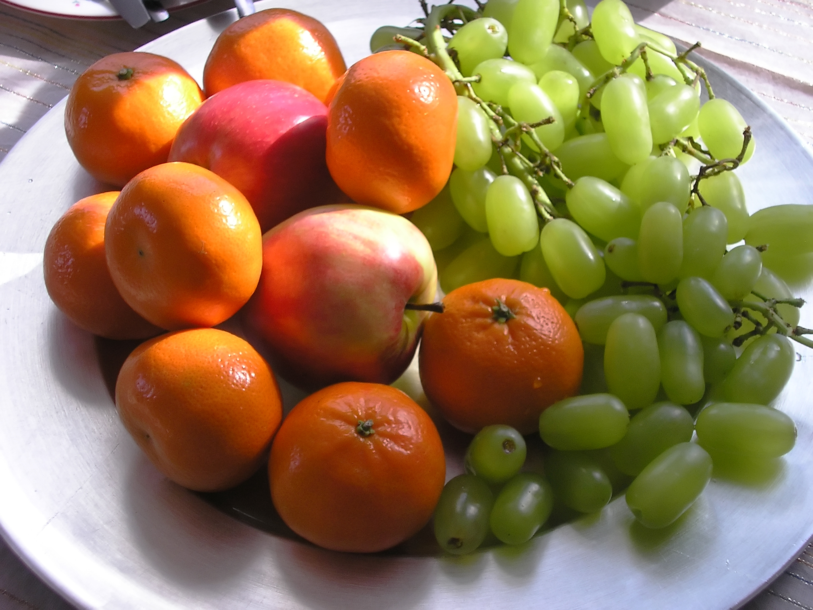

^ https://www.flickr.com/photos/macieklew/3986974018

^ "tastes like fruit"

---

# Tastes Like Fruit


^ https://www.flickr.com/photos/macieklew/3986974018

---


^ https://www.flickr.com/photos/yimhafiz/4547999416

^ "also tastes like fruit"

---

# Also Tastes Like Fruit


^ https://www.flickr.com/photos/yimhafiz/4547999416

---

> "Write code that depends upon tastes-like(fruit) rather than depending upon is-a(fruit)."

---

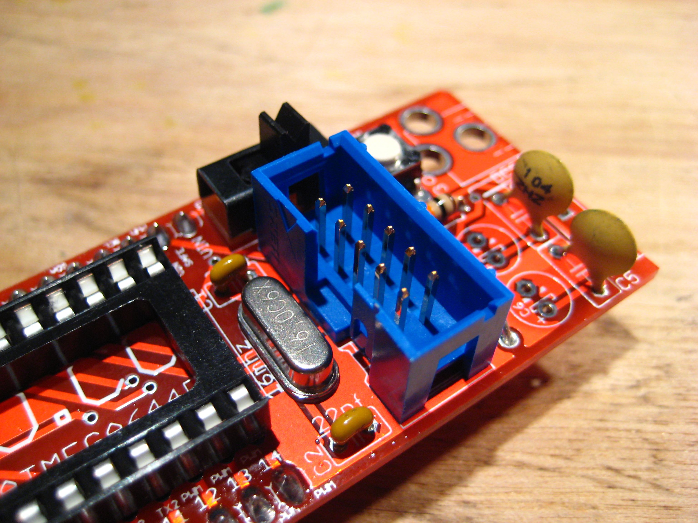

^ https://www.flickr.com/photos/hoeken/2692040215

^ "duck typing is a compatibility technique"

---

### duck typing is a

# Compatibility Technique


^ https://www.flickr.com/photos/hoeken/2692040215

---

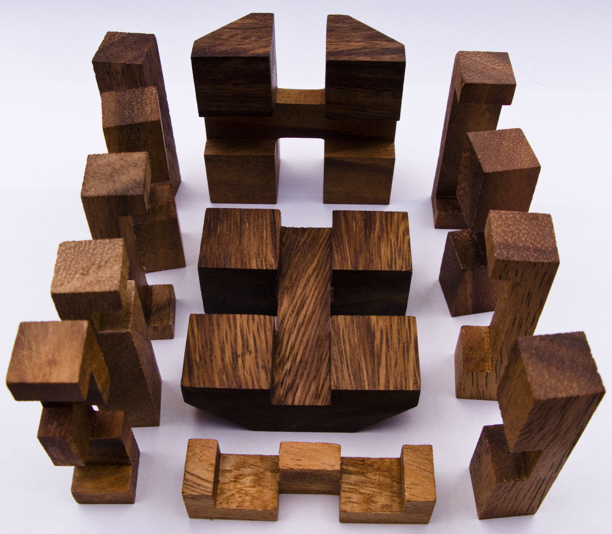

^ https://www.flickr.com/photos/davies/3231308527

---

# A Problem:


^ https://www.flickr.com/photos/davies/3231308527

---

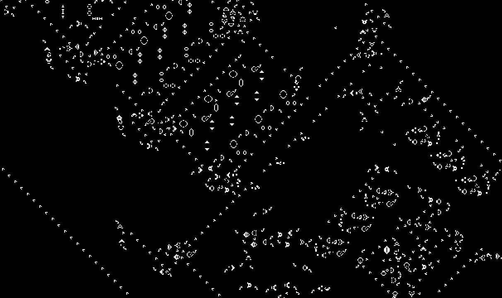

^ https://www.youtube.com/watch?v=DD0B-4KNna8

---

## Conway's Game of Life


^ https://www.youtube.com/watch?v=DD0B-4KNna8

---

> "Conway's Game of Life is a two-state cellular automata."

---

# An Implementation

1. Cells,

---

# An Implementation

1. Cells,
1. Universe,

---

# An Implementation

1. Cells,
1. Universe, and
1. View.

---

# Cell

1. Neighbours,

---

# Cell

1. Neighbours, and
1. State.

---

```javascript
function StandardCell () {
  this._neighbours = [];
  this._alive      = false;
}
```

---

```javascript
StandardCell.prototype.neighbours =
  function neighbours (neighbours) {
    return this._neighbours;
  };

StandardCell.prototype.setNeighbours =
  function setNeighbours (neighbours) {
    this._neighbours = neighbours.slice(0);
    return this;
  };
```

---

```javascript
StandardCell.prototype.alive =
  function alive () {
    return this._alive;
  };

StandardCell.prototype.setAlive =
  function setAlive (alive) {
    this._alive = alive;
    return this;
  };
```

---


^ https://www.flickr.com/photos/gsfc/9524854754

---

#### moving through
# Time


^ https://www.flickr.com/photos/gsfc/9524854754

---

# Cell

1. Neighbours,
1. State, and
1. Transformation of State.

---

# Universe

1. Neighbourhoods (not shown),

---

# Universe

1. Neighbourhoods (not shown), and
1. Transformation of States.

---

```javascript
StandardCell.prototype.nextAlive =
  function nextAlive () {
    var alives =
      this._neighbours.filter(function (n) {
        return n.alive();
      }).length;
    if (this.alive()) {
      return alives === 2 ||
             alives == 3;
    }
    else {
      return alives == 3;
    }
  };
```

---

```javascript
Universe.prototype.iterate =
  function iterate () {
    var aliveInNextGeneration = this.cells().map(
      function (c) {
        return [c, c.nextAlive()];
      }
    );
    
    aliveInNextGeneration.forEach(function (a) {
      var cell = a[0],
          next = a[1];
          
      cell.setAlive(next);
    });
  };
```

---

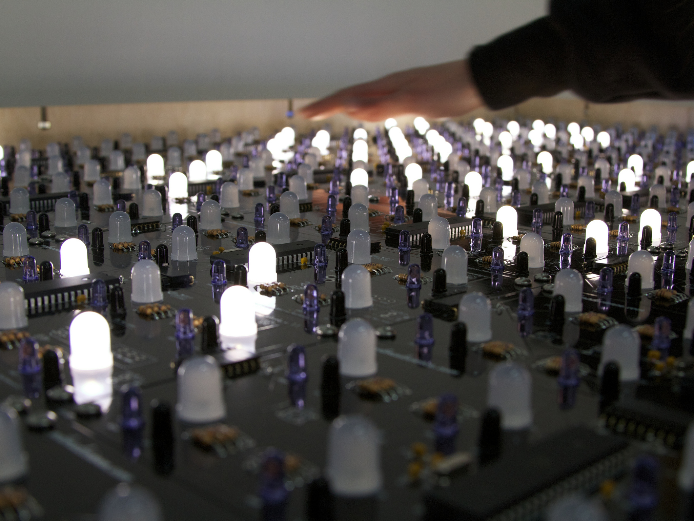

^ https://www.flickr.com/photos/oskay/6838117968

---

### drawing

# Life


^ https://www.flickr.com/photos/oskay/6838117968

---

# View

1. Drawing a Cell:

---

```javascript
View.prototype.drawCell =
  function drawCell (cell, x, y) {
    var xPlus = x + this.cellSize(),
        yPlus = y + this.cellSize()
    this._canvasContext.clearRect(x, y, xPlus, yPlus);
    this._canvasContext.fillStyle = this.cellColour(cell);
    this._canvasContext.fillRect(x, y, xPlus, yPlus);
    return self;
  };
```

---

```javascript
View.prototype.cellColour =
  function cellColour (cell) {
    return cell.alive()
           ? WHITE
           : BLACK;
  };
```

---

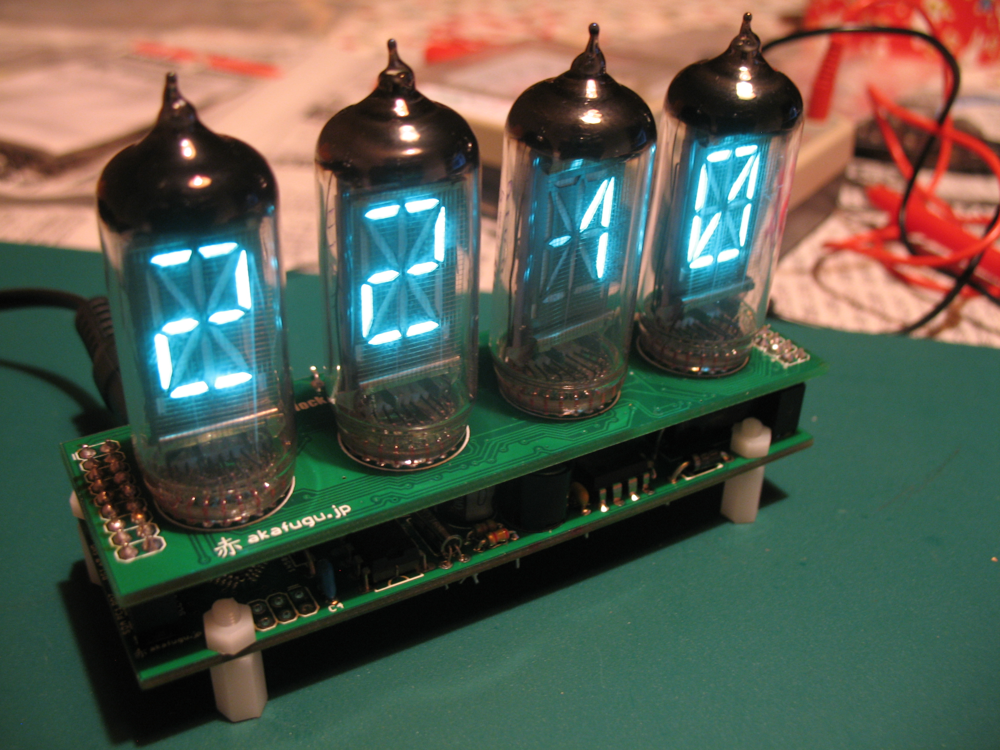

^ https://www.flickr.com/photos/ourmaninjapan/6340506358

^ "5 minutes"

---


^ https://www.flickr.com/photos/nanagyei/6636632951

---

# Ch-ch-ch-changes!


^ https://www.flickr.com/photos/nanagyei/6636632951

---

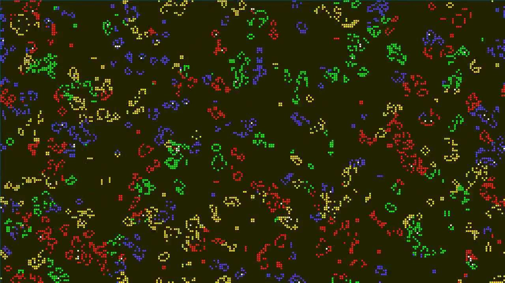

^ https://www.youtube.com/watch?v=etUZw_xm-98 by Marcel Rodrigues

---

### redesigning for 

# Colour


^ https://www.youtube.com/watch?v=etUZw_xm-98 by Marcel Rodrigues

---

```javascript
function ColourCell () {
  this._neighbours = [];
  this._age        = 0;
}

ColourCell.prototype.neighbours =
  StandardCell.prototype.neighbours;


ColourCell.prototype.setNeighbours =
  StandardCell.prototype.setNeighbours;
```

---

```javascript
ColourCell.prototype.age =
  function age () {
    return this._age;
  };

ColourCell.prototype.setAge =
  function setAge (age) {
    this._age = age;
    return this;
  };
```

---


^ https://www.flickr.com/photos/dexxus/2599093453

---

### moving through time

# in Colour


^ https://www.flickr.com/photos/dexxus/2599093453

---

```javascript
ColourCell.prototype.nextAge =
  function next () {
    var alives =
      this._neighbours.filter(function (n) {
        return n.age() > 0;
      }).length;
    if (this.age() > 0) {
      return (alives === 2 || alives == 3) 
             ? (this.age() + 1)
             : 0;
    }
    else {
      return (alives == 3) 
             ? (this.age() + 1)
             : 0;
    }
  };
```

---

```javascript
Universe.prototype.iterate =
  function iterate () {
    var ageInNextGeneration = this.cells().map(
      function (c) {
        return [c, c.nextAge()];
      }
    );
    
    ageInNextGeneration.forEach(function (a) {
      var cell = a[0],
          next = a[1];
          
      cell.setAge(next);
    });
  };
```

---


^ https://www.flickr.com/photos/kara_allyson/4360710819

---

### drawing life

# in Colour


^ https://www.flickr.com/photos/kara_allyson/4360710819

---

```javascript
var COLOURS =
  [ BLACK, GREEN, BLUE, YELLOW, WHITE, RED ];

View.prototype.cellColour =
  function cellColour (cell) {
    return COLORS[
                   (cell.age() >= COLOURS.length)
                   ? (COLOURS.length - 1)
                   : cell.age()
                 ];
  };

// ...
```

---


^ https://www.flickr.com/photos/juliusprinz/8709649221

---

### something

# Doesn't Fit


^ https://www.flickr.com/photos/juliusprinz/8709649221

---

```javascript
Object.keys(StandardCell.prototype)
// =>
  [ 'neighbours',
    'setNeighbours',
    'alive',
    'setAlive',
    'nextAlive' ]
```

---

```javascript
Object.keys(ColourCell.prototype)
// =>
  [ 'neighbours',
    'setNeighbours',
    'age',
    'setAge',
    'nextAge' ]
```

---

> The state of a cell is now "age" instead of "aliveness."

---


^ https://www.flickr.com/photos/120600995@N07/14262980504

---

### These changes will
# Ripple Through Universe and View


^ https://www.flickr.com/photos/120600995@N07/14262980504

---

### our problem is that

# Universe is coupled to Cell's Interface

---


^ https://www.flickr.com/photos/maxwarren/183318800

^ "ten minutes"

---


^ https://www.flickr.com/photos/ter-burg/9704526768

---

### how smart people

# Solve the Problem


^ https://www.flickr.com/photos/ter-burg/9704526768

---

> "Make a coloured cell behave like a standard cell."

---

```javascript
ColourCell.prototype.alive =
  function alive () {
    return this._age > 0;
  };
```

---

```javascript
ColourCell.prototype.setAlive =
  function setAlive (alive) {
    if (alive) {
      this.setAge(this.age() + 1);
    }
    else this.setAge(0);
    return this;
  };
```

---

```javascript
ColourCell.prototype.nextAlive =
  StandardCell.prototype.nextAlive;
```

---

```javascript
Object.keys(ColourCell.prototype)
// =>
  [ 'neighbours',
    'setNeighbours',
    'age',
    'setAge',
    'nextAge',
    'alive',
    'setAlive',
    'nextAlive' ]
```

---

# Presto! Backwards Compatibility.

### (it "tastes like a standard cell")

---


^ https://www.flickr.com/photos/91553413@N00/253281960

---

### universe and cell are

# No Longer Coupled


^ https://www.flickr.com/photos/91553413@N00/253281960

---


^ https://www.flickr.com/photos/66971402@N04/7569786950

---

# At What Cost?


^ https://www.flickr.com/photos/66971402@N04/7569786950

---

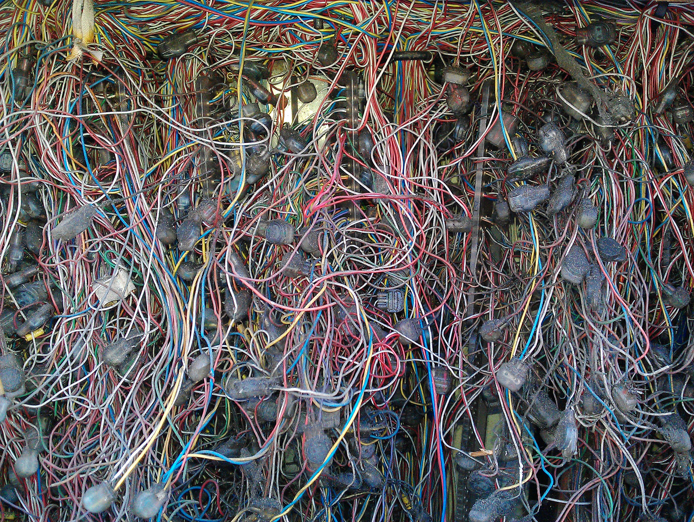

^ https://www.flickr.com/photos/bitterjug/7670055210

---

# Increasing Flexibility
# Increases Complexity


^ https://www.flickr.com/photos/bitterjug/7670055210

---


^ https://www.flickr.com/photos/angeloangelo/4423502365

---

### there is

# Another Way


^ https://www.flickr.com/photos/angeloangelo/4423502365

---

> "Make a cell that behaves like a Standard Cell, but is implemented in terms of a Coloured Cell."

---

```javascript
function AsStandard (colouredCell) {
  this._colouredCell = colouredCell;
}

var tastesLikeAStandardCell =
  new AsStandard(aColourCell);
```

---

```javascript
AsStandard.prototype.neighbours = 
  function neighbours () {
    return this._colouredCell.neighbours();
  };
  
AsStandard.prototype.setNeighbours = 
  function setNeighbours (neighbours) {
    this._colouredCell.setNeighbours(neighbours);
    return this;
  };
```

---

```javascript
AsStandard.prototype.alive =
  function alive () {
    return this._colouredCell.age() > 0;
  };
```

---

```javascript
AsStandard.prototype.setAlive =
  function setAlive (alive) {
    if (alive) {
      this._colouredCell.setAge(this._colouredCell.age() + 1);
    }
    else this._colouredCell.setAge(0);
    return this;
  };
```

---

```javascript
AsStandard.prototype.nextAlive =
  function nextAlive () {
    return this._colouredCell.nextAge() > 0;
  }
```

---

```javascript
Object.keys(AsStandard.prototype)
// =>
  [ 'neighbours',
    'setNeighbours',
    'alive',
    'setAlive',
    'nextAlive' ]
```

---

# When we Upgrade to ColourCell

1. View can depend upon ColourCell,

---

# When we Upgrade to ColourCell

1. View can depend upon ColourCell, and
1. Universe can depend upon AsStandard.

---

# Sweet!

1. Universe is decoupled from changes to Cell,

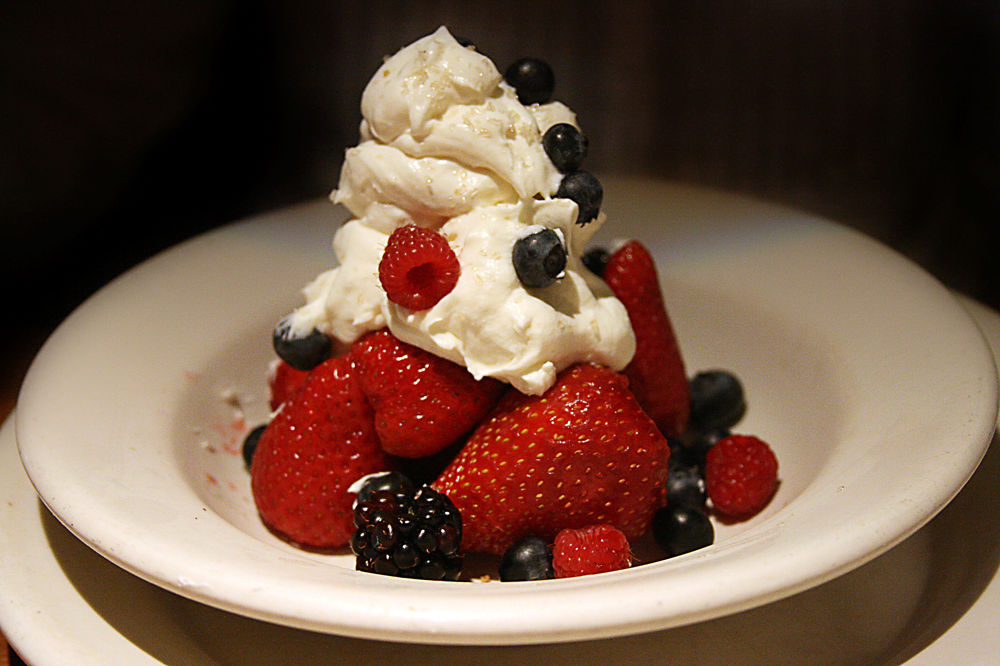

^ https://www.flickr.com/photos/56832361@N00/3705717858

---

# Sweet!

1. Universe is decoupled from changes to Cell, and
2. ColourCell isn't burdened with backwards compatibility.


^ https://www.flickr.com/photos/56832361@N00/3705717858

---

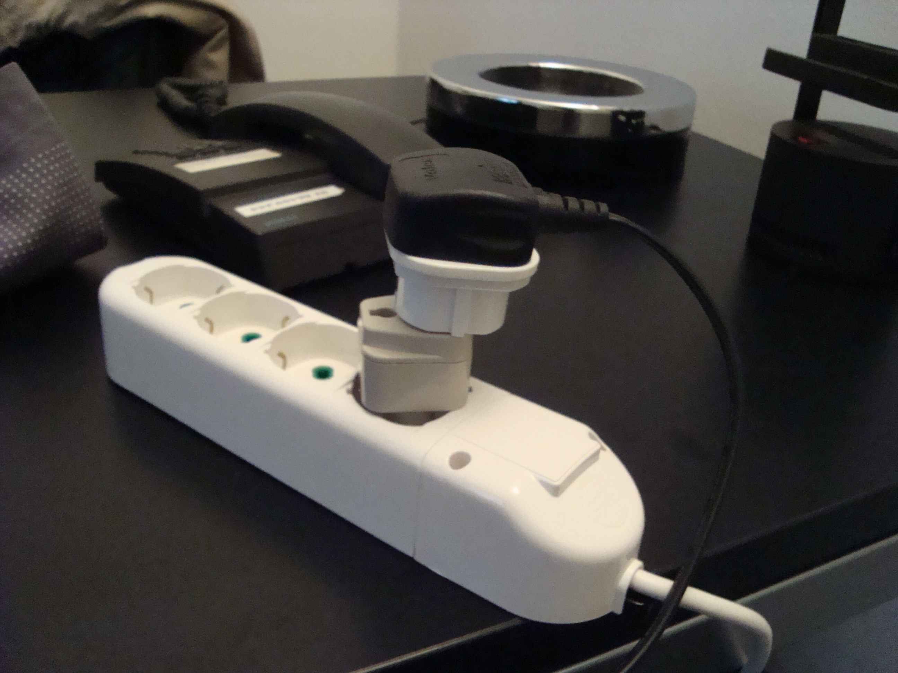

^ https://www.flickr.com/photos/theincidental/3459777668

---

# AsStandard is an *Adaptor*


^ https://www.flickr.com/photos/theincidental/3459777668

---

> The adapter (sic) pattern is a software design pattern that allows the interface of an existing class to be used from another interface...

^ Wikipedia

---

> It is often used to make existing classes work with others without modifying their source code.

^ Wikipedia

---

# TIMTOWTDI

---


^ https://www.flickr.com/photos/fhke/3268894584

^ "good programmers borrow from smalltalk, great programmers steal from C++"

---

### good programmers borrow from smalltalk,

# Great Programmers Steal from C++


^ https://www.flickr.com/photos/fhke/3268894584

^ "copy constructors are value adaptors"

---

```javascript
function colourFromStandard (standard) {
  return new ColourCell()
         .setNeighbours(standard.neighbours())
         .setAge(standard.alive() ? 1 : 0);
}
```

---

```javascript
function standardFromColour (colour) {
  return new StandardCell()
         .setNeighbours(colour.neighbours())
         .setAlive(colour.age() > 0);
}
```

---


^ https://www.flickr.com/photos/e3000/6885969828

^ "Can we create co-proxies instead of wrappers?"

---

# Coproxies


^ https://www.flickr.com/photos/e3000/6885969828

---


^ https://www.flickr.com/photos/zeevveez/6273266577

^ "fifteen minutes"

---


^ https://www.flickr.com/photos/warriorwoman531/6081198171

^ "The conclusion is near"

---

# Approaching the End


^ https://www.flickr.com/photos/warriorwoman531/6081198171

---


^ https://www.flickr.com/photos/samsaunders/11689309615

^ "separate the concern of how to interact with a model from the concern of what the model does"

---

### adaptors 

# Separate Concerns


^ https://www.flickr.com/photos/samsaunders/11689309615

^ "separate the concern of how to interact with a model from the concern of what the model does"

---

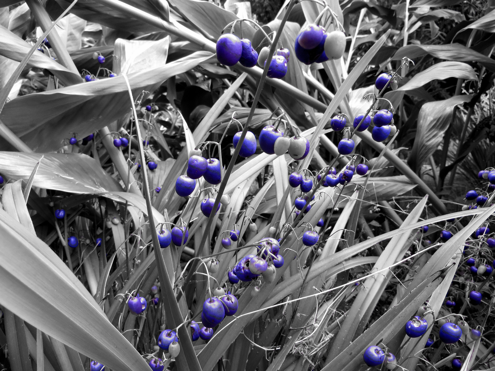

^ https://www.flickr.com/photos/xlibber/14944977391

---

### and thus, adaptors

# Isolate Change


^ https://www.flickr.com/photos/xlibber/14944977391

---


^ https://www.flickr.com/photos/94418464@N08/9631393073

---

### and they
# Decouple Modules


^ https://www.flickr.com/photos/94418464@N08/9631393073

---


^ https://www.flickr.com/photos/janitors/14188094421

^ "adaptors solve compatibility problems"

---

### adaptors

# Solve Compatibility Problems


^ https://www.flickr.com/photos/janitors/14188094421

---


^ https://www.flickr.com/photos/highwaysagency/14874539886

^ "but they also gives us the freedom to make changes, safely"

---

### but they also gives us the freedom to

# Make Changes, Safely 


^ https://www.flickr.com/photos/highwaysagency/14874539886

---


^ https://www.flickr.com/photos/jacme31/6970784086

---

### when we're using teams to build software at scale

# Adaptors are an Important Tool


^ https://www.flickr.com/photos/jacme31/6970784086

---


^ https://www.flickr.com/photos/peddhapati/11671457605

^ THE END

---


^ https://www.flickr.com/photos/swimparallel/3391592144/

^ "eighteen minutes"

---

one more thing:

---


^ https://www.flickr.com/photos/49889874@N05/4772680734

^ "packages"

---


^ https://www.flickr.com/photos/seeminglee/7994149144

---

### when you're holding a

# Version-Shaped Hammer


^ https://www.flickr.com/photos/seeminglee/7994149144

---


^ https://www.flickr.com/photos/jameshammond/8733249464

---

### all changes look like

# Migration-Shaped Nails


^ https://www.flickr.com/photos/jameshammond/8733249464

---


^ https://www.flickr.com/photos/poorfish/7213010794

---

# Packages Have Interlocking Dependencies


^ https://www.flickr.com/photos/poorfish/7213010794

---


^ https://www.flickr.com/photos/imazerart/4918018946

---

# Migrations Can Cascade

### you never know how much work a single upgrade can cause


^ https://www.flickr.com/photos/imazerart/4918018946

---


^ https://www.flickr.com/photos/sidelong/3466699346

^ "semver: does a new version have to be duck-compatible? Or can it adapt?"

---

### migration is expensive, so semver values

# Backwards Compatibility


^ https://www.flickr.com/photos/sidelong/3466699346

---


^ https://www.flickr.com/photos/aigle_dore/13026781635

---

### "duck typed" backwards compatibility

# Holds Progress Back


^ https://www.flickr.com/photos/aigle_dore/13026781635

---


^ https://www.flickr.com/photos/drphotomoto/14040288979

---

### breaking compatibilty

# Exposes Clients to Bugs


^ https://www.flickr.com/photos/drphotomoto/14040288979

---


^ https://www.flickr.com/photos/streetmatt/15083719955

---

### adaptors decouple

# Compatibility from Progress


^ https://www.flickr.com/photos/streetmatt/15083719955

---


^ https://www.flickr.com/photos/sputnik_mania/2216528316

^ "adaptors can provide safe backwards-compatibility without debt"

---

### adaptors provide

# Safe Compatibility


^ https://www.flickr.com/photos/sputnik_mania/2216528316

---

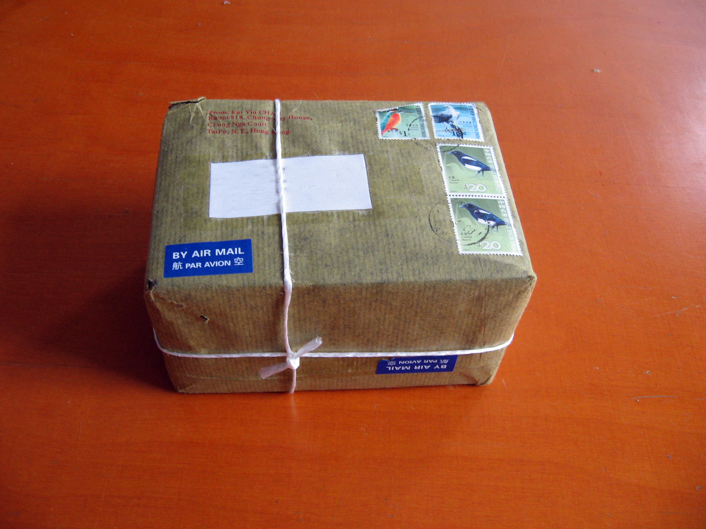

^ https://www.flickr.com/photos/halfbisqued/2353845688

^ What would an adaptor-aware package manager look like?

---

# What would an adaptor-aware package manager look like?


^ https://www.flickr.com/photos/halfbisqued/2353845688

---

# An Adaptor-Aware Package Manager

1. Interfaces and Implementations would be independantly versioned,

---

# An Adaptor-Aware Package Manager

1. Interfaces and Implementations would be independantly versioned,
1. Interfaces would have a many-to-many relationship with Implementations, mediated by Adaptors,

---

# An Adaptor-Aware Package Manager

1. Interfaces and Implementations would be independantly versioned,
1. Interfaces would have a many-to-many relationship with implementations, mediated by adaptors,
1. Clients would specifiy the required interface and implementation,

---

# An Adaptor-Aware Package Manager

1. Interfaces and Implementations would be independantly versioned,
1. Interfaces would have a many-to-many relationship with implementations, mediated by adaptors,
1. Clients would specifiy the required interface and implementation, and
1. Old clients can benefit from bug fixes without rewrites.

---


^ https://www.flickr.com/photos/wackybadger/6171444454

---

### an adaptor-aware package manager would

# Rewire the Way we Grow Software


^ https://www.flickr.com/photos/wackybadger/6171444454

---


^ https://www.flickr.com/photos/esoastronomy/8271747835

^ "and that provides food for thought for a very long time indeed"

---

### and that provides

# Food for Thought

### for a very long time indeed


^ https://www.flickr.com/photos/esoastronomy/8271747835

---


^ https://www.flickr.com/photos/lionsthlm/14175437597

^ "tack så mycket"

---

# Tack Så Mycket!


^ https://www.flickr.com/photos/lionsthlm/14175437597

---

# Questions?


^ https://www.flickr.com/photos/w00ter/13262702873

---

# Reginald Braithwaite

## GitHub, Inc.

## raganwald.com

## @raganwald

Nordic JS
Artipelag, Stockholm, September 19, 2014


^ https://leanpub.com/javascript-spessore