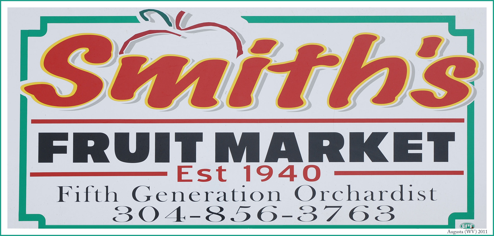
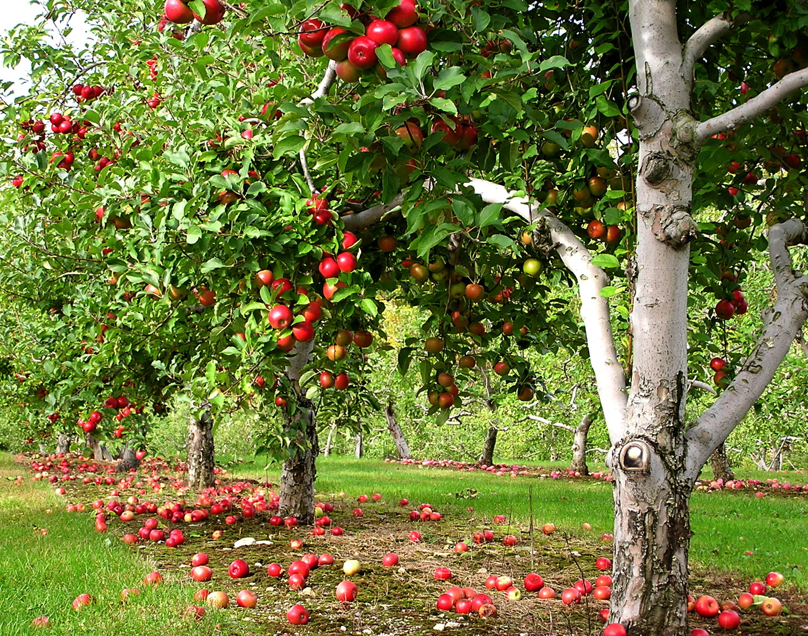
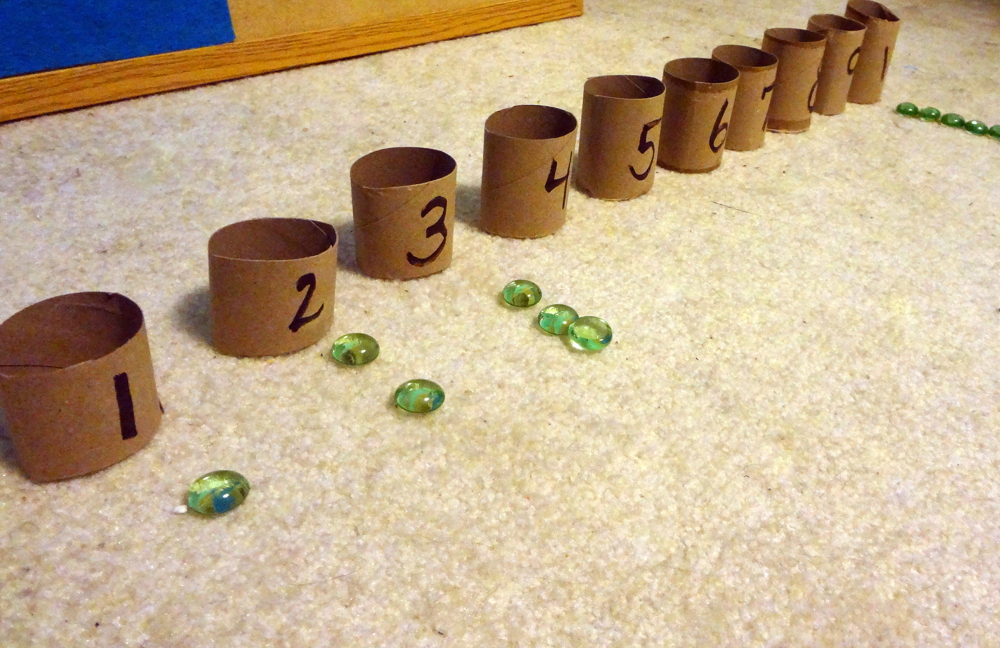
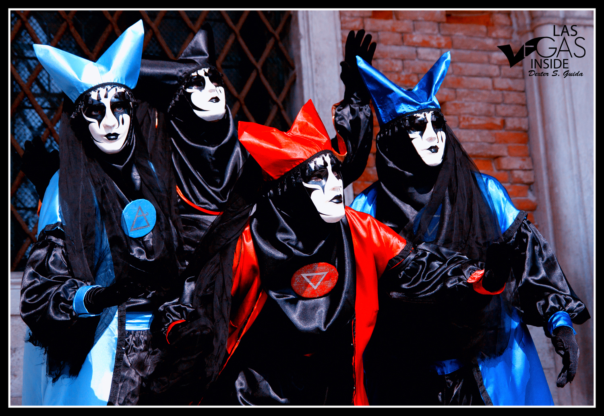
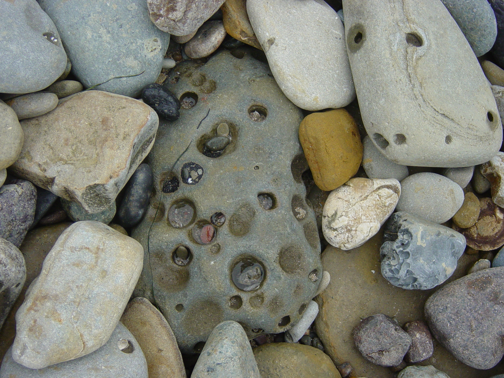
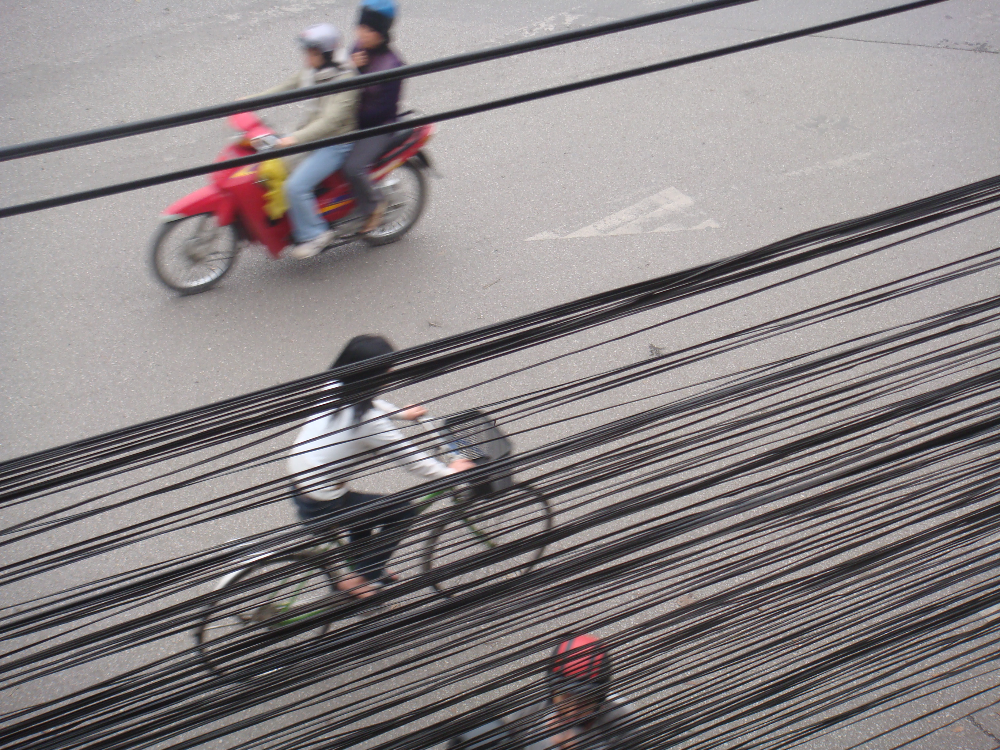
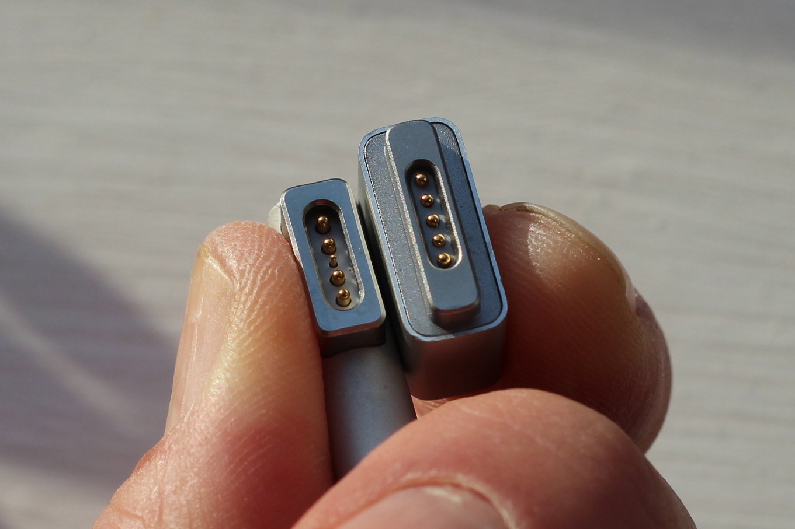
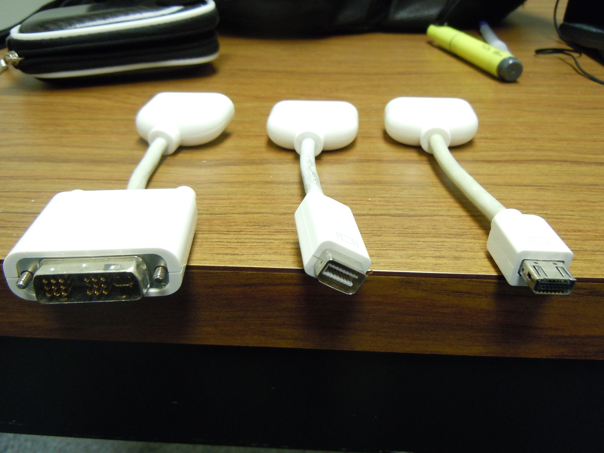

^ https://www.flickr.com/photos/liberato/473981158

^ "A Unified Theory of JavaScript Style, Part III"

---

### the art of the javascript metaobject protocol

# Adapt or Perish


^ https://www.flickr.com/photos/liberato/473981158

---


^ https://www.flickr.com/photos/davelawler/5744858794

^ time is in short supply, so we'll talk about one thing

---


^ https://www.flickr.com/photos/14052937@N04/15064250645

^ "fruit vs duck typing"

---

# Fruit vs Duck Typing


^ https://www.flickr.com/photos/14052937@N04/15064250645

---



^ https://www.flickr.com/photos/22711505@N05/6359758713

^ "fruit typing"

---

# Fruit Typing:


^ https://www.flickr.com/photos/22711505@N05/6359758713

---


^ https://www.flickr.com/photos/macieklew/3986974018

^ "fruit"

---

# Fruit


^ https://www.flickr.com/photos/macieklew/3986974018

---


^ https://www.flickr.com/photos/yimhafiz/4547999416

---

# Not Fruit


^ https://www.flickr.com/photos/yimhafiz/4547999416

^ something can look, smell, and taste like fruit but not *be* fruit

---



^ https://www.flickr.com/photos/calliope/54070471

^ "fruit is deeper than its taste, smell or color"

---

### "fruit" is deeper than its

# Taste, Smell or Color


^ https://www.flickr.com/photos/calliope/54070471

^ In botany, a fruit is a part of a flowering plant that derives from specific tissues of the flower, one or more ovaries, and in some cases accessory tissues. Fruits are the means by which these plants disseminate seeds. "Fruit" is defined in a semantic way that is deeper than the things we can observe of the fruit, deeper than its "interface."

---


^ https://www.flickr.com/photos/katdaned/3543936498

^ "duck typing"

---

# Duck Typing:


^ https://www.flickr.com/photos/katdaned/3543936498

---



^ https://www.flickr.com/photos/98925031@N08/9808827924

^ "enumerable"

---

# "Enumerable"


^ https://www.flickr.com/photos/98925031@N08/9808827924

---



^ https://www.flickr.com/photos/lasvegasinside/12909092113

---

### people are

# "Enumerable"


^ https://www.flickr.com/photos/lasvegasinside/12909092113

---



^ https://www.flickr.com/photos/martinlabar/90632001

---

### rocks are

# "Enumerable"


^ https://www.flickr.com/photos/martinlabar/90632001

---


^ https://www.flickr.com/photos/jwright4701/5748155319

---

### duck typing is like

## "Enumerable," not like "Fruit"


^ https://www.flickr.com/photos/jwright4701/5748155319

---

> Duck typing is a style of typing in which an object's methods and properties determine the valid semantics,

---

> ...rather than its inheritance from a particular class or implementation of an explicit interface.

---


^ https://www.flickr.com/photos/ter-burg/9704526768

---

### a problem we usually

# Solve with Duck Typing:


^ https://www.flickr.com/photos/ter-burg/9704526768

---


^ https://www.youtube.com/watch?v=DD0B-4KNna8

---

## Conway's Game of Life


^ https://www.youtube.com/watch?v=DD0B-4KNna8

---

```javascript
function StandardCell () {
  this._neighbours = [];
  this._alive      = false;
}
```

---

```javascript
StandardCell.prototype.neighbours =
  function neighbours (neighbours) {
    return this._neighbours;
  };

StandardCell.prototype.setNeighbours =
  function setNeighbours (neighbours) {
    this._neighbours = neighbours.slice(0);
    return this;
  };
```

---

```javascript
StandardCell.prototype.alive =
  function alive () {
    return this._alive;
  };

StandardCell.prototype.setAlive =
  function setAlive (alive) {
    this._alive = alive;
    return this;
  };
```

---


^ https://www.flickr.com/photos/gsfc/9524854754

---

#### moving through
# Time


^ https://www.flickr.com/photos/gsfc/9524854754

---

```javascript
StandardCell.prototype.nextAlive =
  function nextAlive () {
    var alives =
      this._neighbours.filter(function (n) {
        return n.alive();
      }).length;
    if (this.alive()) {
      return alives === 2 ||
             alives == 3;
    }
    else {
      return alives == 3;
    }
  };
```

---

```javascript
Universe.prototype.iterate =
  function iterate () {
    var aliveInNextGeneration = this.cells().map(
      function (c) {
        return [c, c.nextAlive()];
      }
    );
    
    aliveInNextGeneration.forEach(function (a) {
      var cell = a[0],
          next = a[1];
          
      cell.setAlive(next);
    });
  };
```

---


^ https://www.flickr.com/photos/oskay/6838117968

---

### drawing

# Life


^ https://www.flickr.com/photos/oskay/6838117968

---

```javascript
View.prototype.drawCell =
  function drawCell (cell, x, y) {
    var xPlus = x + this.cellSize(),
        yPlus = y + this.cellSize()
    this._canvasContext.clearRect(x, y, xPlus, yPlus);
    this._canvasContext.fillStyle = this.cellColour(cell);
    this._canvasContext.fillRect(x, y, xPlus, yPlus);
    return self;
  };
```

---

```javascript
View.prototype.cellColour =
  function cellColour (cell) {
    return cell.alive()
           ? WHITE
           : BLACK;
  };
```

---


^ https://www.flickr.com/photos/ourmaninjapan/6340506358

^ "Let's get to work!"

---


^ https://www.flickr.com/photos/nanagyei/6636632951

---

# Ch-ch-ch-changes!


^ https://www.flickr.com/photos/nanagyei/6636632951

---


^ https://www.youtube.com/watch?v=etUZw_xm-98 by Marcel Rodrigues

---

### redesigning for 

# Colour


^ https://www.youtube.com/watch?v=etUZw_xm-98 by Marcel Rodrigues

---

```javascript
function ColourCell () {
  this._neighbours = [];
  this._age        = 0;
}

ColourCell.prototype.neighbours =
  StandardCell.prototype.neighbours;


ColourCell.prototype.setNeighbours =
  StandardCell.prototype.setNeighbours;
```

---

```javascript
ColourCell.prototype.age =
  function age () {
    return this._age;
  };

ColourCell.prototype.setAge =
  function setAge (age) {
    this._age = age;
    return this;
  };
```

---


^ https://www.flickr.com/photos/dexxus/2599093453

---

### moving through time

# in Colour


^ https://www.flickr.com/photos/dexxus/2599093453

---

```javascript
ColourCell.prototype.nextAge =
  function next () {
    var alives =
      this._neighbours.filter(function (n) {
        return n.age() > 0;
      }).length;
    if (this.age() > 0) {
      return (alives === 2 || alives == 3) 
             ? (this.age() + 1)
             : 0;
    }
    else {
      return (alives == 3) 
             ? (this.age() + 1)
             : 0;
    }
  };
```

---

```javascript
Universe.prototype.iterate =
  function iterate () {
    var ageInNextGeneration = this.cells().map(
      function (c) {
        return [c, c.nextAge()];
      }
    );
    
    ageInNextGeneration.forEach(function (a) {
      var cell = a[0],
          next = a[1];
          
      cell.setAge(next);
    });
  };
```

---


^ https://www.flickr.com/photos/kara_allyson/4360710819

---

### drawing life

# in Colour


^ https://www.flickr.com/photos/kara_allyson/4360710819

---

```javascript
var COLOURS =
  [ BLACK, GREEN, BLUE, YELLOW, WHITE, RED ];

View.prototype.cellColour =
  function cellColour (cell) {
    return COLORS[
                   (cell.age() >= COLOURS.length)
                   ? (COLOURS.length - 1)
                   : cell.age()
                 ];
  };

// ...
```

---


^ https://www.flickr.com/photos/juliusprinz/8709649221

---

### something

# Doesn't Fit


^ https://www.flickr.com/photos/juliusprinz/8709649221

---

```javascript
Object.keys(StandardCell.prototype)
// =>
  [ 'neighbours',
    'setNeighbours',
    'alive',
    'setAlive',
    'nextAlive' ]
```

---

```javascript
Object.keys(ColourCell.prototype)
// =>
  [ 'neighbours',
    'setNeighbours',
    'age',
    'setAge',
    'nextAge' ]
```

---


^ https://www.flickr.com/photos/120600995@N07/14262980504

---

### changes to "cell" ripple through
# Universe and View


^ https://www.flickr.com/photos/120600995@N07/14262980504

---


^ https://www.flickr.com/photos/maxwarren/183318800

---


^ https://www.flickr.com/photos/42244964@N03/6985514625

---

### direct
# Duck Typing


^ https://www.flickr.com/photos/42244964@N03/6985514625

---

```javascript
ColourCell.prototype.alive =
  function alive () {
    return this._age > 0;
  };
```

---

```javascript
ColourCell.prototype.setAlive =
  function setAlive (alive) {
    if (alive) {
      this.setAge(this.age() + 1);
    }
    else this.setAge(0);
    return this;
  };
```

---

```javascript
ColourCell.prototype.nextAlive =
  StandardCell.prototype.nextAlive;
```

---

```javascript
Object.keys(ColourCell.prototype)
// =>
  [ 'neighbours',
    'setNeighbours',
    'age',
    'setAge',
    'nextAge',
    'alive',
    'setAlive',
    'nextAlive' ]
```

---


^ https://www.flickr.com/photos/angeloangelo/4423502365

---

### there is

# Another Way


^ https://www.flickr.com/photos/angeloangelo/4423502365

---

```javascript
function AsStandard (colour) {
  this.it = colour;
}

var quacksLikeAStandardDuck =
  new AsStandard(aColourCell);
```

---

```javascript
AsStandard.prototype.neighbours = 
  function neighbours () {
    return this.it.neighbours();
  };
  
AsStandard.prototype.setNeighbours = 
  function setNeighbours (neighbours) {
    this.it.setNeighbours(neighbours);
    return this;
  };
```

---

```javascript
AsStandard.prototype.alive =
  function alive () {
    return this.it.age() > 0;
  };
```

---

```javascript
AsStandard.prototype.setAlive =
  function setAlive (alive) {
    if (alive) {
      this.it.setAge(this.it.age() + 1);
    }
    else this.it.setAge(0);
    return this;
  };
```

---

```javascript
AsStandard.prototype.nextAlive =
  function nextAlive () {
    return this.it.nextAge() > 0;
  }
```

---

```javascript
Object.keys(AsStandard.prototype)
// =>
  [ 'setNeighbours',
    'alive',
    'setAlive',
    'nextAlive' ]
```

---


^ https://www.flickr.com/photos/andymangold/3313053382

---



^ https://www.flickr.com/photos/anaru/2290758079

---

### we can go in the

# Other Direction


^ https://www.flickr.com/photos/anaru/2290758079

------

```javascript
function AsColour (standard) {
  this.it = standard;
}

var quacksLikeAColouredDuck =
  new AsColour(aStandardCell);
```

---

```javascript
AsColour.prototype.neighbours = 
  function neighbours () {
    return this.it.neighbours();
  };
  
AsColour.prototype.setNeighbours = 
  function setNeighbours (neighbours) {
    this.it.setNeighbours(neighbours);
    return this;
  };
```

---

```javascript
AsColour.prototype.age =
  function age () {
    return this.it.alive()
           ? 1
           : 0;
  };
```

---

```javascript
AsColour.prototype.setAge =
  function setAge (age) {
    this.it.setAlive(age > 0);
    return this;
  };
```

---

```javascript
AsColour.prototype.nextAge =
  function nextAge () {
    return this.it.nextAlive()
           ? 1
           : 0;
  }
```

---

```javascript
Object.keys(AsColour.prototype)
// =>
  [ 'neighbours',
    'setNeighbours',
    'age',
    'setAge',
    'nextAge' ]
```

---


^ https://www.flickr.com/photos/theincidental/3459777668

---

### AsStandard and AsColour are

# Adaptors


^ https://www.flickr.com/photos/theincidental/3459777668

---

> The adapter (sic) pattern is a software design pattern that allows the interface of an existing class to be used from another interface...

^ Wikipedia

---

> It is often used to make existing classes work with others without modifying their source code.

^ Wikipedia

---


^ https://www.flickr.com/photos/mikaelmiettinen/3326060843

^ "homework: what are the implications of proxies and ownership?"

---

### homework: what are the implications of

# Proxies and Ownership?


^ https://www.flickr.com/photos/mikaelmiettinen/3326060843

^ "Can we create proxy adaptors instead of wrapping adaptors?"

---


^ https://www.flickr.com/photos/fhke/3268894584

^ "good programmers borrow from smalltalk, great programmers steal from C++"

---

### good programmers borrow from smalltalk,

### great programmers

# Steal from C++


^ https://www.flickr.com/photos/fhke/3268894584

^ "copy constructors are value adaptors"

---

```javascript
function colourFromStandard (standard) {
  return new ColourCell()
         .setNeighbours(standard.neighbours())
         .setAge(standard.alive() ? 1 : 0);
}
```

---

```javascript
function standardFromColour (colour) {
  return new StandardCell()
         .setNeighbours(colour.neighbours())
         .setAlive(colour.age() > 0);
}
```

---


^ https://www.flickr.com/photos/jameshammond/8733249464

^ "if you use rails, you'd call these 'object migrations'"

---

### if you use rails, you'd call these

# "Object Migrations"


^ https://www.flickr.com/photos/jameshammond/8733249464

---


^ https://www.flickr.com/photos/esoastronomy/8271747835

^ "that's interesting!"

---

# Hmmm, that's interesting!


^ https://www.flickr.com/photos/esoastronomy/8271747835

---

> What if we could manage change with migrations between versions of classes?

---


^ https://www.flickr.com/photos/34316967@N04/4744866167

^ Hmm some more!

---


^ https://www.flickr.com/photos/zeevveez/6273266577

^ "No time, mush rush on!"

---


^ https://www.flickr.com/photos/samsaunders/11689309615

^ "seprate the concern of how to interact with a model from the concern of what the model does"

---

### adaptors 

# Separate Concerns


^ https://www.flickr.com/photos/samsaunders/11689309615

^ "seprate the concern of how to interact with a model from the concern of what the model does"

---


^ https://www.flickr.com/photos/xlibber/14944977391

---

### adaptors

# Isolate Change


^ https://www.flickr.com/photos/xlibber/14944977391

---


^ https://www.flickr.com/photos/94418464@N08/9631393073

---

### adaptors
# Decouple Modules


^ https://www.flickr.com/photos/94418464@N08/9631393073

---



^ https://www.flickr.com/photos/dullhunk/8503205792

^ "adaptors *can* be used to solve compatibility problems"

---

### adaptors *can* be used to

# Solve Compatibility Problems


^ https://www.flickr.com/photos/dullhunk/8503205792

---



^ https://www.flickr.com/photos/mathplourde/5020192587

^ "but they also gives us the freedom to make changes, safely"

---

### but they also gives us the freedom to

# Make Changes, Safely 


^ https://www.flickr.com/photos/mathplourde/5020192587

---


^ https://www.flickr.com/photos/kjcs/15150575105

^ "tack så mycket"

---

# Tack Så Mycket!


^ https://www.flickr.com/photos/kjcs/15150575105

---

# Questions?


^ https://www.flickr.com/photos/w00ter/13262702873

---

# Reginald Braithwaite

## GitHub, Inc.

## raganwald.com

## @raganwald

Nordic JS
Artipelag, Stockholm, September 19, 2014


^ https://leanpub.com/javascript-spessore