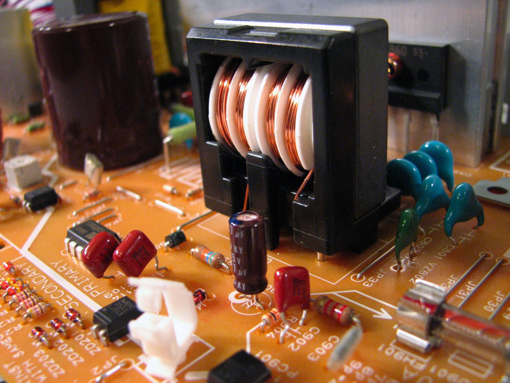
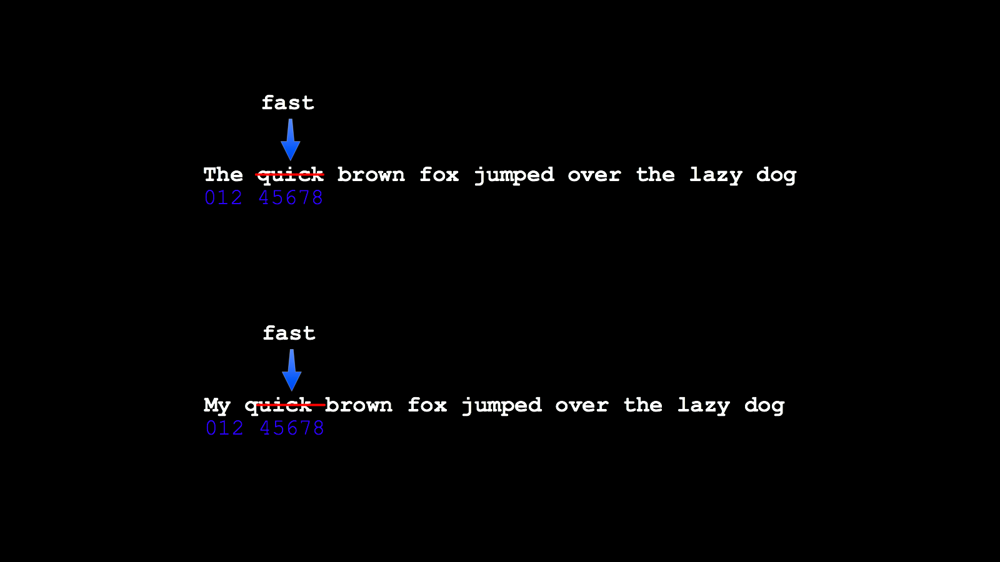
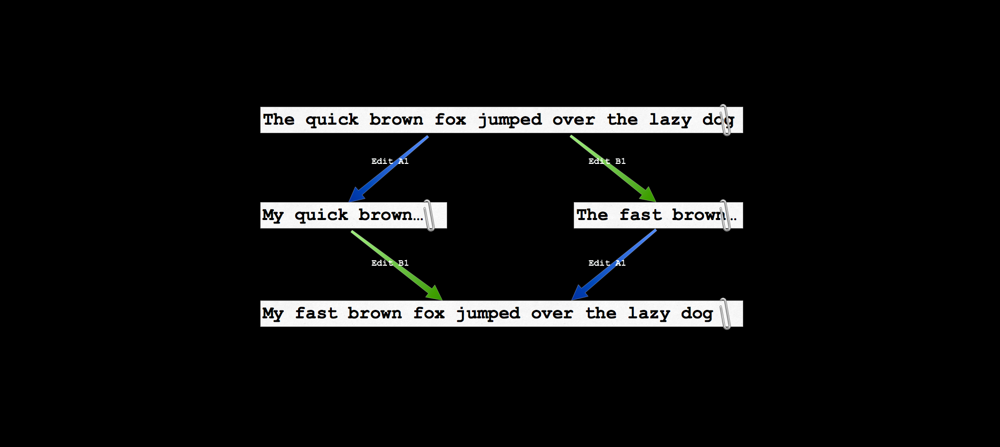
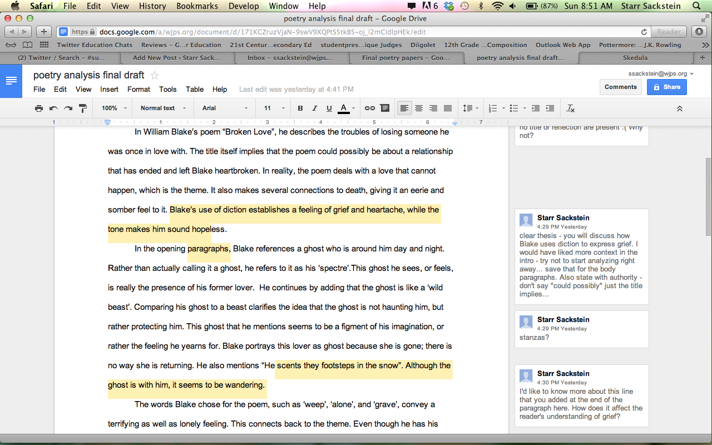
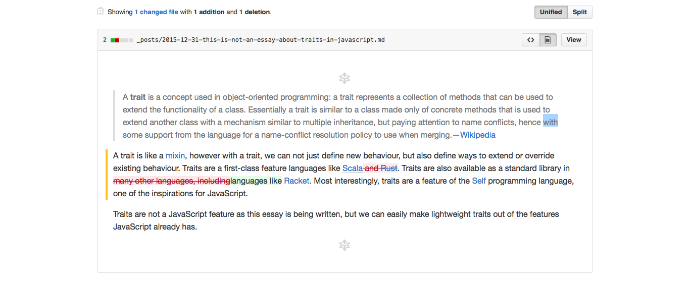

footer: © 2016 Reginald Braithwaite. [Some rights reserved](http://creativecommons.org/licenses/by-sa/4.0/).
slidenumbers: true
autoscale: true


^ https://www.flickr.com/photos/fatedenied/7335413942

^ The Command Pattern

---

# First-Class Commands
### an unexpectedly fertile design pattern


^ https://www.flickr.com/photos/fatedenied/7335413942

---

> why do we care about commands?

---


^ https://www.flickr.com/photos/fatedenied/7335413942

^ Let's get started

---


## the canonical example:

# mutable data

---

```javascript
class Buffer {
  constructor (text = '') { this.text = text; }

  replaceWith (replacement, from = 0, to = this.text.length) {
    this.text = this.text.slice(0, from) +
                  replacement +
                  this.text.slice(to);
    return this;
  }

  toString () { return this.text; }
}
```

---

```javascript
let buffer = new Buffer();

buffer.replaceWith(
  "The quick brown fox jumped over the lazy dog"
);
buffer.replaceWith("fast", 4, 9);
buffer.replaceWith("canine", 40, 43);
 //=> The fast brown fox jumped over the lazy canine
```

---

## `buffer`
# is an object

---

# we treat objects as first-class entities


^ https://www.flickr.com/photos/mwichary/2406482529

---

## `replaceWith`
# is a method

---

# we can treat methods as first-class entities


^ https://www.flickr.com/photos/tompagenet/8580371564

^ e.g. decorators

---

## `buffer.replaceWith("fast", 4, 9)`
# is an invocation

---

# what does it mean to treat an invocation as a first-class entity?


^ https://www.flickr.com/photos/ooocha/2869485136

^ Talk about invocations being ephemeral and tied up with mutable state, some visible, some hidden.

---

# store it



^ https://www.flickr.com/photos/oskay/2550938136

---

```javascript
class Edit {
  constructor (buffer, {replacement, from, to}) {
    this.buffer = buffer;
    Object.assign(this, {replacement, from, to});
  }

  doIt () {
    this.buffer.text =
      this.buffer.text.slice(0, this.from) +
      this.replacement +
      this.buffer.text.slice(this.to);
    return this.buffer;
  }
}
```

---

```javascript
class Buffer {
  constructor (text = '') { this.text = text; }

  replaceWith (replacement, from = 0, to = this.text.length) {
    return new Edit(this, {replacement, from, to});
  }

  toString () { return this.text; }
}
```

---

```javascript
let buffer = new Buffer(), jobQueue = [];

jobQueue.push(
  buffer.replaceWith(
    "The quick brown fox jumped over the lazy dog"
  )
);
jobQueue.push( buffer.replaceWith("fast", 4, 9) );
jobQueue.push( buffer.replaceWith("canine", 40, 43) );

while (jobQueue.length > 0) {
  jobQueue.shift().doIt();
}
 //=> The fast brown fox jumped over the lazy canine
```

^ Presto, a job queue!

---

# query it


^ https://www.flickr.com/photos/baccharus/4474584940

---

```javascript
class Edit {

  netChange () {
    return this.from - this.to + this.replacement.length;
  }
}
```

---

```javascript
let buffer = new Buffer();

buffer.replaceWith(
    "The quick brown fox jumped over the lazy dog"
).netChange();
 //=> 44

buffer.replaceWith("fast", 4, 9).netChange();
 //=> -1
```

---

# transform it


^ https://www.flickr.com/photos/micurs/4906349993

---

```javascript
class Edit {

  reversed () {
    let replacement = this.buffer.text.slice(this.from, this.to),
        from = this.from,
        to = from + this.replacement.length;
    return new Edit(buffer, {replacement, from, to});
  }
}
```

---

```javascript
let buffer = new Buffer(
  "The quick brown fox jumped over the lazy dog"
);

let doer = buffer.replaceWith("fast", 4, 9),
    undoer = doer.reversed();

doer.doIt();
  //=> The fast brown fox jumped over the lazy dog

undoer.doIt();
  //=> The quick brown fox jumped over the lazy dog
```

---

# all together now


^ https://www.flickr.com/photos/purdman1/2875431305

---

```javascript
class Buffer {

  constructor (text = '') {
    this.text = text;
    this.history = [];
    this.future = [];
  }

}
```

---

```javascript
class Buffer {

  replaceWith (replacement, from = 0, to = this.length()) {
    let doer = new Edit(this, {replacement, from, to}),
        undoer = doer.reversed();

    this.history.push(undoer);
    this.future = [];
    return doer.doIt();
  }

}
```

---

# `undo`


^ https://www.flickr.com/photos/daryl_mitchell/15427050433

---

```javascript
class Buffer {

  undo () {
    let undoer = this.history.pop(),
        redoer = undoer.reversed();

    this.future.unshift(redoer);
    return undoer.doIt();
  }

}
```

---

```javascript
let buffer = new Buffer(
  "The quick brown fox jumped over the lazy dog"
);

buffer.replaceWith("fast", 4, 9)
  //=> The fast brown fox jumped over the lazy dog

buffer.replaceWith("canine", 40, 43)
  //=> The fast brown fox jumped over the lazy canine
```

---

```javascript
buffer.undo()
  //=> The fast brown fox jumped over the lazy dog

buffer.undo()
  //=> The quick brown fox jumped over the lazy dog
```

---

# `redo`


^ https://www.flickr.com/photos/the00rig/3753005997

---

```javascript
class Buffer {

  redo () {
    let redoer = this.future.shift(),
        undoer = redoer.reversed();

    this.history.push(undoer);
    return redoer.doIt();
  }

}
```

---

```javascript
buffer.redo()
  //=> The fast brown fox jumped over the lazy dog

buffer.redo()
  //=> The fast brown fox jumped over the lazy canine
```

---

# that's the basic command pattern


^ https://www.flickr.com/photos/robbie1/8656027235

---

# invocations as first-class entities:

## we stored them;
## we queried them;
## we transformed them.


^ https://www.flickr.com/photos/mwichary/2406489333

---

# question!


^ https://www.flickr.com/photos/pedrosimoes7/17386505158

---

```javascript
class Buffer {

  replaceWith (replacement, from = 0, to = this.length()) {
    let doer = new Edit(this, {replacement, from, to}),
        undoer = doer.reversed();

    this.history.push(undoer);
    this.future = [];
    return doer.doIt();
  }

}
```

---

# why do we have to throw the future away?


^ https://www.flickr.com/photos/a-barth/2846621384

---

```javascript
class Buffer {

  replaceWith (replacement, from = 0, to = this.length()) {
    let doer = new Edit(this, {replacement, from, to}),
        undoer = doer.reversed();

    this.history.push(undoer);
    // this.future = [];
    return doer.doIt();
  }

}
```

---

```javascript
let buffer = new Buffer(
  "The quick brown fox jumped over the lazy dog"
);

buffer.replaceWith("fast", 4, 9);
  //=> The fast brown fox jumped over the lazy dog

buffer.undo();
  //=> The quick brown fox jumped over the lazy dog

buffer.replaceWith("My", 0, 3);
  //=> My quick brown fox jumped over the lazy dog
```

---

# what happens when we evaluate `buffer.redo()`?


^ https://www.flickr.com/photos/mleung311/9468927282

---

# "My qfastbrown fox jumped over the lazy dog"


^ https://www.flickr.com/photos/bludgeoner86/5590795033

^ because our commands are coupled to ephemeral state, changing the state breaks the command

---



---

# let's consider commands as a history


^ https://www.flickr.com/photos/49024304@N00/

---
### `let buffer = new Buffer("The quick brown fox jumped over the lazy dog");`

```javascript
"The quick brown fox jumped over the lazy dog"

// PAST

// FUTURE
```

---
### `buffer.replaceWith("fast", 4, 9)`

```javascript
"The fast brown fox jumped over the lazy dog"

// PAST
replaceWith("fast", 4, 9)

// FUTURE
```

---
### `buffer.undo()`

```javascript
"The quick brown fox jumped over the lazy dog"

// PAST

// FUTURE
replaceWith("fast", 4, 9)
```

---
### `buffer.replaceWith("My", 0, 3)`

```javascript
"My quick brown fox jumped over the lazy dog"

// PAST
replaceWith("My", 0, 3)

// FUTURE
replaceWith("fast", 4, 9)
```

---
### `buffer.redo()`

```javascript
"My qfastbrown fox jumped over the lazy dog"

// PAST
replaceWith("My", 0, 3)
replaceWith("fast", 4, 9)

// FUTURE
```

---

# every command depends on the history of commands preceding it


^ https://www.flickr.com/photos/29143375@N05/4575806708

---

# prepending a command into its history alters the command


^ https://www.flickr.com/photos/30239838@N04/4268147953

---

```javascript
let buffer = new Buffer(
  "The quick brown fox jumped over the lazy dog"
);

let fast = new Edit(
    buffer,
    { replacement: "fast", from: 4, to: 9 }
  );

let my = new Edit(
    buffer,
    { replacement: "My", from: 0, to: 3 }
  );
```

---

```javascript
let buffer = new Buffer(
  "The quick brown fox jumped over the lazy dog"
);

let fast = new Edit(
    buffer,
    { replacement: "fast", from: 4, to: 9 }
  );

let my = new Edit(
    buffer,
    { replacement: "My", from: 0, to: 3 }
  );
```

---

```javascript
class Edit {

  isBefore (other) {
    return other.from >= this.to;
  }

}

fast.isBefore(my);
  //=> false

my.isBefore(fast);
  //=> true
```

---

```javascript
class Edit {

  prependedWith (other) {
    if (this.isBefore(other)) {
      return this;
    }
    else if (other.isBefore(this)) {
      let change = other.netChange(),
          {replacement, from, to} = this;

      from = from + change;
      to = to + change;
      return new Edit(this.buffer, {replacement, from, to})
    }
  }

}
```

---

```javascript
my.prependedWith(fast)
  //=> buffer.replaceWith("My", 0, 3)

fast.prependedWith(my)
  //=> buffer.replaceWith("fast", 3, 8)
```

---

```javascript
my.prependedWith(fast)
  //=> buffer.replaceWith("My", 0, 3)

fast.prependedWith(my)
  //=> buffer.replaceWith("fast", 3, 8)
```

---

```javascript
class Buffer {

  replaceWith (replacement, from = 0, to = this.length()) {
    let doer = new Edit(this, {replacement, from, to}),
        undoer = doer.reversed();

    this.history.push(undoer);
    this.future = this.future.map(
      (edit) => edit.prependedWith(doer)
    );
    return doer.doIt();
  }

}
```

---

# let's start over


^ https://www.flickr.com/photos/benetd/4429314827

---

```javascript
let buffer = new Buffer(
  "The quick brown fox jumped over the lazy dog"
);

buffer.replaceWith("fast", 4, 9);
  //=> The fast brown fox jumped over the lazy dog

buffer.undo();
  //=> The quick brown fox jumped over the lazy dog

buffer.replaceWith("My", 0, 3);
  //=> My quick brown fox jumped over the lazy dog

buffer.redo();
```

---

# "My fast brown fox jumped over the lazy dog"


^ https://www.flickr.com/photos/katiethebeau/16670836007

---

# what did fixing `redo` teach us about invocations as first-class entities?

---

> "People assume that time is a strict progression of cause to effect, but *actually* from a non-linear, non-subjective viewpoint—it's more like a big ball of wibbly wobbly… time-y wimey… stuff."


^ https://www.flickr.com/photos/shimgray/2811100997

^ https://www.youtube.com/watch?v=mDsN5lWLKU0

---

# `reversed()` and `prependedWith()` show us we can change both the direction and order of time.

---


^ "Alice B. Toklas and Bob Fosse are editing a script"

---

```javascript
let alice = new Buffer(
  "The quick brown fox jumped over the lazy dog"
);

let bob = new Buffer(
  "The quick brown fox jumped over the lazy dog"
);
```

---

## for simplicity, we'll omit `undo` , `redo` and `reversed`

```javascript
class Buffer {

  constructor (text = '') {
    this.text = text;
    this.history = [];
  }

}
```

---

```javascript
class Buffer {

  replaceWith (replacement, from = 0, to = this.length()) {
    let edit = new Edit(this,
                   {replacement, from, to}
                 );

    this.history.push(edit);
    return edit.doIt();
  }

}
```

---

```javascript
alice.replaceWith("My", 0, 3);
  //=> My quick brown fox jumped over the lazy dog

bob.replaceWith("fast", 4, 9);
  //=> The fast brown fox jumped over the lazy dog
```

---



---

```javascript
class Buffer {

  append (theirEdit) {
    this.history.forEach( (myEdit) => {
      theirEdit = theirEdit.prependedWith(myEdit);
    });
    return new Edit(this, theirEdit).doIt();
  }

}
```

---

```javascript
class Buffer {

  appendAll(otherBuffer) {
    otherBuffer.history.forEach(
      (theirEdit) => this.append(theirEdit)
    );
    return this;
  }

}
```

---

```javascript
alice.appendAll(bob);
  //=> My fast brown fox jumped over the lazy dog

bob.appendAll(alice);
  //=> My fast brown fox jumped over the lazy dog
```

---

### 🐛

^ "We have a little bug."

---


^ "Okay, a big bug! We can't appendAll more than once. Shared mutable data everywhere."

---

```javascript
let GUID = () => ???

class Buffer {

  constructor (text = '', history = []) {
    let befores = new Set(history.map(e => e.guid));
    history = history.slice(0);
    Object.assign(this, {text, history, befores});
  }

  share () {
    return new Buffer(this.text, this.history);
  }

}
```
^ We're going to use guids and a set of before guids in the buffer and the edits

^ let GUID = () => {
^     let _p8 = (s) => {
^         let p = (Math.random().toString(16)+"000000000").substr(2,8);
^
^         return s ? "-" + p.substr(0,4) + "-" + p.substr(4,4) : p ;
^     }
^     return _p8() + _p8(true) + _p8(true) + _p8();
^ }

---

```javascript
class Edit {

  constructor (buffer,
    { guid = GUID(), befores = new Set(),
      replacement, from, to }) {
    this.buffer = buffer;
    befores = new Set(befores);

    Object.assign(this,
                  {guid, replacement, from, to, befores});
  }

}
```

---

```javascript
class Buffer {

  has (edit) { return this.befores.has(edit.guid); }

  perform (edit) {
    if (!this.has(edit)) {
      this.history.push(edit);
      this.befores.add(edit.guid);
      return edit.doIt();
    }
  }

}
```

^ now we check edits before we perform them

---

```javascript
class Buffer {

  replaceWith (replacement,
               from = 0, to = this.length()) {
    let befores = this.befores,
    let edit = new Edit(this,
                   {replacement, from, to, befores}
                 );
    return this.perform(edit);
  }

}
```

^ simplifies `replaceWith`, `append`, and `appendAll`

---

```javascript
class Buffer {

  append (theirEdit) {
    this.history.forEach( (myEdit) => {
      theirEdit = theirEdit.prependedWith(myEdit);
    });
    return this.perform(new Edit(this, theirEdit));
  }

}
```

---

```javascript
class Buffer {

  appendAll(otherBuffer) {
    otherBuffer.history.forEach(
      (theirEdit) =>
        this.has(theirEdit) || this.append(theirEdit)
    );
    return this;
  }

}
```

---

```javascript
class Edit {

  prependedWith (other) {
    if (this.isBefore(other) ||
        this.befores.has(other.guid) ||
        this.guid === other.guid) return this;

    let change = other.netChange(),
        {guid, replacement, from, to, befores} = this;

    from = from + change;
    to = to + change;
    befores = new Set(befores);
    befores.add(other.guid);

    return new Edit(this.buffer, {guid, replacement, from, to, befores});
  }

}
```

---


^ "Alice, Bob, and *Carol* are editing a script"

---

```javascript
let alice = new Buffer(
  "The quick brown fox jumped over the lazy dog"
);

let bob = alice.share();
  //=> The quick brown fox jumped over the lazy dog

alice.replaceWith("My", 0, 3);
  //=> My quick brown fox jumped over the lazy dog
```

---

```javascript
let carol = alice.share();
  //=> My quick brown fox jumped over the lazy dog

bob.replaceWith("fast", 4, 9);
  //=> The fast brown fox jumped over the lazy dog

alice.appendAll(bob);
  //=> My fast brown fox jumped over the lazy dog
```

---

```javascript
bob.appendAll(alice);
  //=> My fast brown fox jumped over the lazy dog

alice.replaceWith("spotted", 8, 13);
  //=> My fast spotted fox jumped over the lazy dog

bob.appendAll(alice);
  //=> My fast spotted fox jumped over the lazy dog

carol.appendAll(bob);
  //=> My fast spotted fox jumped over the lazy dog
```

---

> "Unfortunately, implementing OT sucks. There's a million algorithms with different tradeoffs, mostly trapped in academic papers. The algorithms are really hard and time consuming to implement correctly."


^ https://www.flickr.com/photos/wordridden/4308645407

^ Joseph Gentle, from https://en.wikipedia.org/wiki/Operational_transformation

^ too much responsibility in edits, and we have an XY problem

---

# perhaps we should borrow a trick from react, and periodically scan a "shadow buffer" for diffs that we exchange with collaborators…

^ congratulations, now we're talking differential synchronization. See Electron, Google Docs

^ See also: https://neil.fraser.name/writing/sync/

---

# differential synchronization



---

# this is a very big problem space

---


^ https://www.flickr.com/photos/sidelong/18620995913

^ There are only two hard problems in computer science: Cache invalidation, and naming things--Phil Karleton

---

```javascript
class Buffer {

  replaceWith () { ... }

  share () { ... }

  append () { ... }

  appendAll () { ... }

}
```

---

```javascript
class Branch {

  commit () { ... }

  fork () { ... }

  cherryPick () { ... }

  merge () { ... }

}
```

---

# distributed version control



---

# with invocations as first-class entities, we can build distributed algorithms and protocols; we can master time and change

---


^ https://www.flickr.com/photos/stawarz/3848824508

---

> "Never confuse the example given of a pattern, with the underlying idea the pattern represents."


^ https://www.flickr.com/photos/mwichary/3338901313

---

# Reg Braithwaite<br>PagerDuty, Inc.
### https://speakerdeck.com/raganwald/first-class-commands-an-unexpectedly-fertile-design-pattern

### [raganwald.com](http://raganwald.com)<br>[@raganwald](https://twitter.com/raganwald)


^ https://leanpub.com/javascriptallongesix


