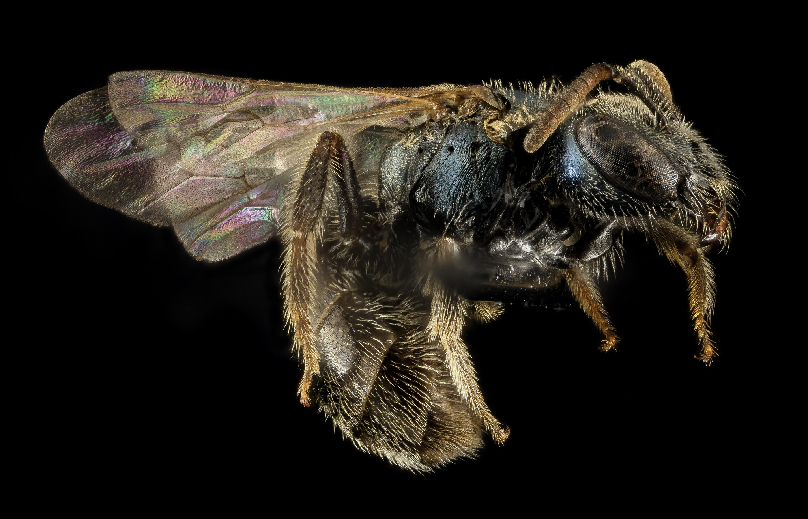
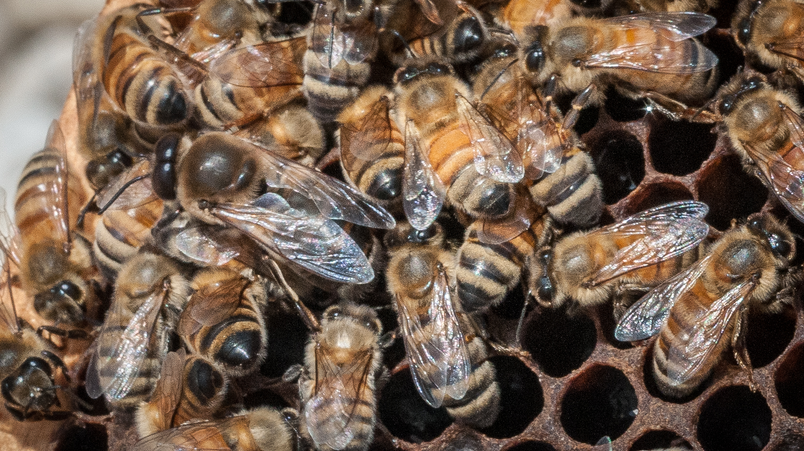

^ https://www.flickr.com/photos/usgsbiml/19987036192

^ The Command Pattern

---

# The Command Pattern

^ https://www.flickr.com/photos/usgsbiml/19987036192

---

^ https://www.flickr.com/photos/usdagov/9112267161

---

## A Mutable Data Structure

^ https://www.flickr.com/photos/usdagov/9112267161

---

---

## Operations

- `insert`
- `delete`

---

### Operations as Functions

---

### Operations as Methods

---

## "Design Patterns"

### Implementing Undo and Redo with Operations

---

### Naked Objects

---

### RESTful Operations

