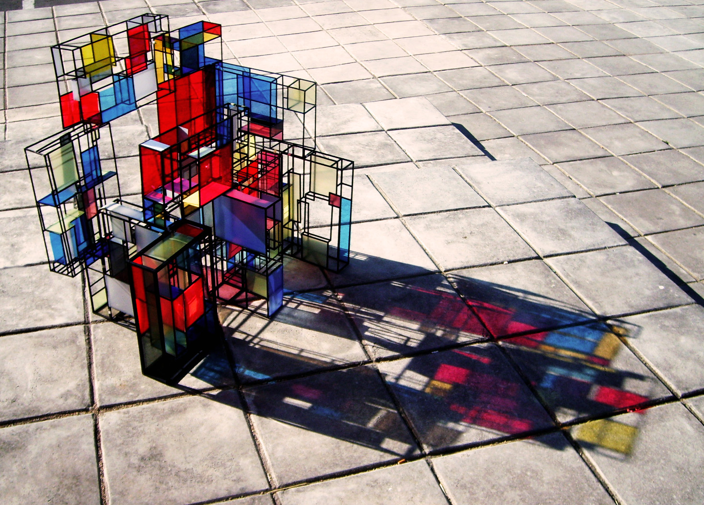
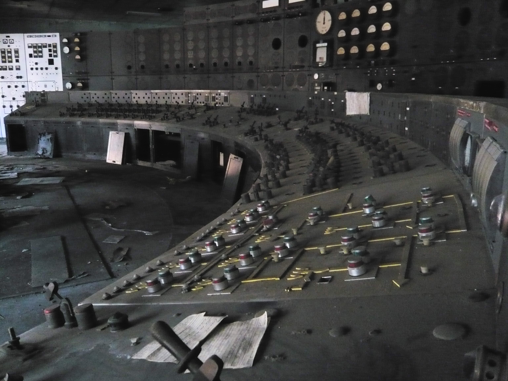

^ https://www.flickr.com/photos/tomasfano/4273062984

^ Writing Composable JavaScript with Decorators and Adaptors

---

### Writing Composable JavaScript with

# Decorators and Adaptors

^ https://www.flickr.com/photos/tomasfano/4273062984

---

^ https://www.flickr.com/photos/pi-p/1537989163

^ The Three Dimensions of Scale

---

### The Three Dimensions of

# Scale

^ https://www.flickr.com/photos/pi-p/1537989163

---

^ https://www.flickr.com/photos/davelawler/5744858794

---

# Time

^ https://www.flickr.com/photos/davelawler/5744858794

---

^ https://www.flickr.com/photos/15609463@N03/8579590420

---

# Space

^ https://www.flickr.com/photos/15609463@N03/8579590420

---

^ https://www.flickr.com/photos/fabien_lemetayer/11762940935

---

# Team

^ https://www.flickr.com/photos/fabien_lemetayer/11762940935

---

^ https://www.flickr.com/photos/nearnearfuture/2637214830

---

### What is the

# Relationship

## between Flexibility and Scale?

^ https://www.flickr.com/photos/nearnearfuture/2637214830

---

^ https://www.flickr.com/photos/mknowles/47457221

---

### The Right kind of

# Flexibility

^ https://www.flickr.com/photos/mknowles/47457221

---

^ https://www.flickr.com/photos/jasoneppink/500239660

---

### The Wrong kind of

# Flexibility

^ https://www.flickr.com/photos/jasoneppink/500239660
