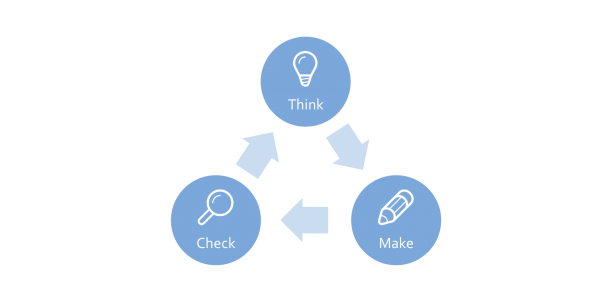
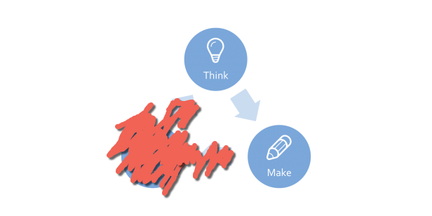
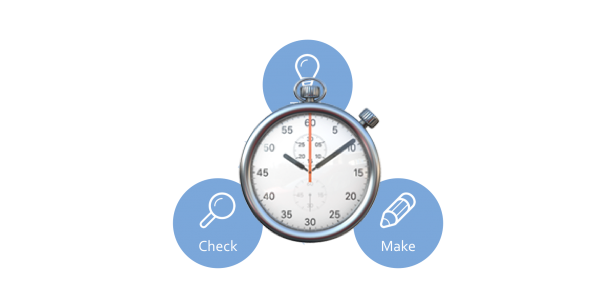
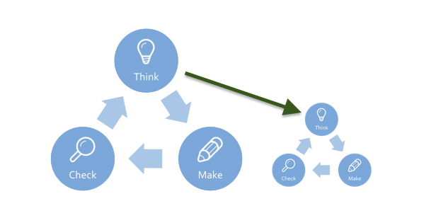
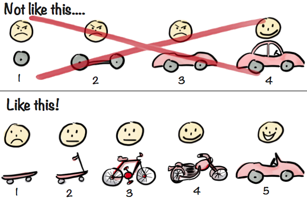
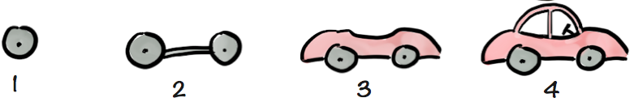
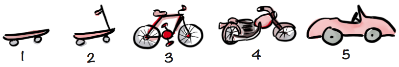

build-lists: true
footer: PagerDuty
slidenumbers: true

# Lean Software Development

---

# Objective:

"To have a shared common understanding of Lean Software Development, and a shared vocabulary for discussing how it applies to PagerDuty."

---

# The Tactics:

- Decide what we want to improve
- Make an introductory presentation
- Note what could be better

---

# The Strategy:

Lather, rinse, repeat until "done."

---

^ "Our process"

^ http://www.usabilityblog.de/2015/08/lean-ux-8-schlanke-grundsaetze-um-die-user-experience-zu-verbessern/

---

# Terminology:

- Decide what we want to improve: "Think"
- Make an introductory presentation: "Make"
- Note what could be better: "Check"

---

^ "The simplest possible lean"

^ http://www.usabilityblog.de/2015/08/lean-ux-8-schlanke-grundsaetze-um-die-user-experience-zu-verbessern/

---

# Wait!

^ How can this be the simplest?

---

---

# Done-ness

- We're "done" when we have some better/higher use of our time...
- **In other words**: We're done when we have a higher priority.

---

# The assumption behind think-make

> Our priorities _now_ will be the same when we're done with **Make**

---

---

# The Invasion of Time

^ Our priorities change as time passes

---

# What changes priorities?

- Our customers advance their understanding of our products
- We engineers advance our understanding of our code
- Our competitors shift the product landscape
- Our management team advances its understanding of how to win

---

# How to manage time

---

---

# Debiggening Development

- Have one thought at a time.
- Build one thing at a time.
- Check one thing at a time.

---

# Debiggening Thinking

Delay decisions as long as possible

---

# Debiggening Building

Build the simplest thing that could possibly work

Make it easy to throw away, not easy to change

---

# Debiggening Checking

Small, isolated changes are the easiest to measure

---

^ Summary

---

# So what's a skateboard, anyways?

---

^ http://blog.crisp.se/2016/01/25/henrikkniberg/making-sense-of-mvp

^ Henrik Kniberg

---

# What are the differences between:

# and:

---

^ http://news.nationalgeographic.com/2015/08/150803-space-nasa-asteroids-comets-nuclear-weapons-defense/

---

# Thank you!
