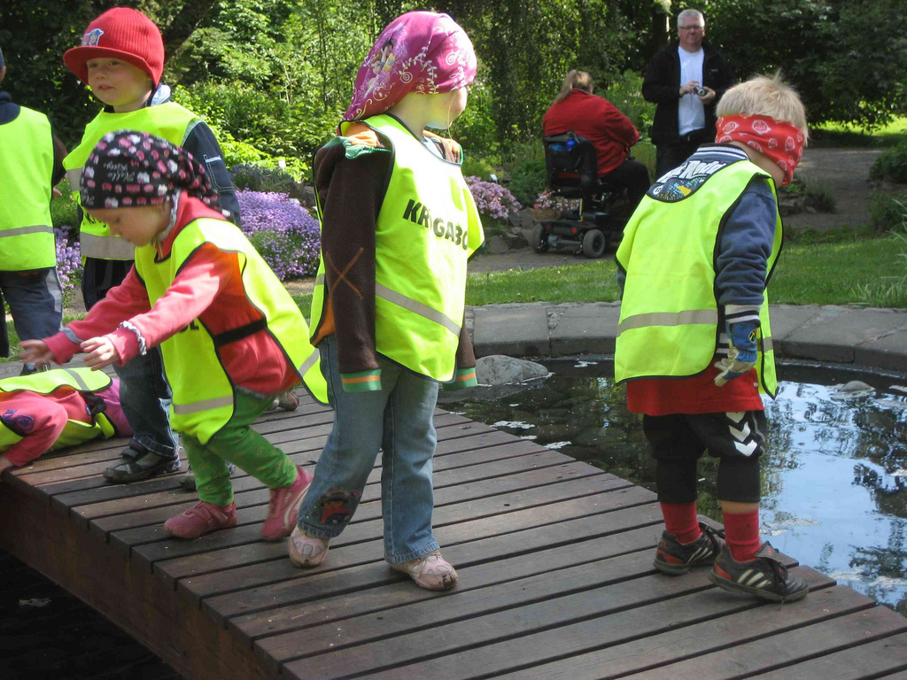
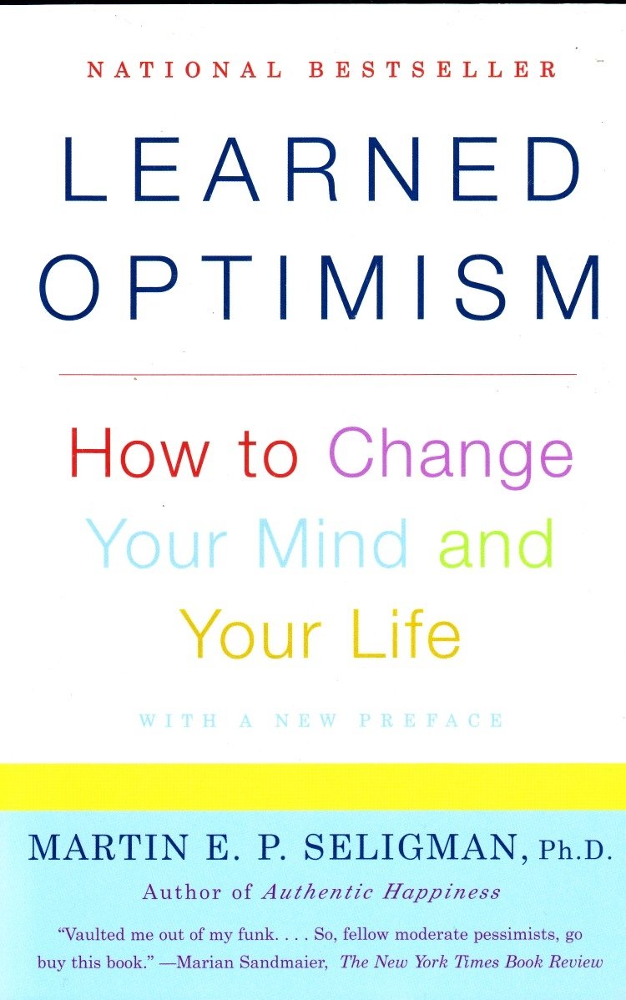

footer: NDC Oslo | @raganwald
slidenumbers: false

# Optimism and the Growth Mindset

^ © 2017 Reginald Braithwaite. [Some rights reserved](http://creativecommons.org/licenses/by-sa/4.0/).

^ Note to the reader: This document is written in [Markdown], a somewhat human-readable markup language. It is processed by a program called [DeckSet], which turns it into a presentation. DeckSet does various things such as treating every paragraph that begins with a caret (`^`) into a speaker's note that is not visible to the audience.

[Markdown]: https://en.wikipedia.org/wiki/Markdown
[DeckSet]: http://www.decksetapp.com

^ You may be looking at a partially-rendered version of this document, thanks to GitHub's ability to render basic MarkDown in the browser as formatted text. If so, you can look at the original document by clicking the [Raw] link above.

[Raw]: https://raw.githubusercontent.com/raganwald/presentations/master/optimism-ii.md

^ I delivered this version at [NDC Oslo]. The fully rendered slides are on [SpeakerDeck], and you can download a PDF there as well.

[SpeakerDeck]: https://speakerdeck.com/raganwald/optimism-ii
[NDC Oslo]: http://ndcoslo.com

^ Some people have pointed out that DeckSet's MarkDown is not an excellent format for reading the material as compared to an essay. This is true. In its favour, you can't read a PowerPoint or KeyNote presentation's raw file *at all*, nor can you do interesting things like submit your own [pull request] on GitHub, so MarkDown does have some interesting affordances.

[pull request]: https://github.com/raganwald/presentations/pulls?q=is%3Apr+is%3Aclosed

^ Thanks for reading this, and feel free to post an [Issue](https://github.com/raganwald/presentations/issues).

---

^ https://www.flickr.com/photos/aigle_dore/10017474965

^ I am going to talk about Optimism, and conversely, about Pessimism.

^ I'm going to describe a framework for understanding why some people are optimistic and some are pessimistic. And I'm going to explain how you can actually become more optimistic in your life.

^ Then I'm going to talk about another framework called "Mindsets", this one for personal growth and agency. And I'll do my best to fit the two frameworks together.

^ Here we go!

---

# **Learned** Optimism

^ Some years ago, I was in an especially low point and I happened upon a book that changed my life. I cannot guarantee that it will change *your* life. "Chance favours the prepared mind," they say, and perhaps it can only change your life if you happen upon it at an inflection point, at a time when your life is ready to change.

^ I needed some change, I was open to change, and with this book, I changed.

^ The book is "[Learned Optimism](http://www.amazon.com/gp/product/1400078393?ie=UTF8&amp;tag=raganwald001-20&amp;linkCode=as2&amp;camp=1789&amp;creative=390957&amp;creativeASIN=1400078393 "Amazon.com: Learned Optimism: How to Change Your Mind and Your Life: Martin E. P. Seligman: Books")," by Dr. Martin Seligman. I'm not going to stand here and read the book aloud, you know that. But I am going to simplify it down to a few points, and you might very well think the book is too simplistic to be worth reading.

^ But trust me on this: **You should not judge a book solely by whether you like what I said about it in a short talk**. Read it for yourself and decide.

---

^ https://www.flickr.com/photos/aigle_dore/9761062125

^ So Dr. Seligman did some research on optimism and success, and the results surprised him, and after a lot of back-and-forth with colleagues and more research, he came up with a theory, and a side-business of selling tests that predict whether salespeople are going to be successful.

^ I want to emphasize the word **research**, because the plural of anecdote is not data. No matter how many nice people like me tell you something from our experience, it is not the same thing as what Dr. Seligman does to come up with this stuff.

^ Dr. Seligman's theory is all about how people explain things to themselves. We all do this, it's part of the whole sentience thing we have going on. Something happens, and we make up a little theory about why it happened.

^ This matters, because our theories about why the world is the way it is is what drives all of the choices we make. That's what drives us as humans.

^ Whether we are aware of it or not, we're making up these explanations for events that concern us all the time.

---

# Dr. Seligman's Claims

^ So, these explanations.

^ Dr. Seligman makes two claims about the explanations we make.

---

^ https://www.flickr.com/photos/spanginator/5372051028

^ The first is that we have patterns for our explanations, and that by testing our explanations, we can identify the patterns. And by identifying the patterns, we can come up with a prediction for our behaviour.

^ He gives us a test, he computes a number with the result, and he calls the resulting scalar "optimism," and he claims that people with high optimism are more productive and happier and whatever else that is nice than people with low optimism. And he thinks he has the numbers to prove it.

---

# The Second Claim

^ His second claim is that with cognitive behavioural therapy, you can change the patterns in your explanations.

^ Further, he claims that this increases your optimism. And that this changes your mood and your productivity.

^ And again, he went out and tested his claim and again he has research he claims proves it.

---

^ https://www.flickr.com/photos/bjarkis/4665751943

^ This is an absolutely **crucial** claim. If the first claim was true, but not the second, this would be like being able to diagnose an ailment, but being unable to cure it.

^ But this claim says that we can measure whether we are optimistic or pessimistic, and then we can make ourselves more optimistic. We can cure the ailment.

---

# Explanatory Theory

^ Dr. Seligman's work is based on **Explanatory Theory**. This is the theory that the explanations we make up for things that happen in our lives have a strong impact on our moods and behaviour.

^ It is not controversial to say that our moods affect the explanations we make up for things that happen in our lives. If we are in a good mood and someone smiles at us, we think they like us. If we are in a bad mood, we wonder if they have read some awkward code we just checked in, and if they are laughing at us.

^ Explanatory Theory takes it a step further and says that the explanations we make up for things also affect our moods and behaviour. That if we deliberately tell ourselves that someone is smiling because they like us, that we will be happier than if we tell ourselves that they are laughing at us.

---

^ Hey! Some code!!

^ In 2009, I was registering for a conference called RubyFringe. And someone I respect very much walked up to me, introduced themselves, then told me that they didn't like the [andand gem](http://andand.rubyforge.org/ "Object#andand") that I wrote.

^ So how did I explain this to myself?

^ Dr. Seligman explains that when we make up an explanation for things, we have three fairly binary properties or axes for each explanation.

---

^ https://www.flickr.com/photos/aigle_dore/22080495601

^ First, we decide whether something is personal or impersonal.

^ So how did I explain the `andand` comment to myself? If I thought there was something inherently wrong with **me** as a developer that I could write something like `andand`, that's personalizing the explanation.

^ I might say something like this…

---

### Some people like andand, because
# **I**
### something-something.

^ On the other hand, if I explain them not liking my work as reflecting upon them and their values--and I don't mean this in a  negative way--that's *depersonalizing* the explanation.

^ In that case, I might say…

---

### Some people dislike andand, because
# **they**
### something-something.

---

### summary
# Personal vs. Impersonal

^ So there's the first axis, *personal vs. impersonal*. We can listen to someone's explanations for why things happened in their lives, and we can decide whether their explanations tend to be more personal or impersonal. In other words, we can *measure* personalization.

^ Dr. Seligman did exactly that: He gathered lots of subjects and measured their personalization using objective criteria. He also measured their moods using standard criteria and furthermore, he measured their success in life, and the results were very interesting.

---

^ https://www.flickr.com/photos/aigle_dore/9997796545

^ The second axis or binary property is **specific vs. general**.

^ Remember the person who didn't like `andand`? Did I take this as a suggestion that they didn't like this one little thing I wrote, maybe twenty or thirty lines of code?

^ Or did I conclude that they didn't like all of my code? Or that they didn't like my work in even more general terms, like disliking my writing and ideas as well?

^ Sometimes, when something happens, we reason about that one specific event on its own. And sometimes, we generalize our explanation: We conclude that the event is a specific case of a set of events that apply across many aspects of our lives.

^ For example, when something I write about code hits the front page of Hacker News, I might say…

---

## Hacker News liked **this blog post**.

^ That is very specific. It's one permutation of words. But I could also say:

---

## Hacker News validated **my experience** as a programmer.

^ That's a "general" explanation, it speaks to my experience, a factor that can contribute to a very broad set of events, this is just one particular positive consequence.

^ Note that both explanations are perfectly true! The choice of explanation is a question of perspective, of emphasis, not of right or wrong.

---

### summary
# Specific vs. General

^ And thus it is with our explanations for the things that happen in our lives. Some of the explanations we make up are specific. Some of the explanations are general. And "specific vs. general" is the second axis of Dr. Seligman's explanatory theory.

---

^ https://www.flickr.com/photos/ronkroetz/19700031749

^ The third and final axis--thanks for your patience with my explanations--is **temporal**. Some explanations describe an event as a result of **temporary** phenomena. And other explanations describe an event in terms of **permanent** phenomena.

^ I've spoken about some code and about writing about code, let me give an example from working with other people.

^ Recently, PagerDuty started up a new team. As the most experienced developer on the team, I had a lot of experience to contribute. But we also work in a very egalitarian way: I do not have a fancy title like "Technical Lead" or "Architect."

^ Any ways, I worked very hard to evangelize and support a particularly lean approach to development, where our iterations were pared down to the minimum required to learn important things we would use in subsequent iterations.

^ And thanks to some great people who brought an equal amount of energy and good ideas to the work, we did some very good work that I'm very proud of, and the feedback has been fantastic.

^ So there are some explanations already, but let me isolate the temporal idea. I could tell you:

---

## Our work made **this project** a success.

^ And that would be perfectly true.

^ I could also tell you…

---

## This was one highlight in my and PagerDuty's **ongoing growth**.

^ And that would be just as true.

---

### summary
# Temporary vs. Permanent

^ So there you have two more ways of explaining something: Is it temporary? Or is it permanent? Did it happen just this specific time? Or is an on-going part of our lives?

^ And neither explanation has to be wrong. It's just a question of what we emphasize to ourselves.

---

# The Recap

^ When we explain something in our heads, our explanations have three properties that matter to whether we are optimistic or not: Whether we explain things in a *personal or impersonal way*, whether we explain things in a *specific or general way*, and whether we explain things in a *temporary or permanent way*.

^ And my proposition is that both productive and unproductive people can be observed describing things as personal, as general, and as permanent. And although I haven't given examples today, I assure you that both productive and unproductive people can also be observed describing things as impersonal, specific, and temporary.

^ Given that Dr. Seligman was able to take these observations and turn them into a metric for measuring optimism, we can deduce that there is more to this than simply measuring whether someone tends to describe things in these three ways.

^ We can deduce that there is something else, a missing factor. One that will perhaps tell us *when* an optimist will describe something as personal. When an optimist will describe something as specific. And when an optimist will describe something as being temporary.

^ What is this factor?

---

^ https://www.flickr.com/photos/martinofranchi/2042632469

^ When I first read "Learned Optimism," I took a little test in the book, and then Dr. Seligman explained the theory. And based on that theory, I had a model for how I made up explanations.

^ For example, I took criticism of my `andand` gem **personally**, I thought it was a comment on my **general** ability as a developer, and I figured that my inability to write popular libraries was **permanent**.

^ And the model told me something else.

^ When I considered a positive event in my life like a successful project, I would have explained that **the company** chose a fruitful product to work on, that I was fortunate to have the **specific** technical skills needed for this project to succeed, and that we happened to be in the right place at the right time, a **temporary** phenomenon.

^ Do you grasp the asymmetry?

---

### I WAS
# Inconsistent

---

^ https://www.flickr.com/photos/borkurdotnet/4493539956

^ I was not consistent. I didn't always explain things one way or the other. More interestingly, I was *consistently inconsistent*: I explained *bad things* as being personal, general, and permanent, but I explained away the good things as being impersonal, specific, and temporary.

^ This may not seem rational. Logically, each of us ought to be consistent in how we explain the world. But we aren't, or at least some of us aren't.

---

# Pessimists

^ The moment this was revealed to me I could guess what came next. I was a *pessimist*.

^ According to me, all the bad things in my life were everywhere, they followed me around because they were about me, and they lasted forever, while the good things were all about other people, and they only came into my life for short moments.

^ Dr. Seligman had discovered something important: Pessimists had a particular kind of asymmetry in the way they explained good and bad things in their lives.

^ Is this a bad thing? Research has shown that sometimes, pessimistic people make particular kinds of good choices. Being a pessimist in Dr. Seligman's sense is not a pejorative valuation of people as human beings.

^ However, the research is that on balance, pessimists are less happy and make choices that lead to lower performance.

---

# Optimists

^ And Dr. Seligman also discovered that optimists are cheerfully inconsistent, they have the mirror image asymmetry.

^ Like pessimists, optimists do not always explain the world the same way. But to an optimist, someone not liking a piece of code is simply one person (impersonal, specific) not liking that one thing (specific again), for their own reasons (impersonal), and it was just a few words in the middle of a long day (extremely temporary).

^ And to the optimist, they're a good athlete (personal, general) and have been all their life (permanent). That one goal was just another scene in their long-playing movie of game highlights.

^ Optimists explain good things as being personal, general, and permanent, and explain away bad things as being impersonal, specific, and temporary. And if you point out the contradiction in their explanations, they see no contradiction. To them, the bad stuff really isn't about them, it's just that one thing that one time.

^ Again, "optimist" is not a value judgment. At the extremes, optimists might be unrealistic about some of the choices they make. But on balance, optimists make choices that result in being happier and having higher performance.

---

^ https://www.flickr.com/photos/vicmontol/541610754

^ "Learned Optimism" shocked me. I read it a bunch of times and actually bought copies for other people. Besides myself, I knew lots of people who fit Dr. Seligman's pessimist theory.

^ I knew this because they cried on my shoulder about their long-running, personal flaws that affected every part of their lives. They were personal, general, and permanent on the subject of unhappiness. And on the subject of happiness, they were impersonal, specific, and temporary.

^ And the book also explained all the successful people in my life. And it explained why I found it hard to relate to them when they were explaining their success: I had a built-in perspective that was the opposite to theirs, I saw a completely different explanation for everything going on.

^ So there you have it. One predictor of happiness and making high-performance choices is this characteristic Dr. Seligman calls optimism, which he measures by testing whether you explain good or bad events as being personal, general, and permanent, and specifically whether you are asymmetric in your explanations.

---

# **Learned** Optimism

^ This is Dr. Seligman's first claim. What about the second?

^ Well, that is the point of the book. That is why it is called **Learned** Optimism.

^ After explaining how to predict whether people are optimistic or pessimistic based on their explanations, the book  goes on to explain how to use cognitive behavioural therapy to change the way you explain things to yourself.

^ I am not a psychologist, I cannot teach you cognitive therapy at all, much less in less than an hour. So please, read the book and follow the exercises. And I mean, *follow the exercises*.

---

^ https://www.flickr.com/photos/layant/3703241001

^ But the basis of the method is this:

^ You train yourself to make a note of your explanations, every day. Repetition and consistency matters: You have to do it every day.

^ You analyze whether your explanations for good things are personal, general, and permanent. You analyze whether your explanations for bad things are impersonal, specific, and temporary.

^ And then you correct your explanations to make them optimistic. Every time. And you track your progress, just as you would track your progress for anything else you are trying to change in your life.

^ Seligman's research shows that you **can** change the way you explain things, and the research also shows that the change makes you happier and more productive. And by more productive, we mean that you make more productive choices.

---

# Conclusion:

### Changing your explanations through repetition and consistency, changes your life: You become happier and more productive.

^ Learned Optimism resonated with me. I worked on adjusting the way I explained good and bad events to myself, and the way I talked about them with other people, and over time I did become happier, and while it's hard to measure productivity for programming, I observed that I was dropping a lot of my unproductive habits.

^ And now, to Part II.

---

^ https://www.flickr.com/photos/magical-world/4981970535

^ But there was an interesting counterpoint to my experience.

^ I've worked and trained with a number of successful people. Many describe *other* successful people as having personal, general and permanent attributes for success, like being "smart, or "athletic."

^ But they describe their own success as coming from specific and temporary causes, like practise and training. According to the Learned Optimism model, they were a little pessimistic! They saw their success as coming from hard work, or as one person I know put it in a presentation, from "**grit**."

^ What explains this?

---

## a funny thing happened on the way to the forum…

^ I originally wrote about Learned Optimism in 2009 (Here's a copy you can [read for yourself][2009]). I then spoke about it in June 2016. A while after that, Hacker News discovered my speaker's notes.

[2009]: http://braythwayt.com/homoiconic/2009/05/01/optimism.html

^ After each discovery, a few people would share the exact same feedback with me: Dr. Seligman's theories about Learned Optimism conflicted directly with a different theory, **Mindsets**.

---

^ https://www.flickr.com/photos/anieto2k/15867820274

^ Stanford University psychologist Dr. Carol Dweck has also done a lot of research into what makes people productive, and like Dr. Seligman, she also believes that she has a model that explains a class of unproductive people. And also like Dr Seligman, she believes that through a particular type of CBT, unproductive people can change the way they think about the root causes of their success and failure, and that this change results in them becoming successful.

---

# Fixed and Growth Mindsets

^ Dr. Dweck summarized her work in a very famous newsmagazine article, and when that became wildly popular, she wrote a book called **Mindset** explaining how laypeople can learn to better themselves and the people they care for.

^ Once again, I'm not going to read an entire book to you. If you like what I have to say about Dr. Dweck's work, read her book. If you don't like what I have to say about it, read her book and find out what I got wrong. But here goes.

^ Dr. Dweck asked people a lot of clever questions, and based on the answers to those questions, she divided respondents up into two categories: Those with a **fixed** mindset, and those with a **growth** mindset.

---

# The **Fixed** Mindset

^ The fixed mindset is a belief that people have certain predetermined capabilities, and that these capabilities do not change much, if at all, over time. I am smart, or I'm not. You are likeable, or you're not. They are competent, or they're not.

^ People with the fixed mindset believe that activities like studying, training, or practise serve to reveal the fixed capabilities the person always had or never had. So if you are "naturally fit," exercise and sports practise simply brings your natural capability to light.

---

# The **Growth** Mindset

^ The growth mindset is a belief that people do not have predetermined capabilities: People have abilities that grow over time, and that growth is driven by their investment in their own abilities. So I have learned a lot, you have gone out of your way to make friends, and they have a great deal of experience.

^ People with the growth mindset believe that activities like studying, training, and practising increase their abilities. They accept that there are limits to human performance that vary from person to person, but in general everyone can be better at things, and working on your abilities does indeed make you better.

---

^ https://www.flickr.com/photos/davidstanleytravel/4899034463

^ The Mindset model has become very popular amongst laypeople. Dr. Dweck uses anecdotes (both real and composite) to illustrate the conclusions she draws from her research. One such anecdote concerns what happens when we give feedback to children.

^ Dr. Dweck explains it like this: If we praise children for things that appear to be fixed talents, like being "smart" or "athletic," this reinforces a fixed mindset. If we praise children for the results of the things they did to better themselves, like study or practise, this reinforces a growth mindset.

^ So what difference does this make to the children?

^ Well, the answer depends very much on what the children already think of themselves. If a child thinks that they are good at something, if the child thinks they are competent, telling them that they are good at it and that they have accomplished something simply reinforces what they already believed.

^ But what if the child has doubts? This is an important case, because most children have doubts about themselves in one way or another. This is the very basis of being a child, being small and inexperienced and powerless in the world.

---

# Children and the Fixed Mindset

^ When a child has doubts, when they do not firmly believe in their own talent and competency, telling them that they have talent and competency may seem like it will reverse their self-belief. But it doesn't. What it actually does, is reinforce their belief that success and accomplishment comes from fixed talents.

^ We may think that we are telling them, "You are talented," but what they hear is, "People have fixed talents." This is a very important distinction, because what it tells them is that activities like study or practise do not change their talent, they merely serve to reveal what is permanently there.

---

^ https://www.flickr.com/photos/stignygaard/3867959479

^ And if they do not believe in their own fixed talent--and why should they, they are children, it is sensible for a child to feel incompetent at a great many things--then they will perceive activities like study and practise as opportunities to reveal to themselves, and to the world, that they lack the talent.

^ So for them, study and practise and other things that would make them better are not only a waste of time, but they may embarrassingly reveal their lack of talent. So they *avoid* study and practise, and wind up doing *worse* than had we not praised them for being talented.

^ Sadly, I am not spouting conjecture here. Dr. Dweck has studied this behaviour and reports that it is very real. Praising children for fixed talents can actually make their performance worse.

---

# Children and the Growth Mindset

^ What about when we praise children for what they did to perform? What happens when they don't have a lot of confidence in their talent, but we tell them, "Your practise paid off today," or perhaps, "That A on your report card is no accident, you studied hard and deserve it." How do they respond?

^ What they hear now is, "People have talents that can grow." And they hear, "I just grew, and I can grow some more."

---

^ https://www.flickr.com/photos/xavier-gardere/14475132795

^ And many of them go on and practise some more, and study some more, and lo an behold, they get better, and this reinforces the idea that people's abilities are subject to growth and development, and they do more studying and practise.

^ Well, they're children, so they also play games and watch cartoons, and have fun. As they should, no framework for performance should try to transform children into child prodigies. But Dr. Dweck's research shows that continued reinforcement of a Grown Mindset leads children to better performance.

^ So to summarize: If we praise children for their fixed talents, they adopt a fixed mindset in a  negative way and avoid study, training, or practise, which leads to negative performance.

^ But when we praise children for the things they do to grow their abilities, they adopt a growth mindset in a positive way, and develop the habit of studying, training, and practising. And this leads to positive performance.

---

# Changing Mindsets

^ I am not going to read the entire book to you, and given what you have already heard about Dr. Seligman's second conjecture, you will not be surprised to hear that Dr. Dweck discovered a similar thing with Mindsets, whether with children or adults:

^ People with a Fixed Mindset could, through practice and repetition, teach themselves to adopt a Growth Mindset. And, when they adopted the Growth Mindset, they embraced activities to grow their abilities, and their performance improved.

^ This is exciting. Amongst other things, I take from it that no matter what we think of a particular model, be it Learned Optimism or Mindsets, people seem to be *plastic*: Our ability to learn and grow is an ability just like sales or programming or riding a bicycle, it can be improved through training and practice.

^ In short, what these two researchers have discovered reinforces the Growth Mindset model of personal growth.

---

^ https://www.flickr.com/photos/41812768@N07/14959573699

^ Now we have two models, Dr. Seligman's "Learned Optimism" model, and Dr. Dweck's "Mindsets" model.

^ They have similar mechanisms. They both focus on the way people explain their success or failure to themselves. They both are backed by research that shows that people can change the way they model their performance through practice changing the way they explain their performance to themselves.

^ But superficially, they seem to take two completely opposite perspectives on the subject of abilities:

^ Dr. Seligman teaches people to explain their successes as being Personal, General, and Permanent.

^ Dr. Dweck teaches people to explain their success as the result of activities that grow their abilities, not permanent talents.

^ Is this a conflict?

---

# Returning to Childhood

^ Let's return to the example of getting an "A" from studying.

^ By Dr. Seligman's model, explaining that a child "Received an A because they studied," is personal (they studied), is specific, and it's temporary.

^ Is there a way to make "studying" general and permanent? If there was, we could give feedback to children that fit the Learned Optimism model and the Growth Mindset model.

^ Consider:

---

### you got an "A," because
## **you studied**

^ That's specific and temporary. Now consider:

---

### you got an "A," because
## **when you study, your grades improve**

^ This feedback is still specific, but it's permanent. Can we make it general as well? Consider:

---

### you got an "A," because
## **when you study, you learn, and your grades reflect your learning**

^ Aha! This feedback is personal, general, permanent, *and* it fits the Growth Mindset.

---

^ https://www.flickr.com/photos/briangratwicke/14788286996

^ The lesson here is that it is possible to construct explanations for positive events as being personal, general, permanent, **and** emphasize growth.

^ And we see that one way to do this is through emphasizing our agency, the personal choices we make, and casting them in terms of lifelong growth.

---

# Optimism and growth for **positive** feedback

- Emphasize personal choice;
- Generalize the results of the our choices;
- Emphasize an ongoing arc of applying choices to produce personal growth.

^ This applies to our own explanations and to feedback that we give others. Here's an example:

---

### this code is great, because

## **when you apply learning to your work, the results get better and better**

---

^ https://www.flickr.com/photos/8058853@N06/4517294977

^ Of course, not all events are positive, and not all feedback is positive.

^ From our asymmetric model of Learned Optimism, we reverse our explanations for negative events: We make them impersonal, we deëmphasize choice, we make the event specific, and we emphasize the temporary nature of the event. Like this:

---

# Optimism and growth for **negative** feedback

- Emphasize an impersonal cause of the event;
- Restrict to a specific impact;
- Emphasize that this is a temporary blip in an otherwise positive ongoing arc.

---

^ https://www.flickr.com/photos/jenniferboyer/23692080713

^ There are many ways to give good constructive feedback in response to a negative event. One deservedly popular approach is to be impersonal, specific, and temporary about the negative event, then provide personal, general, and permanent guidance as to how to improve things in the future.

^ Note that "general" does not preclude giving specific advice about what to do, it speaks to the *general impact* of the recommended action.

^ So we start with the negative feedback:

---

## **this** blog post lacks a narrative that would hold its arguments together

^ Then we frame the suggested course of action in optimistic and growth mindset terms:

---

## when **you** state and stick to a theme, your posts are always coherent

---

^ https://www.flickr.com/photos/jenniferboyer/17745689272

^ So we can give constructive feedback to others--or ourselves--that fits the Learned Optimism and Growth Mindset models.

^ The "Learned Optimism" and "Growth Mindsets" can fit together, both in how we teach ourselves to think, and in how we construct feedback for others to encourage them to be optimistic and to have their own growth mindsets.

---

# Grit
### (explained)

^ I mentioned earlier that some people see their accomplishments as flowing from a lifelong series of activities. They see themselves as less talented than other people, but they make up for it with hard work, or discipline, or "grit."

^ At first glance, Learned Optimism didn't seem to fit their model for success, but now we see that it does, we just need to see that the personal, general and permanent cause for their success is the way they apply hard work, discipline, and grit to become successful.

---

^ https://www.flickr.com/photos/misschatter/24548550959

^ It is not an accident that I am talking about feedback at a software conference.

^ We used to think that writing software was a question of hiring people who are "smart," a fixed mindset approach. Now we not only know that "smart" is a vague attribute, but we know that the highest performing teams are learning teams, teams that have a collective growth mindset.

^ It turns out that the dynamics of a team matter more than the skill of the individual contributors. One huge part of that dynamic is how the team views itself: Is it an Optimistic Team? Does the team have a Growth Mindset?

^ My proposition today is that we have an enormous influence over the team's dynamics through the way we explain the team's performance and the way the team gives itself feedback. And I've given you two models to consider for your own personal growth as well as for your team's growth.

^ I love technical work as much as anybody. But agonizing for months over what framework to use for our code while ignoring the framework we use for thinking about our work and for communicating with each other is an example of misplaced priorities.

^ So this is why I am here today, to share with you my personal experience adopting a framework for thinking about the causes for things that happen in my life and my work, and how that relates to communicating with others.

---

^ https://www.flickr.com/photos/jonathanhood/11755209913

^ A final caution.

^ I  want to emphasize that Dr. Seligman's work on Learned Optimism is based on actual research, as is Dr. Dweck's work on Mindsets. My own experience applying these ideas to my life is just an anecdote. My conjectures about fitting the two together is an exploration of an idea, it is not a proven concept.

^ So, if Learned Optimism is new to you, please go and get Dr. Seligman's book, read it, and do the exercises for yourself. Likewise, if Mindsets is new to you, please go and get Dr. Dweck's book, read that book too, and do its exercises for yourself.

^ I believe that we all can grow, and that our choices drive our growth. I also believe that we can influence each other's mental models for the better, by framing our feedback for each other in optimistic and growth mindset ways.

^ And I believe that we can make our teams and communities happier and more productive, just as we make ourselves happier and more productive.

^ And if what I've shared resonates with you, please choose to follow up and research the ideas behind Learned Optimism and the Growth Mindset.

^ Thank you.

---

# Reginald Braithwaite
## PagerDuty, Inc.
### [raganwald.com](http://raganwald.com) [@raganwald](https://twitter.com/raganwald)

