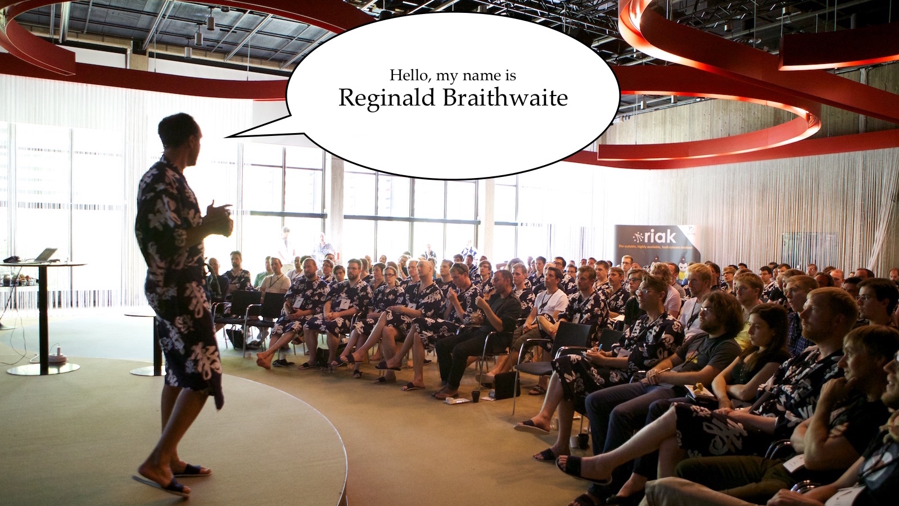

footer: Nordic Ruby | @raganwald
slidenumbers: true

^ © 2016 Reginald Braithwaite. [Some rights reserved](http://creativecommons.org/licenses/by-sa/4.0/).

---

# Optimism

---

^ https://www.flickr.com/photos/aigle_dore/10017474965

^ I am going to talk about Optimism, and conversely, about Pessimism.

^ I'm going to describe a framework for understanding why some people are optimistic and some are pessimistic. I'm going to explain how you can actually become more optimistic in your life, and I am going to explain how I think you can help other people be more optimistic in your personal life and in your community.

^ Before I do that, I want to share with you One True Thing about myself, and it will help you understand why I have spent most of my life struggling to be happy, despite having many privileges and gifts.

^ So, from my heart:

---

### I LIVE WITH
# Depression

---

^ https://www.flickr.com/photos/8058853@N06/4517294977

^ I have had many high points in my life, but I also have had many low points. I have been jobless. I have been penniless. I have been friendless. I have been homeless. I have felt that I was pointless and that my life had no value.

^ **Those of you who have not had this affliction may question this, but it is true, and part of what I will describe today will explain why it is difficult for people who feel optimistic and happy in life to understand people who are pessimistic and sad.**

---

# "Learned Optimism"

^ Some years ago I was in an especially low point and I happened upon a book that changed my life. I cannot guarantee that it will change *your* life. "Chance favours the prepared mind," they say, and perhaps it can only change your life if you happen upon it at an inflection point, at a time when your life is ready to change.

^ I needed some change, I was open to change, and with this book, I changed.

^ The book is "[Learned Optimism](http://www.amazon.com/gp/product/1400078393?ie=UTF8&amp;tag=raganwald001-20&amp;linkCode=as2&amp;camp=1789&amp;creative=390957&amp;creativeASIN=1400078393 "Amazon.com: Learned Optimism: How to Change Your Mind and Your Life: Martin E. P. Seligman: Books")," by Dr. Martin Seligman. I'm not going to stand here and read the book aloud, you know that. But I am going to simplify it down to a few points, and you might very well think the book is too simplistic to be worth reading.

^ But trust me on this:** You should not judge a book solely by whether you like what I said about it in a short talk**. Read it for yourself and decide.

---

^ https://www.flickr.com/photos/aigle_dore/9761062125

^ So Dr. Seligman did some research on optimism and success, and the results surprised him, and after a lot of back-and-forth with colleagues and more research, he came up with a theory, and a side-business of selling tests that predict whether salespeople are going to be successful.

^ I want to emphasize the word **research**, because the plural of anecdote is not data. No matter how many nice people like me tell you something from our experience, it is not the same thing as what Dr. Seligman does to come up with this stuff.

^ Dr. Seligman's theory is all about how people explain things to themselves. We all do this, it's part of the whole sentience thing we have going on. Something happens, and we make up a little theory about why it happened.

^ This matters, because our theories about why the world is the way it is is what drives all of the choices we make. That's what drives us as humans.

^ Whether we are aware of it or not, we're making up these explanations for events that concern us all the time.

---

# Dr. Seligman's Claims

^ So, these explanations.

^ Dr. Seligman makes two claims about the explanations we make.

---

^ https://www.flickr.com/photos/spanginator/5372051028

^ The first is that we have patterns for our explanations, and that by testing our explanations, we can identify the patterns. And by identifying the patterns, we can come up with a prediction for our behaviour.

^ He gives us a test, he computes a number with the result, and he calls the resulting scalar "optimism," and he claims that people with high optimism are more productive and happier and whatever else that is nice than people with low optimism. And he thinks he has the numbers to prove it.

---

# The Second Claim

^ His second claim is that with cognitive behavioural therapy, you can change the patterns in your explanations.

^ Further, he claims that this increases increase your optimism. And that this changes your mood and your productivity.

^ And again, he went out and tested his claim and again he has research he claims proves it.

---

^ https://www.flickr.com/photos/bjarkis/4665751943

^ This is an absolutely **crucial** claim. If the first claim was true, but not the second, this would be like being able to diagnose an ailment, but being unable to cure it.

^ But this claim says that we can measure whether we are optimistic or pessimistic, and then we can make ourselves more optimistic. We can cure the ailment.

---

# Explanatory Theory

^ Dr. Seligman's work is based on **Explanatory Theory**. This is the theory that the explanations we make up for things that happen in our lives have a strong impact on our moods and behaviour.

^ It is not controversial to say that our moods affect the explanations we make up for things that happen in our lives. If we are in a good mood and someone smiles at us, we think they like us. If we are in a bad mood, we wonder if they have read some awkward code we just checked in, and if they are laughing at us.

^ Explanatory Theory takes it a step further and says that the explanations we make up for things also affect our moods and behaviour. That if we deliberately tell ourselves that someone is smiling because they like us, that we will be happier than if we tell ourselves that they are laughing at us.

---

^ Hey! Ruby!!

^ In 2009, I was registering for a conference very much like this called RubyFringe. And someone I respect very much walked up to me, introduced themselves, then told me that they didn't like the [andand gem](http://andand.rubyforge.org/ "Object#andand") that I wrote.

^ So how did I explain this to myself?

^ Dr. Seligman explains that when we make up an explanation for things, we have three fairly binary properties or axes for each explanation.

---

^ https://www.flickr.com/photos/aigle_dore/22080495601

^ First, we decide whether something is personal or impersonal.

^ So how did I explain the `andand` comment to myself? If I thought there was something inherently wrong with **me** as a developer that I could write something like `andand`, that's personalizing the explanation.

^ I might say something like this…

---

### Some people like `andand`, because
# **"I"**
### something-something.

^ On the other hand, if I explain them not liking my work as reflecting upon them and their values--and I don't mean this in a  negative way--that's *depersonalizing* the explanation.

^ In that case, I might say…

---

### Some people dislike `andand`, because
# **"IT"**
### something-something.

---

### summary
# Personal vs. Impersonal

^ So there's the first axis, *personal vs. impersonal*. We can listen to someone's explanations for why things happened in their life, and we can decide whether their explanations tend to be more personal or impersonal. In other words, we can *measure* personalization.

^ Dr. Seligman did exactly that: He gathered lots of subjects and measured their personalization using objective criteria. He also measured their moods using standard criteria and furthermore, he measured their success in life, and the results were very interesting.

---

### THE
## Personal vs. Impersonal
# Paradox

^ So, the obvious question to ask is, **Are optimists more or less likely to "take things personally?"**

^ I'm not going to say what he says just yet, but when I was reading about this in the book, I didn't know what to think. If you read books by self-help gurus, a lot of them talk quite a bit about taking responsibility for everything that happens in your life. It seems they advocate taking everything personally.

^ Yet people who "take things too personally" are often morose, depressed, and defensive. It feels like a paradox: Happy, successful people take responsibility for their lives, while many depressed, unsuccessful people think they are the cause of the unhappiness in their lives.

^ We'll come back to Dr. Seligman's answer after discussing the other two axes.

---

^ https://www.flickr.com/photos/aigle_dore/9997796545

^ The second axis or binary property is **specific vs. general**.

^ Remember the person who didn't like `andand`? Did I take this as a suggestion that they didn't like me in a general sense? Or did I conclude that they didn't like this one little thing I wrote, maybe twenty or thirty lines of code?

^ Sometimes, something happens and we generalize the explanation. Sometimes we make it really specific. For example, I have really specific explanations for the success or failure of the blog posts I write, and I judge each one specifically.

^ So when something I write flops, I say…

---

> This **specific** post didn't click.

^ On the other hand, I can take a terribly general attitude about my writing overall.

^ So when I wrote an essay about Optimism, and it went to #1 on Hacker News, I said…

---

> This post clicked because **generally**, I'm a good writer.

---

### summary
# Specific vs. General

^ And thus it is with our explanations for the things that happen in our lives. Some of the explanations we make up are specific. Some of the explanations are general. And "specific vs. general" is the second axis of Dr. Seligman's explanatory theory.

---

### THE
## Specific vs. General
# Paradox

^ And if we have not read about Learned Optimism before, we must be curious: **Are optimists more likely to come up with specific explanations for things in their life? Or more likely to come up with general explanations?**

^ When I read this, I was just as confused as I was when I read about personal and impersonal explanations. I knew many people who were happy and successful, and they had overwhelmingly general ideas about their own talents. They sincerely believed they were successful in a general sense.

^ (By the way, this often trips successful people up when they try for an "Act II:" They believe so sincerely in the general explanation for their success that they fail to realize how specific their experience and talents really are.)

^ But I also knew some very depressed people who had remarkably general explanations for their failure. They believed that they were "failures in life," a general explanation if ever there was one.

^ So once again: Paradox! Were optimistic people more likely to give general or specific explanations for the things that happened to them? And how could we reconcile this with what we know about unhappy, unsuccessful people?

---

^ https://www.flickr.com/photos/ronkroetz/19700031749

^ The third and final axis--thanks for your patience with my explanations--is **temporal**. Some explanations describe an event as a result of **temporary** phenomena. And other explanations describe an event in terms of **permanent** phenomena.

^ To give a very real and poignant example, I will tell you about something that happened to me more than forty years ago. When I was young, I thought that the subways in Toronto were very interesting.

^ There were these stacks of signal lights, and I tried to deduce how they worked. I was especially curious about how drivers would approach a red signal at speed, and just before the train reached the signal, it would change to green. How did they know?

^ And the technology was so interesting. They were trains... Underground! Buried beneath a huge city was another world, full of tunnels and maintenance shafts and cables and machinery.

^ But I digress. I liked subways, and used to ride around on them, just for fun. Well, one day I was riding on the subway, and it was not very busy, and some boys got on, and started making some very loud remarks about my race.

^ I disembarked, and they followed me. There was a confrontation, and they ended up assaulting me on the subway platform while shouting racist insults.

^ And you know, we still have problems with racism in the world. But let's talk about my explanation:

^ I could have said…

---

> **That day**, I was assaulted by racists.

^ And that would be perfectly true.

^ I could also have said…

---

> I've **always** faced racism in my life.

^ And that would be just as true.

---

### summary
# Temporary vs. Permanent

^ So there you have two more ways of explaining something: Is it temporary? Or is it permanent? Did it happen just this specific time? Or is an on-going part of our lives?

^ And neither explanation has to be wrong. It's just a question of what we emphasize to ourselves.

---

### THE
## Temporary vs. Permanent
# Paradox

^ Obviously, we can measure whether explanations tend to describe things in temporary or permanent ways. And given what we saw with personal vs. impersonal, and specific vs. general explanations, we would not be surprised to discover that happy successful people appear to describe all sorts of things in permanent ways, like their success. And so do unhappy, unsuccessful people.

---

# The Recap

^ When we explain something in our heads, our explanations have three properties that matter to whether we are optimistic or not: Whether we explain things in a *personal or impersonal way*, whether we explain things in a *specific or general way*, and whether we explain things in a *temporary or permanent way*.

^ And my proposition is that both productive and unproductive people can be observed describing things as personal, as general, and as permanent. And although I haven't given examples today, I assure you that both productive and unproductive people can also be observed describing things as impersonal, specific, and temporary.

^ Given that Dr. Seligman was able to take these observations and turn them into a metric for measuring optimism, we can deduce that there is more to this than simply measuring whether someone tends to describe things in these three ways.

^ We can deduce that there is something else, a missing factor. One that will perhaps tell us *when* an optimist will describe something as personal. When an optimist will describe something as specific. And when an optimist will describe something as being temporary.

^ What is this factor?

---

^ https://www.flickr.com/photos/martinofranchi/2042632469

^ When I first read "Learned Optimism," I took a little test in the book, and then Dr. Seligman explained the theory. And based on that theory, I had a model for how I made up explanations.

^ For example, I took criticism of my `andand` gem **personally**, I thought it was a comment on my **general** ability as a developer, and I figured that my inability to write popular libraries was **permanent**.

^ And the model told me something else.

^ When someone told me that I scored a good goal in Ultimate, I would have put it down to **my opponent** being out of shape, explained that I **specialized** in scoring goals, and thought that maybe I got lucky on that play. I would have explained the compliment as being **impersonal**, **specific**, and **temporary**.

^ Do you grasp the asymmetry?

---

### I WAS
# Inconsistent

---

^ https://www.flickr.com/photos/borkurdotnet/4493539956

^ I was not consistent. I didn't always explain things one way or the other. More interestingly, I was *consistently inconsistent*: I explained *bad things* as being personal, general, and permanent, but I explained away the good things as being impersonal, specific, and temporary.

^ This may not seem rational. Logically, each of us ought to be consistent in how we explain the world. But we aren't, or at least some of us aren't.

---

# Pessimists

^ The moment this was revealed to me I could guess what came next. I was a *pessimist*.

^ According to me, all the bad things in my life were everywhere, they followed me around because they were about me, and they lasted forever, while the good things were all about other people, and they only came into my life for short moments.

^ Dr. Seligman had discovered something important: Pessimists had a particular kind of asymmetry in the way they explained good and bad things in their lives.

---

# Optimists

^ And Dr. Seligman also discovered that optimists are cheerfully inconsistent, they have the mirror image asymmetry.

^ Like pessimists, optimists do not always explain the world the same way. But to an optimist, someone not liking a piece of code is simply one person (impersonal, specific) not liking that one thing (specific again), for their own reasons (impersonal), and it was just a few words in the middle of a long day (extremely temporary).

^ And to the optimist, they're a good athlete (personal, general) and have been all their life (permanent). That one goal was just another scene in their long-playing movie of game highlights.

^ Optimists explain good things as being personal, general, and permanent, and explain away bad things as being impersonal, specific, and temporary. And if you point out the contradiction in their explanations, they see no contradiction. To them, the bad stuff really isn't about them, it's just that one thing that one time.

---

^ https://www.flickr.com/photos/jonathanhood/11755209913

^ "Learned Optimism" shocked me. I read it a bunch of times and actually bought copies for other people. Besides myself, I knew lots of people who fit Dr. Seligman's pessimist theory.

^ I knew this because they cried on my shoulder about their long-running, personal flaws that affected every part of their lives. They were personal, general, and permanent on the subject of unhappiness. And on the subject of happiness, they were impersonal, specific, and temporary.

^ And the book also explained all the successful people in my life. And it explained why I found it hard to relate to them when they were explaining their success: I had a built-in perspective that was the opposite to theirs, I saw a completely different explanation for everything going on.

^ So there you have it. One predictor of happiness and success is this characteristic Dr. Seligman calls optimism, which he measures by testing whether you explain good or bad events as being personal, general, and permanent, and specifically whether you are asymmetric in your explanations.

---

# **Learned**
### Optimism

^ This is Dr. Seligman's first claim. What about the second?

^ Well, that is the point of the book. That is why it is called **Learned** Optimism.

^ After explaining how to predict whether people are optimistic or pessimistic based on their explanations, the book  goes on to explain how to use cognitive behavioural therapy to change the way you explain things to yourself.

^ I am not a psychologist, I cannot teach you cognitive therapy at all, much less in thirty minutes. So please, read the book and follow the exercises. And I mean, *follow the exercises*.

---

^ https://www.flickr.com/photos/layant/3703241001

^ But the basis of the method is this:

^ You train yourself to make a note of your explanations, every day. Repetition and consistency matters: You have to do it every day.

^ You analyze whether your explanations for good things are personal, general, and permanent. You analyze whether your explanations for bad things are impersonal, specific, and temporary.

^ And then you correct your explanations to make them optimistic. Every time. And you track your progress, just as you would track your progress for anything else you are trying to change in your life.

^ Seligman's research shows that you **can** change the way you explain things, and the research also shows that the change makes you happier and more productive.

---

# Conclusion:

### Changing your explanations through repetition and consistency, changes your life: You become happier and more productive.

---

^ https://www.flickr.com/photos/anieto2k/15867820274

^ Whether you are happy with your life or not, whether you are a Bipolar Lisp Programmer or a Well-Adjusted Rubyist, I conjecture that Dr. Seligman's theory applies to more than understanding why we are unhappy, and I conjecture that it applies to more than teaching ourselves to be more optimistic.

---

# My Conjecture

^ My conjecture is that the way we explain things to others—specifically the way we explain things that happen to others, or that others have done—affects their mood and productivity in exactly the same way as their own explanations affect them.

^ Like Cognitive Behavioural Therapy, we have to apply these explanations repeatedly and consistently to make a change. It's not presenting people with an epiphany, it's creating an optimistic environment for them.

^ In other words, I conjecture that we can give optimistic and pessimistic feedback to people about the things that happen to them. And I conjecture that optimistic feedback makes other people happier and more productive.

---

^ https://www.flickr.com/photos/mejvis/15187392082

^ Unfortunately, optimistic feedback is not a given. We often encounter the opposite,  **pessimistic feedback**.

^ Pessimistic praise is impersonal, specific, and temporary: "Ruby made `andand` really elegant for its time."

^ Pessimistic criticism is personal, general, and permanent: "Only a life-long loser would make mistakes like this."

^ Pessimistic feedback is a recipe for making people depressed and pessimistic, we are imposing a pessimistic explanation on them and on everybody who comes into contact with us.

---

# Why is there Pessimistic Feedback?

^ I think about why I was a pessimist, and it tells me why teams and cultures become pessimistic.

^ First, it is because we are not given a specific model for good feedback. We hear about the importance of giving and receiving transparent feedback without softening it, and we don't realize that just being transparent isn't enough, we must also be effective.

^ Second, it is because there are some examples of smart people who give bad feedback in the world. This is not surprising: They are generally amazing people, but have one specific thing they do that is not amazing.

^ Remember the paradoxes? Well, an unconsciously optimistic person thinks that their success is personal, general, and permanent. That's how they think programming works.

^ So when they give feedback, they do it in terms of the model they understand: They tell us about what they think are personal, general, and permanent characteristics. And they happen to be wrong about that.

^ But we can change this dynamic.

^ For one thing, when we receive some feedback, we can translate it from pessimistic to optimistic. And we can train the person giving us the feedback by reiterating it back to them in optimistic terms.

^ That's good for us, and for them.

^ And second, we can give better feedback to others.

---

^ https://www.flickr.com/photos/aigle_dore/13649199935

^ Let's talk about praise and criticism.

^ Praise and criticism are the foundation of performance improvement. In every place where humans work together, they give each other feedback, and they take that feedback and use it to get better.

^ But some teams, some organizations, some communities are better at it. Some managers have a knack for giving great feedback that helps people grow. Some teams have a culture of giving honest but fair feedback that encourages everyone to reach for excellence. And some communities have high standards, but set a positive, encouraging tone that motivates everyone to reach and exceed expectations.

^ Quite simply, praise should follow Seligman's model for optimistically explaining good things.

^ Criticism should follow Seligman's model for optimistically explaining bad things.

---

# Optimistic praise should be personal, general, and permanent.

^ If people are to *own* praise, it has to be personal. Praise for the team or company is appropriate, but if you never praise individuals, they cannot connect themselves with the group.

^ If people are to keep doing what made them productive, it has to be permanent.

---

> This issue you filed shows why **you** have been and will **continue** to be an **asset** to the community.

---

# Optimistic criticism should be impersonal, specific, and temporary.

^ There's a difference between criticizing words or code and criticizing people.

^ If we want people to be able to change, we have to be specific in our criticism.

^ If we want performance to improve, if we want people to grow, our criticism by definition has to be temporary.

---

> **This** pull request does not **currently** meet **our** standards, because these **specific** something-something-somethings.

---

^ https://www.flickr.com/photos/8058853@N06/5720433220

^ Optimistic feedback is how we create a positive, high-performance environment for people to work with people.

^ Sometimes, people think that to encourage others, we need to avoid criticism, to shy away from "hurting their feelings" or "offending them." And thus, you have a false dichotomy where you have a choice between giving criticism and encouraging high performance.

^ If my conjecture is correct, we can be optimistic, offer criticism where necessary, and still maintain personal motivation and high performance.

^ And that will work for pair programming, for teams, for companies, and communities.

---

# Optimistic Repetition and Consistency

^ Giving optimistic feedback once-in-a-while is not enough. Change of this type requires repetition and consistency. If we are going to change a team, a company, or a community, we need a critical mass of people giving optimistic feedback.

^ This is why "culture" is so important. If there is a critical mass of people giving optimistic feedback, and reasoning about events in an optimistic way, then they are providing consistent, repetitive optimistic explanations.

^ A critical mass of optimistic people makes a team optimistic. A critical mass of optimistic people makes a company optimistic. And a critical mass of optimistic people makes a culture optimistic.

^ A critical mass of optimistic people isn't just optimistic, it's self-correcting. This follows directly from Seligman's work on changing your optimism.

---

^ https://www.flickr.com/photos/chris-collation/12638784843

^ I'm here because I feel optimistic.

^ I will tell you that my parents were hippies who demonstrated for civil rights. That work is far from done, but their generation left us a tremendous legacy: An understanding that things don't always have to be so.

^ That belief is a belief that although society is, in general, good, there are specific things about it that are bad. And that this can be a temporary state of affairs. and that it's not us at fault.

^ Their legacy for me was a sense of optimism. A belief that my generation could take our talents and move the needle. Whether it's on a small scale or a large one. Whether it's on people, process, or society.

^ I hope you feel that same sense of optimism in your life.

^ And I hope you will take your talents, your excellence, forward. If you have been struggling, I hope you now have a hint that perhaps your struggles are temporary, and specific, and that you will make them better.

^ And I hope that you will take this model, these ideas, and apply them to making your team, your community, and your society happy, optimistic, and productive.

^ Thank you.
