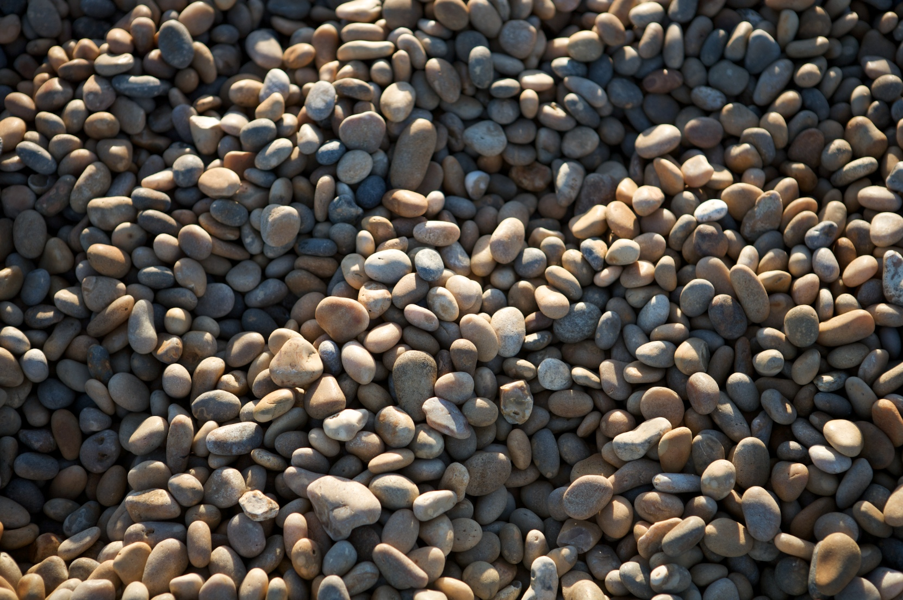
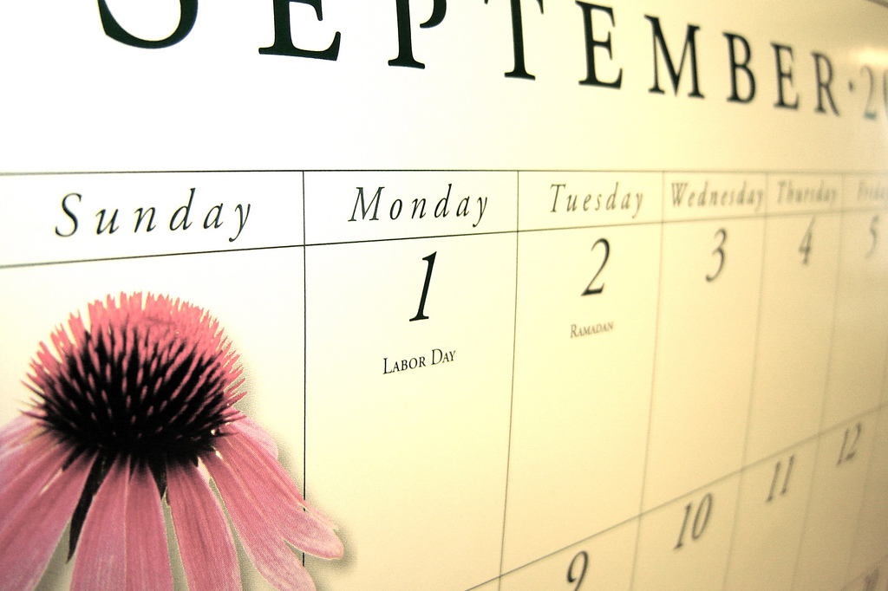
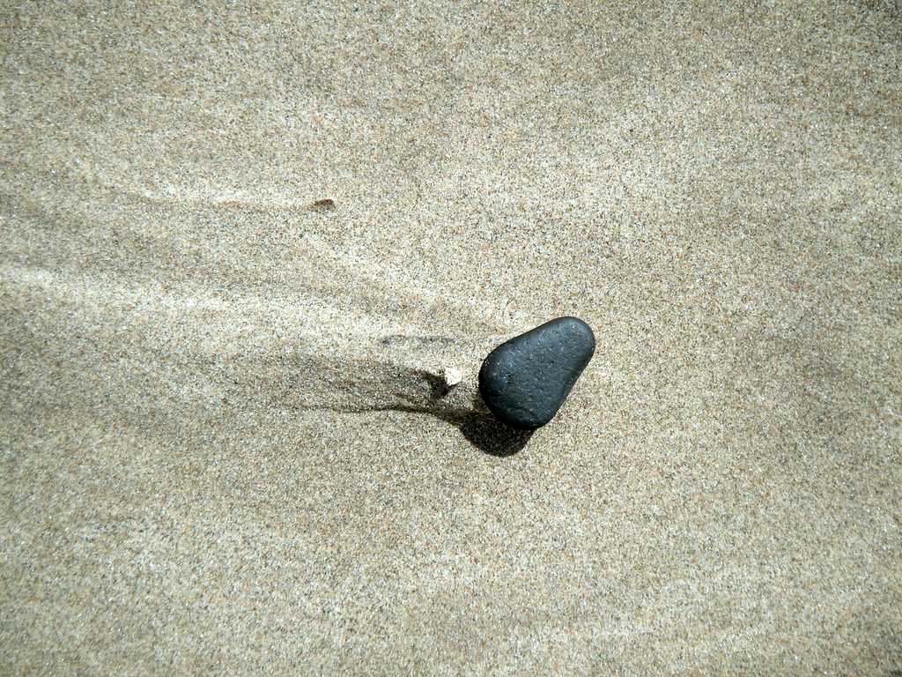
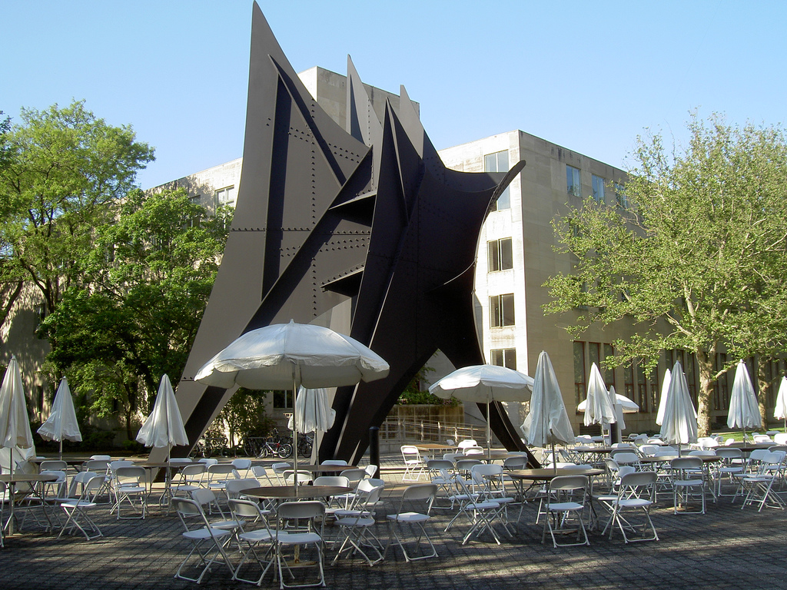
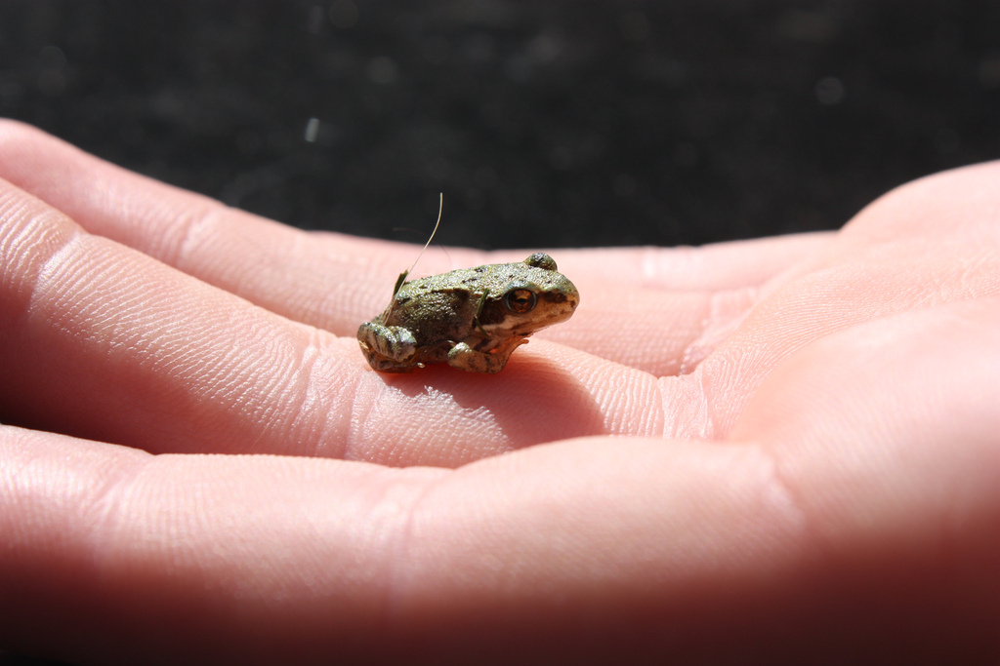
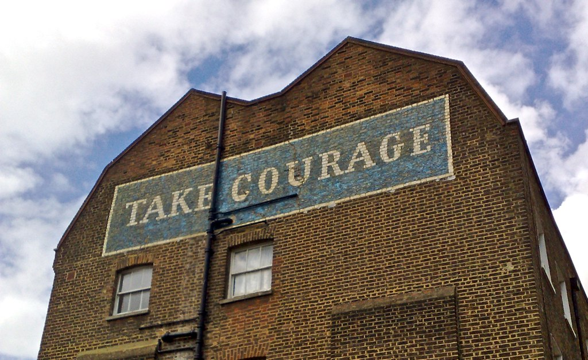
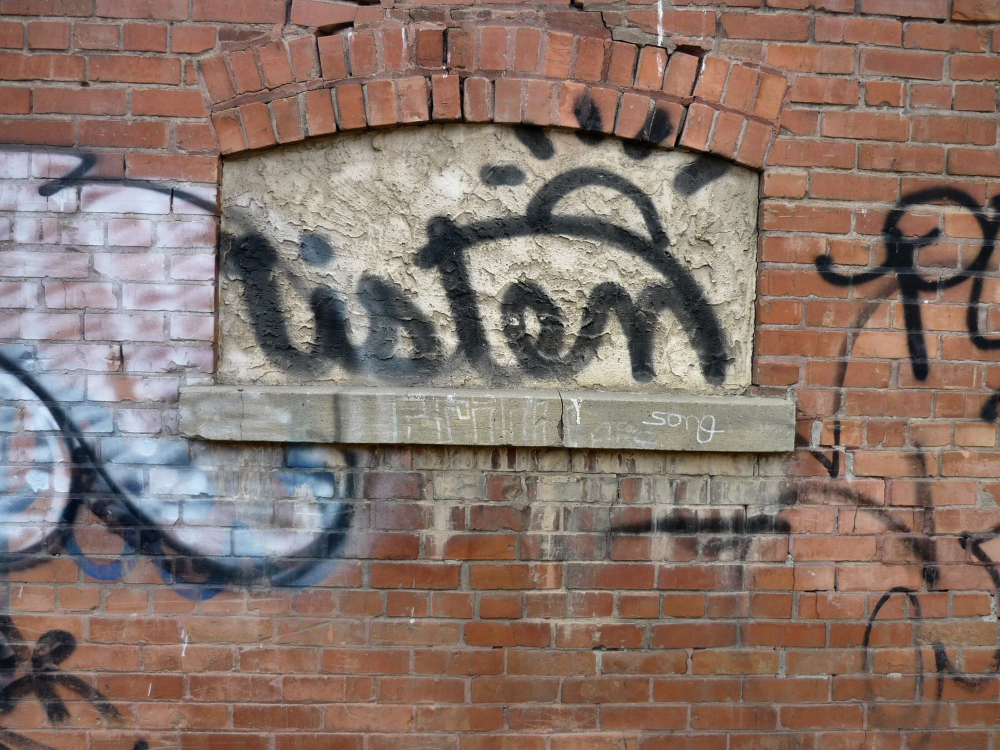
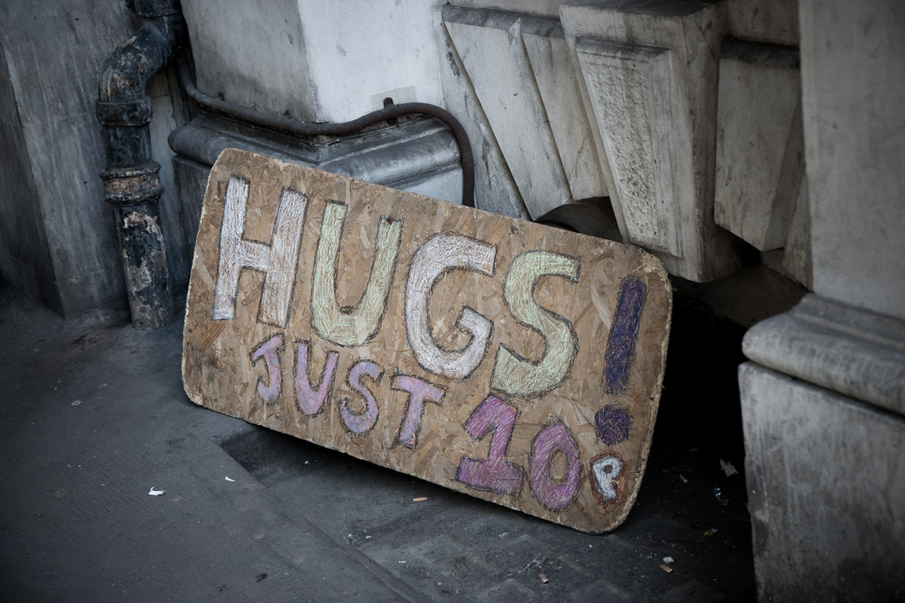

Theme: Next, 3
Footer: PagerDuty
slidenumbers: true

^ Hello, I'm Reg Braithwaite.

^ Today I'd like to talk about courage. The dictionary tells me that "courage" is the *choice* and *willingness* to confront agony, pain, danger, uncertainty, or intimidation.

^ (https://www.flickr.com/photos/joevahling/9153370287)

[.slidenumbers: false]

---

## Courage

> the *choice* and *willingness* to confront agony, pain, danger, uncertainty, or intimidation.

^ Courage helps us change and grow. Change is uncertain.

^ Courage helps us do difficult things, painful things.

^ Courage helps us escape from environments that try to intimidate us into being less than who we are.

^ (https://www.flickr.com/photos/joevahling/9153370287)

---

^ "Courage" is a really big word. When we say "courage," we think of things like standing up against injustice, or speaking truth to power.

^ One of the problems with the word "courage," is that it sounds too big, too intimidating.

^ Too hard.

^ (https://www.flickr.com/photos/taedc/4863004688)

---

^ How do we make the leap all the way from being our ordinary selves, to becoming courageous?

^ It seems like we need a tremendous amount of courage, just to become courageous!

^ That's hard.

---

^ There is a way: We can do small things, one at a time.

^ Every day, we have dozens of opportunities to commit tiny acts of courage.

^ Each tiny act of courage is like a pebble. It's small, but it's still a rock.

^ It's still courage.

^ (https://www.flickr.com/photos/peterpearson/3090070386)

---

^ Now:

^ If we listen to motivational speakers, to society, we're told that the value of tiny acts is that they can be put together into a big act, like pebbles piled into a tower.

^ This is unnecessary, and wrong.

^ (https://www.flickr.com/photos/bladeflyer/6996525239)

---

^ Or perhaps we are told that courage is a habit, and by practising it daily, we'll build up our courage into an irresistible force, and that is the goal.

^ This is also unnecessary, and it is also wrong.

^ (https://www.flickr.com/photos/andreanna/2837855969)

---

^ A pebble is a pebble.

^ A pebble does not have to be stacked.

^ A pebble does not have to be part of a beach.

^ We do not have to place a pebble every day.

^ We do not have to grow strong to place bigger pebbles.

^ A pebble is a pebble.

^ (https://www.flickr.com/photos/matt_gibson/504309625)

---

^ Stacks of stone are useful.

^ Habits we practice, make us strong.

^ A pasture of grass nourishes life.

^ But a tiny act of courage, like grass in a crack, is an act of courage, and it is its own reward.

^ (https://www.flickr.com/photos/pyogenes_gruffer/39969678731)

---

^ Ok! This is great, it's inspirational.

^ But we still need to eat. We need to go about our everyday lives. We need to ship.

^ How, specifically, can we commit these tiny acts of courage?

^ I have a suggestion.

^ Consider this:

^ (https://www.flickr.com/photos/usfwsmtnprairie/35203521620)

---

## “If I had asked people what they wanted, they would have said faster horses.”

### Henry Ford

^ We often refer to customer wishes as "faster horses."

^ The principle is to look beyond what people want, and to build what they need.

^ But it takes courage to build something that people don't know they want *yet*.

^ For example:

^ (https://www.flickr.com/photos/roolewis/15931212035)

---

^ In 2002, I attended a one-day programming language conference organized by Paul Graham.

^ The morning keynote was by Joe Armstrong, who introduced the **Erlang** programming language.

^ Few people had heard of Erlang.

^ (https://www.flickr.com/photos/dan4th/167330621)

---

^ Erlang was "functional," which was weird, and didn't have curly braces, also weird.

^ But it did concurrency at scale really, really well.

^ Erlang gave people what they needed, and it grew into a modest success.

^ Later, someone made it familiar, that's **Elixir**, and we use it at PagerDuty today.

^ (https://www.flickr.com/photos/criminalintent/3879361532/)

---

^ See what I just did? I described "courage" as inventing a programming language!

^ That's not a pebble. A pebble might be *trying* a new language.

^ Or just asking politely, "Why are we using Ruby to build something concurrent, at scale?"

^ (https://www.flickr.com/photos/ksayer/5614813544)

---

^ So one thing we can do whenever we see an act of courage that looks big and daunting and intimidating, is scale it down.

^ We can ask ourselves, "What is the smallest act of courage that could possibly make a difference?"

^ (https://www.flickr.com/photos/50253654@N06/5241846534)

---

^ Questions are *fantastic* pebbles.

^ And as pebbles, they don't need to be big or important or serious.

^ It is not necessary to ask a question that changes **everything**.

^ Just take courage, and ask a question!

^ (https://www.flickr.com/photos/skhan/3483855239)

---

^ Questions aren't the only kind of courage.

^ Another is listening, being receptive, being open to change.

^ We can cultivate "Strong opinions, weakly held."

^ That is a kind of courage.

^ (https://www.flickr.com/photos/runran/2875808584)

---

^ We can also be defensive when others questions us personally.

^ Questions feel like criticism, and that's painful.

^ A small pebble of courage is to listen despite the pain.

^ I feel this pain too, and when you feel it, I send you my hugs.

^ https://www.flickr.com/photos/tompagenet/2595893059

---

## “~~If I had asked people what they wanted, they would have said faster horses.~~”

### ~~Henry Ford~~

^ Now, speaking of being open to correction:

^ It turns out that Ford didn't actually say this! People wanted cars, they just couldn't afford them.

^ Ford's innovation was making cars *affordable*.

^ I didn't know that until I prepared this talk.

^ (public domain)

---

^ This reminds us that lots of conventional wisdom is **wrong**. Lots of things everybody knows, **aren't true**.

^ So have the courage to question.

^ And have the courage to listen, and to be open to learning.

^ Thank you.

^ (https://www.flickr.com/photos/amitp/11182201516)
