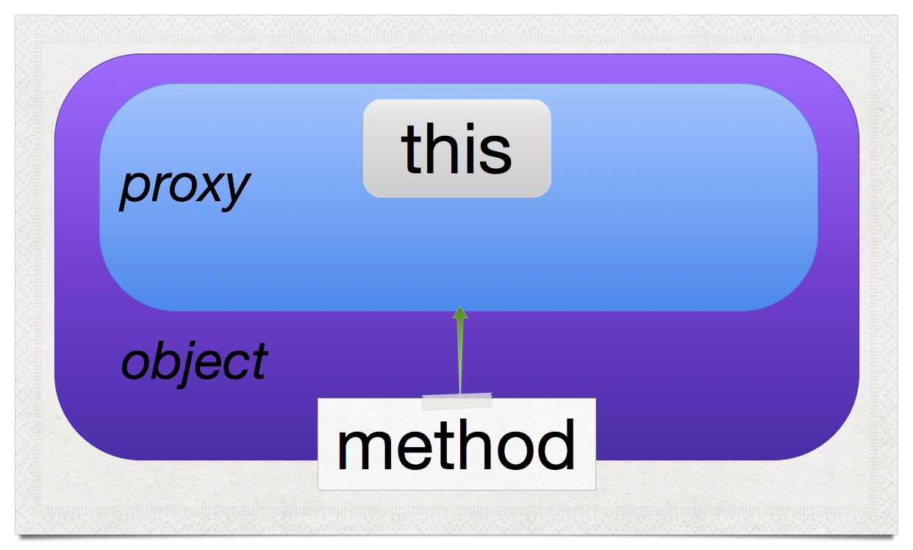

^ https://www.flickr.com/photos/andy_li/4378437185

^ "A Unified Theory of JavaScript Style, Part I"

---

### A Unified Theory of JavaScript Style, Part I

# JavaScript Combinators


^ https://www.flickr.com/photos/andy_li/4378437185

^ The "backbone" of this talk is to explain the combinators make software that is easier to factor and refactor by creating an "aglgebra" where functions form a semigroup, rather than using code, which is more flexibible but creates a sparse group

---


^ https://www.flickr.com/photos/popculturegeek/5991539415

^ "talk about Combinators and decorators"

---

## we'll talk about
# Combinators and decorators


^ https://www.flickr.com/photos/popculturegeek/5991539415

---


^ https://www.flickr.com/photos/creative_stock/3521504068

^ "think about flexibility and decluttering"

---

## but think about
# Flexibility and decluttering


^ https://www.flickr.com/photos/creative_stock/3521504068

---


^ https://www.flickr.com/photos/scelera/3036797409

^ "We compose entities to create new entities"

---

## composition
# *We compose entities to create new entities*


^ https://www.flickr.com/photos/scelera/3036797409

---


^ https://www.flickr.com/photos/justinbaeder/5317820857

^ Not all entities "fit together"

---

## interfaces
# *Not all entities "fit together"*


^ https://www.flickr.com/photos/justinbaeder/5317820857

^ worse, some are time-dependent

---


^ https://www.flickr.com/photos/michale/2744016741

^ "Homogeneous interfaces create dense spaces"

---

# Homogeneous interfaces create dense spaces


^ https://www.flickr.com/photos/michale/2744016741

^ Example: Integers and addition, multiplication: very dense

---


^ https://www.flickr.com/photos/stretta/5572576057

^ "Heterogeneous interfaces create sparse spaces"

---

# Heterogeneous interfaces create sparse spaces


^ https://www.flickr.com/photos/stretta/5572576057

^ counter-example: imagine an operation on integers wher emost operations were invalid. you'd have to engage in  a complex search to find the path from any one integer to another.

---


^ https://www.flickr.com/photos/michale/2744016741


^ https://www.flickr.com/photos/stretta/5572576057

^ "Dense is more flexible than sparse"

---

# Dense is more flexible than sparse


^ https://www.flickr.com/photos/michale/2744016741


^ https://www.flickr.com/photos/stretta/5572576057

---


^ https://www.flickr.com/photos/dipfan/110857520


^ https://www.flickr.com/photos/nathanoliverphotography/9604185186

^ "Sparse can be quicker to grasp"

---

# Sparse can be quicker to grasp


^ https://www.flickr.com/photos/dipfan/110857520


^ https://www.flickr.com/photos/nathanoliverphotography/9604185186

^ we'll give an example, showing how we have to build up.

---


^ https://www.flickr.com/photos/joao_trindade/4362414729

^ "enough with the math!"

---

## enough with the math!


^ https://www.flickr.com/photos/joao_trindade/4362414729

---


^ https://www.flickr.com/photos/mediterraneaaan/12756787045

^ "pluck"

---

## pluck: "A convenient version of what is perhaps the most common use-case for map: extracting a list of property values."


^ https://www.flickr.com/photos/mediterraneaaan/12756787045

^ underscorejs.org

---

# "pluckWith" is the flipped form of "pluck"

---

```javascript
function pluck (mappable, key) {
  return mappable.map(function (obj) {
		return obj[key];
	});
};

function pluckWith (key, mappable) {
  return pluck(mappable, key);
};

var stooges = [
	{name: 'moe', age: 40},
	{name: 'larry', age: 50},
	{name: 'curly', age: 60}];

pluckWith('name', stooges);
	//=> ["moe", "larry", "curly"]
```

---

# Let's make "pluckWith" out of combinators

___

# A unary combinator

```javascript
function flip (fn) {
	return function flipped (a, b) {
		return fn.call(this, b, a);
	}
}

function arrow (a, b) {
    return "" + a + " -> " + b;
}

flip(arrow)("x", "y")
	//=> 'y -> x'
```

^ http://jsfiddle.net/raganwald/wFRP8/

---


^ https://www.flickr.com/photos/saramarlowe/8170948596

^ Another unary combinator

---

## curry

# Another unary combinator


^ https://www.flickr.com/photos/saramarlowe/8170948596

---

```javascript
function curry (fn) {
	return function curried (a, optionalB) {
		if (arguments.length > 1) {
			return fn.call(this, a, optionalB);
		}
		else return function partiallyApplied (b) {
			return fn.call(this, a, b);
		}
	}
}
```

^ binary only

---
# Currying:

```javascript
var curriedArrow = curry(arrow);
	//=> [function]
	
curriedArrow('finger')('moon')
	//=> 'finger -> moon'
```

^ http://raganwald.com/2013/03/07/currying-and-partial-application.html

---

# Partial Application:

```javascript
var taoism = curry(arrow)('finger');
	//=> [function]
	
taoism('moon')
	//=> 'finger -> moon'
```

^ http://raganwald.com/2013/03/07/currying-and-partial-application.html

---


^ https://www.flickr.com/photos/genista/4449316

^ "Partial application transforms binary operations into unary operations"

---

## nota bene
# *Partial application transforms binary operations into unary operations*


^ https://www.flickr.com/photos/genista/4449316

^ makes the interface more homogeneous

---

```javascript
function get (object, property) {
	return object[property];
}

get({foo: 1}, 'foo')
	//=> 1
```

---

```javascript
var getWith = curry(flip(get));

getWith('foo')({foo: 1})
	//=> 1
```

---

```javascript
function map (mappable, fn) {
	return mappable.map(fn, this);
}

function double (n) {
    return n * 2;
}

map([1, 2, 3], double)
	//=> [2, 4, 6]
```

---

```javascript
var mapWith = curry(flip(map));

mapWith(double, [1, 2, 3]);
	//=> [2, 4, 6]

var doubleAll = mapWith(double);

doubleAll([1, 2, 3])
	//=> [2, 4, 6]
```

---

> almost there...

---

```javascript
function pluckWith (attr) {
  return mapWith(getWith(attr));
}
```

---


^ https://www.flickr.com/photos/ctaweb/8487304182

^ "Compose"

---

# Compose


^ https://www.flickr.com/photos/ctaweb/8487304182

---

```javascript
function compose (a, b) {
	return function composed (c) {
		return a(b(c));
	}
}
```

---

## quod erat demonstrandum
# *The combinator implementation of* "pluckWith"

---

```javascript
var pluckWith = compose(mapWith, getWith);
```

---

## let's compare both implementations of "pluckWith"

---

```javascript
var pluckWith = compose(mapWith, getWith);

//// versus ////

function pluck (mappable, key) {
  return mappable.map(function (obj) {
		return obj[key];
	});
};

function pluckWith (key, mappable) {
  return pluck(mappable, key);
};
```

---

## lesson
# *Composing functions with combinators increases code flexibility...*

^ teases apart heterogeneous factoring

---

## lesson
# *Composing functions with combinators demands increased mental flexibility*

^ asterix: with care, they can be easier to read.

---

## using combinators to make
# *Decorators*

---

```javascript
function Cake () {}

extend(Cake.prototype, {
  mix: function () {
    // mix ingredients together
		return this;
  },
  rise: function (duration) {
    // let the ingredients rise
		return this;
  },
  bake: function () {
    // do some baking
		return this;
  }
});
```

---

# fluent

```javascript
function fluent (methodBody) {
  return function fluentized () {
    methodBody.apply(this, arguments);
    return this;
  }
}
```

---

```javascript
function Cake () {}

extend(Cake.prototype, {
  mix: fluent( function () {
    // mix ingredients together
  }),
  rise: fluent( function (duration) {
    // let the ingredients rise
  }),
  bake: fluent(function () {
    // do some baking
  })
});
```

---

## new requirements
# *Mix before rising or baking*

---

```javascript
extend(Cake.prototype, {
  mix: fluent( function () {
    // mix ingredients together
  }),
  rise: fluent( function (duration) {
		this.mix();
    // let the ingredients rise
  }),
  bake: fluent(function () {
		this.mix();
    // do some baking
  })
});
```

---

# before
## a combinator that transforms decorations into decorators

```javascript
var before = curry(
	function decorate (decoration, method) {
		return function decoratedWithBefore () {
    	decoration.apply(this, arguments);
    	return method.apply(this, arguments);
		};
  }
);

var mixFirst = before(function () {
  this.mix()
});
```

---

# the final version

```javascript
extend(Cake.prototype, {
  
  // Other methods...
  
  mix: fluent( function () {
    // mix ingredients together
  }),
  rise: fluent( mixFirst( function (duration) {
    // let the ingredients rise
  })),
  bake: fluent( mixFirst( function () {
    // do some baking
  }))
});
```

---

## lesson
# *Decorators declutter secondary concerns*

---

# after

```javascript
var after = curry(
	function decorate (decoration, method) {
		return function decoratedWithAfter () {
			var returnValue = method.apply(this, arguments);
    	decoration.apply(this, arguments);
    	return returnValue;
		};
  }
);
```

---

# around

```javascript
var around = curry(
	function decorate (decoration, method) {
		return function decoratedWithAround () {
			var methodPrepended = [method].concat(
				[].slice.call(arguments, 0)
			);
			
    	return decoration.apply(this, methodPrepended);
		};
  }
);
```

---

# call me maybe

```javascript
var maybe = around(function (fn, value) {
	if (value != null) {
		return fn.call(this, value);;
	}
});

maybe(double)(2)
	//=> 4
	
maybe(double)(null)
	//=> undefined
```

---

# generalized guards

```javascript
function provided (guard) {
	return around(function () {
		var fn = arguments[0],
		    values = [].slice.call(arguments, 1);
				
		if (guard.apply(this, values)) {
			return fn.apply(this, values);
		}
	});
}

var maybe = provided( function (value) { 
	return value != null; 
});
```

---

# inversions

```javascript
function not (fn) {
	return function notted () {
		return !fn.apply(this, arguments)
	}
}

var except = compose(provided, not);

var maybe = except( function (value) {
	return value == null;
});
```

---


^ https://www.flickr.com/photos/68112440@N07/6210847796

^ "lessons"

---

## lessons


^ https://www.flickr.com/photos/68112440@N07/6210847796

---


^ https://www.flickr.com/photos/paulmccoubrie/6792412657

^ "Combinators increase code flexibility and require increased mental flexibility"

---

## lesson one
# *Combinators increase code flexibility and require increased mental flexibility*


^ https://www.flickr.com/photos/paulmccoubrie/6792412657

---


^ https://www.flickr.com/photos/terry_wha/107810852

^ "Decorators declutter secondary concerns"

---

## lesson two
# *Decorators declutter secondary concerns*


^ https://www.flickr.com/photos/terry_wha/107810852

---


^ https://www.flickr.com/photos/suburbanbloke/723665503

^ "Do not follow in the footsteps of the sages. Seek what they sought"

---

## lesson three
# *Do not follow in the footsteps of the sages.*
# *Seek what they sought*


^ https://www.flickr.com/photos/suburbanbloke/723665503

---

# Reginald Braithwaite

## GitHub, Inc.

## http://raganwald.com

## @raganwald

NDC Conference, Oslo, Norway, June 5, 2014


^ https://www.flickr.com/photos/wwworks/3226981951

---


^ https://www.flickr.com/photos/data_op/2473348747

^ "intermission"

---


^ https://www.flickr.com/photos/frans16611/6139595092

^ "A Unified Theory of JavaScript Style, Part II"

---

### A Unified Theory of JavaScript Style, Part II

# The Art of the JavaScript Metaobject Protocol


^ https://www.flickr.com/photos/frans16611/6139595092

---


^ https://www.flickr.com/photos/cogdog/5560050395

^ "We'll talk about Proxies, Encapsulation, and Composition"

---

## we'll talk about
# Proxies, Encapsulation, and Composition


^ https://www.flickr.com/photos/cogdog/5560050395

---


^ https://www.flickr.com/photos/seier/3553005609

---

## but think about
# Flexibility and Deoupling at Scale


^ https://www.flickr.com/photos/seier/3553005609

---


^ https://www.flickr.com/photos/zscheyge/49012397

^ "open mixins"

---

## basics
# Open Mixins


^ https://www.flickr.com/photos/zscheyge/49012397

---

```javascript
var sam = {
  firstName: 'Sam',
  lastName: 'Lowry',
  fullName: function () {
    return this.firstName + " " + this.lastName;
  },
  rename: function (first, last) {
    this.firstName = first;
    this.lastName = last;
    return this;
  }
}
```

---

```javascript
var sam = {
  firstName: 'Sam',
  lastName: 'Lowry'
};

var Person = {
  fullName: function () {
    return this.firstName + " " + this.lastName;
  },
  rename: function (first, last) {
    this.firstName = first;
    this.lastName = last;
    return this;
  }
};
```

---

```javascript
function extend () {
  var consumer = arguments[0],
      providers = [].slice.call(arguments, 1),
      key,
      i,
      provider;

  for (i = 0; i < providers.length; ++i) {
    provider = providers[i];
    for (key in provider) {
      if (provider.hasOwnProperty(key)) {
        consumer[key] = provider[key];
      };
    };
  };
  return consumer;
}
```

---

# Mixins are many to _

```javascript
extend(sam, Person);

var peck = {
  firstName: 'Sam',
  lastName: 'Peckinpah'
};

extend(peck, Person);
```

---

# Mixins are _ to many

```javascript
var HasCareer = {
  career: function () {
    return this.chosenCareer;
  },
  setCareer: function (career) {
    this.chosenCareer = career;
    return this;
  }
};

extend(peck, HasCareer);

peck.setCareer('Director');
```

---


^ https://www.flickr.com/photos/ell-r-brown/4654012932

^ "Private Mixins"

---

## basics
# Private Mixins


^ https://www.flickr.com/photos/ell-r-brown/4654012932

---

```javascript
function extendPrivately (receiver, mixin) {
  var methodName,
      privateProperty = Object.create(null);

  for (methodName in mixin) {
    if (mixin.hasOwnProperty(methodName)) {
      receiver[methodName] = mixin[methodName].bind(privateProperty);
    };
  };
  return receiver;
};
```

---

```javascript
var peck = {
  firstName: 'Sam',
  lastName: 'Peckinpah'
};

extendPrivately(peck, HasCareer);

peck.setCareer("Director;

peck.chosenCareer
	//=> undefined
```

^ hand-waving over "self"

---


^ https://www.flickr.com/photos/oddwick/2398128614

^ "forwarding"

---

## basics
# Forwarding


^ https://www.flickr.com/photos/oddwick/2398128614

---

```javascript
function forward (receiver, metaobject, methods) {
  if (methods == null) {
    methods = Object.keys(metaobject).filter(function (methodName) {
      return typeof(metaobject[methodName]) == 'function';
    });
  }
  methods.forEach(function (methodName) {
    receiver[methodName] = function () {
      var result = metaobject[methodName].apply(metaobject, arguments);
      return result === metaobject ? this : result;
    };
  });

  return receiver;
};
```

---


^ https://www.flickr.com/photos/25722571@N08/5509806114

---

## forwarding is important
# Let's stick a tack in this for later


^ https://www.flickr.com/photos/25722571@N08/5509806114

---

# Four shades of gray

1. A mixin uses the receiver's method body, and executes in the receiver's context.
2. A private mixin uses the receiver's method body, but executes in another object's context.
3. Forwarding uses another object's method body, and executes in another object's context.
4. What uses another object's method body, but executes in the receiver's context?


^ https://www.flickr.com/photos/astragony/8571474312

---

```javascript
function delegate (receiver, metaobject, methods) {
  if (methods == null) {
    methods = Object.keys(metaobject).filter(function (methodName) {
      return typeof(metaobject[methodName]) == 'function';
    });
  }
  methods.forEach(function (methodName) {
    receiver[methodName] = function () {
      return metaobject[methodName].apply(receiver, arguments);
    };
  });

  return receiver;
};
```

---


^ https://www.flickr.com/photos/carbonnyc/6415460111

---

# Could there be another way to delegate to a metaobject?


^ https://www.flickr.com/photos/carbonnyc/6415460111

---

# Yes.

```javascript
Object.create(metaobject);
```

---


^ https://www.flickr.com/photos/environment/2167097486

^ "inheritence is delegation through prototypes"

---

## inheritence is
# Delegation through Prototypes


^ https://www.flickr.com/photos/environment/2167097486

---


^ https://www.flickr.com/photos/double-m2/4341910416

^ "Now that we've categorized our basic tools"

---

# Now that we've categorized our basic tools...


^ https://www.flickr.com/photos/double-m2/4341910416

---


^ "pale blue dot"

^ we need to think at scale

---

## we need to think
# At Scale


---


^ https://www.flickr.com/photos/keyg3n/4211020552

^ "Problems at Scale"

---

### Problems at Scale


^ https://www.flickr.com/photos/keyg3n/4211020552

---

### Problems at Scale

## - object coupling


^ https://www.flickr.com/photos/keyg3n/4211020552

---

### Problems at Scale

## - object coupling
## - inflexibility


^ https://www.flickr.com/photos/keyg3n/4211020552

---

### Problems at Scale

## - object coupling
## - inflexibility
## - metaobject coupling


^ https://www.flickr.com/photos/keyg3n/4211020552

---


^ https://www.flickr.com/photos/genista/5756772

^ "object coupling"

---

# object coupling


^ https://www.flickr.com/photos/genista/5756772

---

> OOP to me means only messaging, local retention & protection & hiding of state-process*
--Dr. Alan Kay

^ He also said, "and extreme late-binding of all things."

---


^ https://www.flickr.com/photos/lukepeterson/8134526531

^ "we have a pattern for private state: forwarding"

---

## we have a pattern for private state:
# Forwarding


^ https://www.flickr.com/photos/lukepeterson/8134526531

^ proxies are a forwarding pattern

---

```javascript
function proxy (baseObject, optionalPrototype) {
  var proxyObject = Object.create(optionalPrototype || null),
      methodName;
  for (methodName in baseObject) {
    if (typeof(baseObject[methodName]) ===  'function') {
      (function (methodName) {
        proxyObject[methodName] = function () {
          var result = baseObject[methodName].apply(
						baseObject,
						arguments
					);
          return (result === baseObject)
                 ? proxyObject
                 : result;
        }
      })(methodName);
    }
  }
  return proxyObject;
}
```

^ shim for ES5

---

```javascript
var stack = {
  array: [],
  index: -1,
  push: function (value) {
    return this.array[this.index += 1] = value;
  },
  pop: function () {
    var value = this.array[this.index];
    this.array[this.index] = void 0;
    if (this.index >= 0) {
      this.index -= 1;
    }
    return value;
  },
  isEmpty: function () {
    return this.index < 0;
  }
};
```

---

```javascript
var stackProxy = proxy(stack);

stackProxy.push('first');

stackProxy
  //=>
    { push: [Function],
      pop: [Function],
      isEmpty: [Function] }

stackProxy.pop();
  //=> 'first'
```

---


^ https://www.flickr.com/photos/waynenf/3725860708

^ "Flexibility"

---

# Inflexibility


^ https://www.flickr.com/photos/waynenf/3725860708

---

## prototype inheritence is
# One to Many

---

# mixins are
# Many to Many

^ if you can mix behaviour into objects, you can mix behaviour into metaobjects, because javascript is a metaobject-1 language

---

## person

```javascript
var Person = {
  fullName: function () {
    return this.firstName + " " + this.lastName;
  },
  rename: function (first, last) {
    this.firstName = first;
    this.lastName = last;
    return this;
  }
};
```

---

## has-career

```javascript
var HasCareer = {
  career: function () {
    return this.chosenCareer;
  },
  setCareer: function (career) {
    this.chosenCareer = career;
    return this;
  }
};
```

---

## modern careerist

```javascript
var Careerist = extend(
	Object.create(null), 
	Person, 
	HasCareer
);

var sam = Object.create(Careerist);
```

---

## traditional careerist

```javascript
function Careerist () {}

Careerist.prototype = extend(
	Object.create(null), 
	Person, 
	HasCareer
);

var sam = new Careerist();
```

---


^ https://www.flickr.com/photos/78428166@N00/7803972200

^ "metaobject coupling"

---

# Metaobject to Metaobject Coupling


^ https://www.flickr.com/photos/78428166@N00/7803972200

---


^ https://www.flickr.com/photos/realsmiley/4895250473

^ "Encapsulation for metaobjects"

---

# Encapsulation for Metaobjects


^ https://www.flickr.com/photos/realsmiley/4895250473

---


^ https://www.flickr.com/photos/bitterjug/7670055210

^ "Open recursion considered harmful"

---

# Open recursion considered harmful


^ https://www.flickr.com/photos/bitterjug/7670055210

---

The **fragile base class problem** is a fundamental architectural problem of object-oriented programming systems where base classes (superclasses) are considered "fragile" because seemingly safe modifications to a base class, when inherited by the derived classes, may cause the derived classes to malfunction.


^ https://www.flickr.com/photos/stevenduong/4081192022

---

# Encapsulation for Metaobjects


^ https://www.flickr.com/photos/realsmiley/4895250473

---


^ "encapsulating an object"

---

## encapsulating an
# Object


---



^ "encapsulating this"

---

## encapsulating
# this


---

```javascript
var number = 0;

function encapsulate (behaviour) {
  var safekeepingName = "__" + ++number + "__",
      encapsulatedObject = {};

  function createContext (methodReceiver) {
    return proxy(methodReceiver);
  }

  function getContext (methodReceiver) {
    var context = methodReceiver[safekeepingName];
    if (context == null) {
      context = createContext(methodReceiver);
      Object.defineProperty(methodReceiver, safekeepingName, {
        enumerable: false,
        writable: false,
        value: context
      });
    }
    return context;
  }

  Object.keys(behaviour).forEach(function (methodName) {
    var methodBody = behaviour[methodName];

    encapsulatedObject[methodName] = function () {
      var context = getContext(this),
          result = description[methodName].apply(context, arguments);
      return (result === context) ? this : result;
    };
  });

  return encapsulatedObject;
}
```

^ includes safekeeping pattern

---

## encapsulation lacks 
# A Sense of Self

```javascript
function createContext (methodReceiver) {
  return Object.defineProperty(
    proxy(methodReceiver),
    'self',
    { writable: false, enumerable: false, value: methodReceiver }
  );
}
```

^ discuss context-1s and context-2s

---

# Private Methods

```javascript
var MultiTalented = encapsulate({
  _englishList: function (list) {
    var butLast = list.slice(0, list.length - 1),
        last = list[list.length - 1];
    return butLast.length > 0
           ? [butLast.join(', '), last].join(' and ')
           : last;
  },
  initialize: function () {
    this._careers = [];
    return this;
  },
  addCareer: function (career) {
    this._careers.push(career);
    return this;
  },
  careers: function () {
    return this._englishList(this._careers);
  }
});
```

---

## private methods
# Are a Key Encapsulation Idea

---

## if only we knew which methods were private...

```javascript
function createContext (methodReceiver) {
	var innerProxy = proxy(methodReceiver);
	
	privateMethods.forEach(function (methodName) {
		innerProxy[methodName] = behaviour[methodName];
	});
  return Object.defineProperty(
    innerProxy,
    'self',
    { writable: false, enumerable: false, value: methodReceiver }
  );
}
```

---

```javascript
function encapsulate (behaviour) {
  var privateMethods = methods.filter(function (methodName) {
          return methodName[0] === '_';
        }),
      publicMethods = methods.filter(function (methodName) {
          return methodName[0] !== '_';
        });

	// ...

  return publicMethods.reduce(function (acc, methodName) {
    var methodBody = behaviour[methodName];

    acc[methodName] = function () {
      var context = getContext(this),
          result = behaviour[methodName].apply(context, arguments);
      return (result === context) ? this : result;
    };
    return acc;
  }, {});
}
```

---


^ https://www.flickr.com/photos/powerpig/6073050305

^ (c) 2011 Chris McVeigh, All Rights Reserved. http://www.chrismcveigh.com

---

## encapsulation's beard is
# Half Constructed


^ https://www.flickr.com/photos/powerpig/6073050305

^ (c) 2011 Chris McVeigh, All Rights Reserved. http://www.chrismcveigh.com

^ We define the public methods we expose, but not the public methods we consume. This leads to coupling creep.

---

## has-name is
# independent

```javascript
var HasName = encapsulate({
  name: function () {
    return this.name;
  },
  setName: function (name) {
    this.name = name;
    return this;
  }
});
```

---

## has-career is
# independent

```javascript
var HasCareer = encapsulate({
  career: function () {
    return this.name;
  },
  setCareer: function (name) {
    this.name = name;
    return this;
  }
});
```

---

## is-delf describing has
# Dependencies

```javascript
var IsSelfDescribing = encapsulate({
  description: function () {
    return this.name() + ' is a ' + this.career();
  }
});
```

---

## we can
# Name our Dependencies

```javascript
var IsSelfDescribing = encapsulate({
  name: undefined,
  career: undefined,

  description: function () {
    return this.name() + ' is a ' + this.career();
  }
});
```

---

# methods-of-type

```javascript
function methodsOfType (behaviour, type) {
  var methods = [],
      methodName;

  for (methodName in behaviour) {
    if (typeof(behaviour[methodName]) === type) {
      methods.push(methodName);
    }
  };
  return methods;
}
```

---

# Identifying Dependencies

```javascript
function encapsulate (behaviour) {
  var safekeepingName = "__" + ++number + "__",
      methods = Object.keys(behaviour).filter(function (methodName) {
          return typeof behaviour[methodName] === 'function';
        }),
      privateMethods = methods.filter(function (methodName) {
          return methodName[0] === '_';
        }),
      publicMethods = methods.filter(function (methodName) {
          return methodName[0] !== '_';
        }),
			dependencies = Object.keys(behaviour).filter(function (methodName) {
          return typeof behaviour[methodName] === 'undefined';
        });
```

---

# Partial Proxies

```javascript
function partialProxy (baseObject, methods, proxyPrototype) {
  var proxyObject = Object.create(proxyPrototype || null);

  methods.forEach(function (methodName) {
    proxyObject[methodName] = function () {
      var result = baseObject[methodName].apply(baseObject, arguments);
      return (result === baseObject)
             ? proxyObject
             : result;
    }
  });

  return proxyObject;
}
```

---

# Using Partial Proxies

```javascript
function createContext (methodReceiver) {
	var innerProxy = partialProxy(
					methodReceiver,
					publicMethods.concat(dependencies)
				);
	
	privateMethods.forEach(function (methodName) {
		innerProxy[methodName] = behaviour[methodName];
	});
  return Object.defineProperty(
    innerProxy,
    'self',
    { writable: false, enumerable: false, value: methodReceiver }
  );
}
```

---

## encapsulation's
# Key Features

1. The Receiver is encapsulated in an unenumerated property.
1. Separation of context and self.
1. Private methods.
1. Named Dependencies

---


^ http://apod.nasa.gov/apod/ap080914.html

^ "composing metaobjects"

---

# Composing Metaobjects


^ http://apod.nasa.gov/apod/ap080914.html

---

```javascript
var SingsSongs = encapsulate({
  _songs: null,

  initialize: function () {
    this._songs = [];
    return this;
  },
  addSong: function (name) {
    this._songs.push(name);
    return this;
  },
  songs: function () {
    return this._songs;
  }
});
```

---

```javascript
var HasAwards = encapsulate({
  _awards: null,

  initialize: function () {
    this._awards = [];
    return this;
  },
  addAward: function (name) {
    this._awards.push(name);
    return this;
  },
  awards: function () {
    return this._awards;
  }
});
```

---

```javascript
var AwardWinningSongwriter = extend(
				Object.create(null), 
				SingsSongs,
				HasAwards
			),
    tracy = Object.create(AwardWinningSongwriter);

tracy.initialize();
tracy.songs()
  //=> undefined
```

---


^ https://www.flickr.com/photos/ruthbruin2002/4889606882

^ "LSP"

---

# Liskov Substitution Principle

**Substitutability** is a principle in object-oriented programming. It states that, in a computer program, if S is a subtype of T, then objects of type T may be replaced with objects of type S (i.e., objects of type S may substitute objects of type T) without altering any of the desirable properties of that program


^ https://www.flickr.com/photos/ruthbruin2002/4889606882

---

```javascript
function isUndefined (value) {
  return typeof value === 'undefined';
}

function isntUndefined (value) {
  return typeof value !== 'undefined';
}

function isFunction (value) {
  return typeof value === 'function';
}
```

---

```javascript
function orderStrategy2 () {
  if (arguments.length === 1) {
    return arguments[0];
  }
  else {
    var fns = __slice.call(arguments, 0);

    return function composed () {
      var args    = arguments,
          context = this,
          values  = fns.map(function (fn) {
            return fn.apply(context, args);
          }).filter(isntUndefined);

      if (values.length > 0) {
        return values[values.length - 1];
      }
    }
  }
}
```

---

```javascript
function propertiesToArrays (metaobjects) {
  return metaobjects.reduce(function (collected, metaobject) {
    var key;

    for (key in metaobject) {
      if (key in collected) {
        collected[key].push(metaobject[key]);
      }
      else collected[key] = [metaobject[key]]
    }
    return collected;
  }, {})
}
```

---

```javascript
function resolveUndefineds (collected) {
  return Object.keys(collected).reduce(function (resolved, key) {
    var values = collected[key];

    if (values.every(isUndefined)) {
      resolved[key] = undefined;
    }
    else resolved[key] = values.filter(isntUndefined);

    return resolved;
  }, {});
}
```

---

```javascript
function applyProtocol(seed, resolveds, protocol) {
  return Object.keys(resolveds).reduce( function (applied, key) {
    var value = resolveds[key];

    if (isUndefined(value)) {
      applied[key] = value;
    }
    else if (value.every(isFunction)) {
      applied[key] = protocol.apply(null, value);
    }
    else throw "Don't know what to do with " + value;

    return applied;
  }, seed);
}
```

---

```javascript
function canBeMergedInto (object1, object2) {
  var prototype1 = Object.getPrototypeOf(object1),
      prototype2 = Object.getPrototypeOf(object2);

  if (prototype1 === null) return prototype2 === null;
  if (prototype2 === null) return true;
  if (prototype1 === prototype2) return true;

  return Object.prototype.isPrototypeOf.call(prototype2, prototype1);
}
```

---

```javascript
var callLeft2 = (function () {
  if (typeof callLeft == 'function') {
    return callLeft;
  }
  else if (typeof allong === 'object' && 
			typeof allong.es === 'object' && 
			typeof allong.es.callLeft === 'function') {
    return allong.es.callLeft;
  }
  else {
    return function callLeft2 (fn, arg2) {
      return function callLeft2ed (arg1) {
        return fn.call(this, arg1, arg2);
      };
    };
  }
})();
```

---

```javascript
function seedFor (objectList) {
  var seed = objectList[0] == null
             ? Object.create(null)
             : Object.create(
                 Object.getPrototypeOf(objectList[0])
               ),
      isCompatibleWithSeed = callLeft2(canBeMergedInto, seed);

  if (!objectList.every(isCompatibleWithSeed)) {
		throw 'incompatible prototypes';
	}
  return seed;
}
```

---

```javascript
function composeMetaobjects () {
  var metaobjects = __slice.call(arguments, 0),
      arrays      = propertiesToArrays(metaobjects),
      resolved    = resolveUndefineds(arrays),
      seed        = seedFor(metaobjects),
      composed    = applyProtocol(seed, resolved, orderStrategy2);

  return composed;
}
```

---


^ https://www.flickr.com/photos/usnavy/9320933063

^ compose-metaobjects in action

---

## compose-metaobjects
# In Action


^ https://www.flickr.com/photos/usnavy/9320933063

---

```javascript
var Songwriter = encapsulate({
  initialize: function () {
    this._songs = [];
    return this.self;
  },
  addSong: function (name) {
    this._songs.push(name);
    return this.self;
  },
  songs: function () {
    return this._songs;
  }
});
```

---

```javascript
var Subscribable = encapsulate({
  initialize: function () {
    this._subscribers = [];
    return this.self;
  },
  subscribe: function (callback) {
    this._subscribers.push(callback);
  },
  unsubscribe: function (callback) {
    this._subscribers = this._subscribers.filter( function (subscriber) {
      return subscriber !== callback;
    });
  },
  subscribers: function () {
    return this._subscribers;
  },
  notify: function () {
    receiver = this;
    this._subscribers.forEach( function (subscriber) {
      subscriber.apply(receiver.self, arguments);
    });
  }
});
```

---

```javascript
var SubscribableSongwriter = composeMetaobjects(
  Object.create(Songwriter),
  Subscribable,
  encapsulate({
    notify: undefined,
    addSong: function () { this.notify(); }
  })
);
```

---

```javascript
var SongwriterView = {
  initialize: function (model, name) {
    this.model = model;
    this.name = name;
    this.model.subscribe(this.render.bind(this));
    return this;
  },
  _englishList: function (list) {
    var butLast = list.slice(0, list.length - 1),
        last = list[list.length - 1];
    return butLast.length > 0
           ? [butLast.join(', '), last].join(' and ')
           : last;
  },
  render: function () {
    var songList  = this.model.songs().length > 0
                    ? [" has written " + this._englishList(this.model.songs().map(function (song) {
                        return "'" + song + "'"; }))]
                    : [];

    console.log(this.name + songList);
    return this;
  }
};
```

---

```javascript
var paulSimon = Object.create(SubscribableSongwriter).initialize(),
    paulView  = Object.create(SongwriterView).initialize(paulSimon, 'Paul Simon');

paulSimon.addSong('Cecilia')
  //=> Paul Simon has written 'Cecilia'
       {}

paulSimon.songs()
```

---


^ https://www.flickr.com/photos/jonasb/2225086786

^ "lessons"

---

## lessons


^ https://www.flickr.com/photos/jonasb/2225086786

---


^ https://www.flickr.com/photos/pasukaru76/10694045606

^ "Fexibility follows from combining small metaobjects with focused responsibilities"

---

## lesson one
# Fexibility follows from combining small metaobjects with focused responsibilities


^ https://www.flickr.com/photos/pasukaru76/10694045606

---


^ https://www.flickr.com/photos/ell-r-brown/4673860297

^ "Encapsulation reduces convenience, but increases flexibility"

---

## lesson two
# Encapsulation reduces convenience, but increases flexibility


^ https://www.flickr.com/photos/ell-r-brown/4673860297

---


^ https://www.flickr.com/photos/jorbasa/9715489429

^ "Careful composition creates cohesion without coupling"

---

## lesson three
# Careful composition creates cohesion without coupling


^ https://www.flickr.com/photos/jorbasa/9715489429

---


^ https://www.flickr.com/photos/jankunst/2592917255

^ "final lesson"

---

## final lesson
# This isn't really about protocols.
# It's about flexibility and coupling.


^ https://www.flickr.com/photos/jankunst/2592917255

---

# Reginald Braithwaite

## GitHub, Inc.

## http://raganwald.com

## @raganwald

NDC Conference, Oslo, Norway, June 5, 2014


^ https://www.flickr.com/photos/wwworks/3226981951
