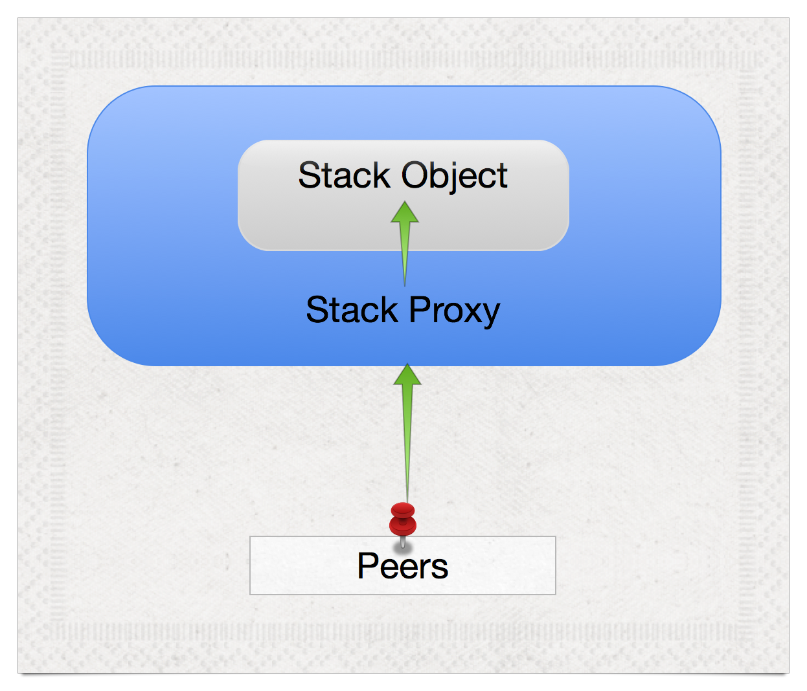
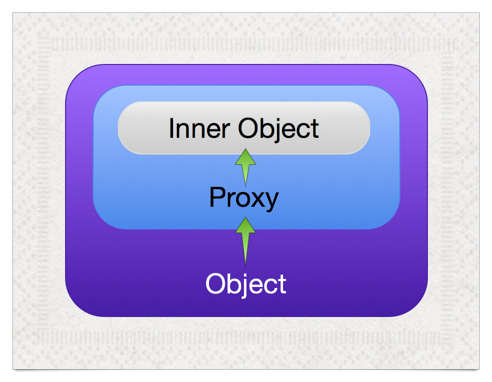

### A Unified Theory of JavaScript Style, Part I

# JavaScript Combinators


^ https://www.flickr.com/photos/andy_li/4378437185

^ The "backbone" of this talk is to explain the combinators make software that is easier to factor and refactor by creating an "aglgebra" where functions form a semigroup, rather than using code, which is more flexibible but creates a sparse group

---

# what's ahead...


^ https://www.flickr.com/photos/nicholas_t/10395426296

---


^ https://www.flickr.com/photos/nicholas_t/10395426296

^ discuss composition, groups, density as a metaphor

---

## composition
# *We compose entities to create new entities.*


^ https://www.flickr.com/photos/scelera/3036797409

---

## interfaces
# *Not all entities "fit together"*


^ https://www.flickr.com/photos/justinbaeder/5317820857

^ worse, some are time-dependent

---

# Homogeneous interfaces create dense spaces...


^ https://www.flickr.com/photos/michale/2744016741

---


^ Example: Integers and addition, multiplication: very dense

^ https://www.flickr.com/photos/michale/2744016741

---

# Heterogeneous interfaces create sparse spaces...


^ https://www.flickr.com/photos/stretta/5572576057

---


^ counter-example: imagine an operation on integers wher emost operations were invalid. you'd have to engage in  a complex search to find the path from any one integer to another.

^ https://www.flickr.com/photos/stretta/5572576057

---

# Dense is more flexible than sparse...


^ https://www.flickr.com/photos/michale/2744016741


^ https://www.flickr.com/photos/stretta/5572576057

---


^ https://www.flickr.com/photos/michale/2744016741


^ https://www.flickr.com/photos/stretta/5572576057

---

# Sparse can be quicker to grasp...


^ https://www.flickr.com/photos/dipfan/110857520


^ https://www.flickr.com/photos/nathanoliverphotography/9604185186

---


^ https://www.flickr.com/photos/dipfan/110857520


^ https://www.flickr.com/photos/nathanoliverphotography/9604185186

^ we'll give an example, showing how we have to build up.

---

## enough with the math!


^ https://www.flickr.com/photos/joao_trindade/4362414729

---

## pluck: "A convenient version of what is perhaps the most common use-case for map: extracting a list of property values."


^ https://www.flickr.com/photos/mediterraneaaan/12756787045

^ underscorejs.org

---

# "pluckWith" is the flipped form of "pluck"

---

```javascript
function pluck (mappable, key) {
  return mappable.map(function (obj) {
		return obj[key];
	});
};

function pluckWith (key, mappable) {
  return pluck(mappable, key);
};

var stooges = [
	{name: 'moe', age: 40},
	{name: 'larry', age: 50},
	{name: 'curly', age: 60}];

pluckWith('name', stooges);
	//=> ["moe", "larry", "curly"]
```

---

# Let's make "pluckWith" out of combinators

___

# A unary combinator

```javascript
function flip (fn) {
	return function flipped (a, b) {
		return fn.call(this, b, a);
	}
}

function arrow (a, b) {
    return "" + a + " -> " + b;
}

flip(arrow)("x", "y")
	//=> 'y -> x'
```

^ http://jsfiddle.net/raganwald/wFRP8/

---

# Another unary combinator


^ https://www.flickr.com/photos/saramarlowe/8170948596

---

```javascript
function curry (fn) {
	return function curried (a, optionalB) {
		if (arguments.length > 1) {
			return fn.call(this, a, optionalB);
		}
		else return function partiallyApplied (b) {
			return fn.call(this, a, b);
		}
	}
}
```

^ binary only

---
# Currying:

```javascript
var curriedArrow = curry(arrow);
	//=> [function]
	
curriedArrow('finger')('moon')
	//=> 'finger -> moon'
```

^ http://raganwald.com/2013/03/07/currying-and-partial-application.html

---

# Partial Application:

```javascript
var taoism = curry(arrow)('finger');
	//=> [function]
	
taoism('moon')
	//=> 'finger -> moon'
```

^ http://raganwald.com/2013/03/07/currying-and-partial-application.html

---

## nota bene
# *Partial application transforms binary operations into unary operations*


^ https://www.flickr.com/photos/genista/4449316

^ makes the interface more homogeneous

---

```javascript
function get (object, property) {
	return object[property];
}

get({foo: 1}, 'foo')
	//=> 1
```

---

```javascript
var getWith = curry(flip(get));

getWith('foo')({foo: 1})
	//=> 1
```

---

## "map" is a mathematical term, it has very little to do with cartography


^ https://www.flickr.com/photos/philipedmondson/7646442604

---

```javascript
function map (mappable, fn) {
	return mappable.map(fn, this);
}

function double (n) {
    return n * 2;
}

map([1, 2, 3], double)
	//=> [2, 4, 6]
```

---

```javascript
var mapWith = curry(flip(map));

mapWith(double, [1, 2, 3]);
	//=> [2, 4, 6]

var doubleAll = mapWith(double);

doubleAll([1, 2, 3])
	//=> [2, 4, 6]
```

---

> almost there...

---

```javascript
function pluckWith (attr) {
  return mapWith(getWith(attr));
}
```

---

# Compose


^ https://www.flickr.com/photos/ctaweb/8487304182

---

```javascript
function compose (a, b) {
	return function composed (c) {
		return a(b(c));
	}
}
```

---

## quod erat demonstrandum
# *The combinator implementation of* "pluckWith"

---

```javascript
var pluckWith = compose(mapWith, getWith);
```

---

## let's compare both implementations of "pluckWith"

---

```javascript
var pluckWith = compose(mapWith, getWith);

//// versus ////

function pluck (mappable, key) {
  return mappable.map(function (obj) {
		return obj[key];
	});
};

function pluckWith (key, mappable) {
  return pluck(mappable, key);
};
```

---

## lesson
# *Composing functions with combinators increases code flexibility...*

---

## lesson
# *Composing functions with combinators demands increased mental flexibility*

---

## enough theory!
# *Some practical method combinators*

---

```javascript
function Cake () {}

extend(Cake.prototype, {
  mix: function () {
    // mix ingredients together
		return this;
  },
  rise: function (duration) {
    // let the ingredients rise
		return this;
  },
  bake: function () {
    // do some baking
		return this;
  }
});
```

---

# fluent

```javascript
function fluent (methodBody) {
  return function fluentized () {
    methodBody.apply(this, arguments);
    return this;
  }
}
```

---

```javascript
function Cake () {}

extend(Cake.prototype, {
  mix: fluent( function () {
    // mix ingredients together
  }),
  rise: fluent( function (duration) {
    // let the ingredients rise
  }),
  bake: fluent(function () {
    // do some baking
  })
});
```

---

## new requirements
# *Mix before rising or baking*

---

```javascript
extend(Cake.prototype, {
  mix: fluent( function () {
    // mix ingredients together
  }),
  rise: fluent( function (duration) {
		this.mix();
    // let the ingredients rise
  }),
  bake: fluent(function () {
		this.mix();
    // do some baking
  })
});
```

---

# before
## a combinator that transforms decorations into decorators

```javascript
var before = curry(
	function decorate (decoration, method) {
		return function decoratedWithBefore () {
    	decoration.apply(this, arguments);
    	return method.apply(this, arguments);
		};
  }
);

var mixFirst = before(function () {
  this.mix()
});
```

---

# the final version

```javascript
extend(Cake.prototype, {
  
  // Other methods...
  
  mix: fluent( function () {
    // mix ingredients together
  }),
  rise: fluent( mixFirst( function (duration) {
    // let the ingredients rise
  })),
  bake: fluent( mixFirst( function () {
    // do some baking
  }))
});
```

---

## lesson
# *Method decorators declutter secondary concerns*

---

# after

```javascript
var after = curry(
	function decorate (decoration, method) {
		return function decoratedWithAfter () {
			var returnValue = method.apply(this, arguments);
    	decoration.apply(this, arguments);
    	return returnValue;
		};
  }
);
```

---

# around

```javascript
var around = curry(
	function decorate (decoration, method) {
		return function decoratedWithAround () {
			var methodPrepended = [method].concat(
				[].slice.call(arguments, 0)
			);
			
    	return decoration.apply(this, methodPrepended);
		};
  }
);
```

---

# call me maybe

```javascript
var maybe = around(function (fn, value) {
	if (value != null) {
		return fn.call(this, value);;
	}
});

maybe(double)(2)
	//=> 4
	
maybe(double)(null)
	//=> undefined
```

---

# generalized guards

```javascript
function provided (guard) {
	return around(function () {
		var fn = arguments[0],
		    values = [].slice.call(arguments, 1);
				
		if (guard.apply(this, values)) {
			return fn.apply(this, values);
		}
	});
}

var maybe = provided( function (value) { 
	return value != null; 
});
```

---

# inversions

```javascript
function not (fn) {
	return function notted () {
		return !fn.apply(this, arguments)
	}
}

var except = compose(provided, not);

var maybe = except( function (value) {
	return value == null;
});
```

---

## wrap up


^ https://www.flickr.com/photos/68112440@N07/6210847796

---

## lesson one
# *Combinators increase code flexibility and require increased mental flexibility*

---

## lesson two
# *Method decorators declutter secondary concerns*

---

## lesson three
# *Do not follow in the footsteps of the sages. Seek what they sought...*


^ https://www.flickr.com/photos/suburbanbloke/723665503

---


^ https://www.flickr.com/photos/suburbanbloke/723665503

---

# Reginald Braithwaite

## GitHub, Inc.

## http://raganwald.com

NDC Conference, Oslo, Norway, June 5, 2014


^ https://www.flickr.com/photos/wwworks/3226981951

---

### A Unified Theory of JavaScript Style, Part II

# The Art of the JavaScript Metaobject Protocol


^ https://www.flickr.com/photos/frans16611/6139595092

---

# Basics


^ https://www.flickr.com/photos/zscheyge/49012397

---

```javascript
var sam = {
  firstName: 'Sam',
  lastName: 'Lowry',
  fullName: function () {
    return this.firstName + " " + this.lastName;
  },
  rename: function (first, last) {
    this.firstName = first;
    this.lastName = last;
    return this;
  }
}
```

---

```javascript
var sam = {
  firstName: 'Sam',
  lastName: 'Lowry'
};

var Person = {
  fullName: function () {
    return this.firstName + " " + this.lastName;
  },
  rename: function (first, last) {
    this.firstName = first;
    this.lastName = last;
    return this;
  }
};
```

---

```javascript
function extend () {
  var consumer = arguments[0],
      providers = [].slice.call(arguments, 1),
      key,
      i,
      provider;

  for (i = 0; i < providers.length; ++i) {
    provider = providers[i];
    for (key in provider) {
      if (provider.hasOwnget(key)) {
        consumer[key] = provider[key];
      };
    };
  };
  return consumer;
}
```

---

# Mixins are many to _

```javascript
extend(sam, Person);

var peck = {
  firstName: 'Sam',
  lastName: 'Peckinpah'
};

extend(peck, Person);
```

---

# Mixins are _ to many

```javascript
var HasCareer = {
  career: function () {
    return this.chosenCareer;
  },
  setCareer: function (career) {
    this.chosenCareer = career;
    return this;
  }
};

extend(peck, HasCareer);

peck.setCareer('Director');
```

---

# Software entities should be open for extension, but closed for modification


^ https://www.flickr.com/photos/jorbasa/9715489429
^ [The Open/Closed Principle](https://en.wikipedia.org/wiki/Open/closed_principle)

---

# `extend` considered harmful

## Mutable metaobjects violate the open/closed principle


^ https://www.flickr.com/photos/marfis75/8178035999

---

```javascript
function composeObjects () {
	return extend.apply(
		null,
		[{}].concat([].slice.call(arguments, 0))
	);
}

var Both = composeObjects(Person, Director);
```

---

## Encapsulation


^ https://www.flickr.com/photos/lukepeterson/8134526531

---

> OOP to me means only messaging, local retention and protection and hiding of state-process, and extreme late-binding of all things.
--Dr. Alan Kay

---

```javascript
function proxy (baseObject, optionalPrototype) {
  var proxyObject = Object.create(optionalPrototype || null),
      methodName;
  for (methodName in baseObject) {
    if (typeof(baseObject[methodName]) ===  'function') {
      (function (methodName) {
        proxyObject[methodName] = function () {
          var result = baseObject[methodName].apply(
						baseObject,
						arguments
					);
          return (result === baseObject)
                 ? proxyObject
                 : result;
        }
      })(methodName);
    }
  }
  return proxyObject;
}
```
---

```javascript
var stack = {
  array: [],
  index: -1,
  push: function (value) {
    return this.array[this.index += 1] = value;
  },
  pop: function () {
    var value = this.array[this.index];
    this.array[this.index] = void 0;
    if (this.index >= 0) {
      this.index -= 1;
    }
    return value;
  },
  isEmpty: function () {
    return this.index < 0;
  }
};
```

---

```javascript
var stackProxy = proxy(stack);

stackProxy.push('first');

stackProxy
  //=>
    { push: [Function],
      pop: [Function],
      isEmpty: [Function] }

stackProxy.pop();
  //=> first
```

---

# Open recursion considered harmful


^ https://www.flickr.com/photos/furryscalyman/497450458

---

The **fragile base class problem** is a fundamental architectural problem of object-oriented programming systems where base classes (superclasses) are considered "fragile" because seemingly safe modifications to a base class, when inherited by the derived classes, may cause the derived classes to malfunction.


^ https://www.flickr.com/photos/stevenduong/4081192022

---


^ https://www.flickr.com/photos/yugui/3572489968

---

# Encapsulation for Metaobjects


^ https://www.flickr.com/photos/realsmiley/4895250473

---



---



---

```javascript
var number = 0;

function encapsulate (behaviour) {
  var safekeepingName = "__" + ++number + "__",
      encapsulatedObject = {};

  Object.keys(behaviour).forEach(function (methodName) {
    var methodBody = behaviour[methodName];

    encapsulatedObject[methodName] = function () {
      var context = this[safekeepingName],
          result;
      if (context == null) {
        context = proxy(this);
        Object.defineget(this, safekeepingName, {
          enumerable: false,
          writable: false,
          value: context
        });
      }
      result = methodBody.apply(context, arguments);
      return (result === context) ? this : result;
    };
  });
  return encapsulatedObject;
}
```

^ includes safekeeping pattern

---

# Reginald Braithwaite

## GitHub, Inc.

## http://raganwald.com

NDC Conference, Oslo, Norway, June 5, 2014


^ https://www.flickr.com/photos/wwworks/3226981951

---